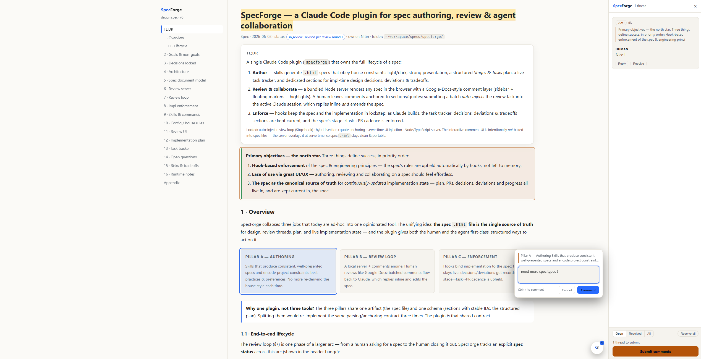
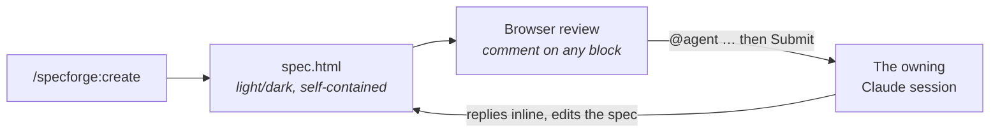
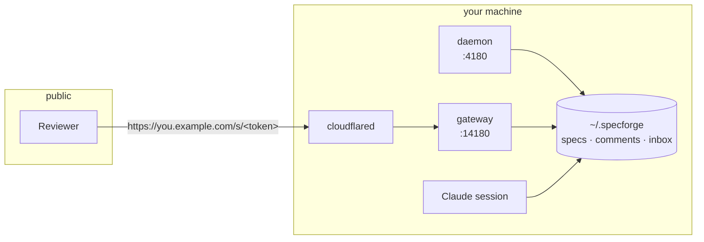

<div align="center">

# SpecForge

**Write specs with Claude. Review them in your browser. Comment, and the agent that owns the spec replies inline and edits the document.**

[](https://github.com/NitinJ/specforge/actions/workflows/test.yml)


</div>



## Install

```sh
git clone https://github.com/NitinJ/specforge && cd specforge
./install.sh
```

Checks prerequisites, installs the plugin, and sets up a permanent address for
your specs. It asks you nothing: a browser opens once to pick a domain, and your
address becomes `<your-username>.<that domain>`.

```sh
./install.sh --plugin-only   # skip the sharing setup
./install.sh -n              # show what it would do, change nothing
```

You need [Claude Code](https://claude.com/claude-code), Node 18+, and, only for
sharing, [cloudflared](https://developers.cloudflare.com/cloudflare-one/connections/connect-networks/downloads/).
The installer reports anything missing and installs none of it, because a script
that takes root on a new machine is a poor first impression.

## The loop



Submitting wakes the session that owns the spec, even while it sits idle. It
replies to each thread and amends the document; the open page reloads itself.

```
/specforge:create research on on-device vs server inference
```

SpecForge infers the type, scaffolds the spec, starts the daemon and prints a
URL. Hover a block to comment. The floating **SF** button opens contents, theme,
width and Export PDF; the pill beside it is the one action worth taking next.

## Spec types

`/specforge:create` picks one from your wording and confirms it. Sections are
starting points the authoring skill adapts, not a rigid schema.

| Type | For | Scaffolds |
|---|---|---|
| `design` | a decision or architecture doc | problem, goals, design, alternatives, decisions, open questions |
| `research` | a findings report | question, method, findings, analysis, recommendations, sources |
| `design-impl` *(default)* | design **and** build it | the design sections, plus Stages/Tasks, a live tracker, Runtime stubs |
| `impl` | build an existing design | light scope, plus Stages/Tasks, a live tracker, Runtime stubs |

## Commands

| Slash command | Does |
|---|---|
| `/specforge:create` | Author a new spec and open it for review |
| `/specforge:convert <file>` | Bring an existing `.md`/`.html` doc into the store |
| `/specforge:list` | Specs attached to this session |
| `/specforge:listall` | Every spec, with the index URL |
| `/specforge:start` | Start or reuse the daemon, print the index URL |

Reviewing needs no command. Hooks deliver submitted batches to the session that
owns the spec.

## Sharing

A spec is loopback-only until you share it.

```sh
specforge share <id>            # → https://you.example.com/s/<token>
specforge share <id> --rotate   # new token; every link already sent goes dead
specforge unshare <id>          # stop serving it
specforge shares                # what is public right now
```

**A link never changes on its own.** It survives a daemon restart, a tunnel
restart and a reboot. One command changes it:

| Action | The link |
|---|---|
| `share` again | unchanged |
| `unshare` then `share` | unchanged |
| `share --rotate` | **replaced**, so rotating is how you revoke |

**Anyone holding a link has your rights on that spec**: read, comment, resolve,
and submit work to your agent. There are no accounts. Share it the way you would
share a document link.

### Discussion, or work

A comment is a conversation between people unless it says `@agent`:

- `why is this bounded at 40 bits?` never reaches an agent
- `@agent widen this to 64` enters the next batch you submit

Adding `@agent` later hands over the **whole thread**, so the agent reads the
discussion that produced the request. The footer counts both (`2 for agent · 3
discussions`), so a forgotten `@agent` is visible before you submit.

### For a team

Add each person to the same Cloudflare account. Everyone runs `./install.sh`,
authenticates as themselves, and gets `<their-username>.<the shared domain>`. No
credentials are passed around and nobody needs their own domain.

One tunnel per machine is not optional: a hostname routes to whichever machine
runs its tunnel, so two machines on one tunnel means requests land on either at
random.

## The action button

One contextual call-to-action, driven by the spec's comments and status:

| State | Means |
|---|---|
| **Submit comments** | you have written comments for the agent |
| **Awaiting response** | sent; the agent has not engaged |
| **Picked up** → **Working on comments** | the owning session surfaced it, then started amending |
| **Review replies** | every open thread answered; read and resolve |
| **LGTM ✓** → **Implement →** | all resolved, then approved |
| **Implementing… / Done ✓** | the work, in the attached session |

Status lives on the document root: `draft → in_review → approved → implementing
→ done → closed`.

## Architecture



| Piece | What it is |
|---|---|
| **Store** | Every spec at `~/.specforge/specs/<id>/`: `spec.html`, meta, comments, review inbox, nav index. Not in your repo. |
| **Daemon** | One zero-dep HTTP server per machine on loopback, with a lockfile and port fall-forward. Serves the index and every spec with the review layer injected. |
| **Gateway** | One socket serving every published spec at `/s/<token>`. The tunnel's only downstream, so no daemon route is reachable from the internet. |
| **Tunnel** | Runs detached, so it outlives the daemon; a starting daemon adopts it rather than reaping it, which is what makes a link survive a restart. |
| **Attachment** | A spec belongs to one Claude session, which receives its batches. One session holds many specs; stale locks expire on a heartbeat. |
| **Review layer** | `server/public/review.{js,css}`, injected at serve time. No build step. |
| **spec-nav** | A per-spec section index ranked with a hand-rolled BM25, no embeddings. Skills open only the sections a comment touches instead of re-reading the spec. |

**Isolation rests on two tested properties.** The tunnel reaches only the gateway
port, and a spec is reachable only through a token that was handed out, never
through a spec id. Everything else answers 404, including revoked tokens, byte
for byte.

**Live updates** use an event stream on loopback and polling on a published page,
because Cloudflare's edge accepts an SSE response and then buffers every body
byte (measured: 0 events in 30s through a tunnel, against 15 of 15 on loopback).
The listener that answers a request says which, so no page waits on a stream that
never speaks.

### Hooks

Fail-safe: any error exits 0, and each no-ops unless a spec is in play.

| Hook | Role |
|---|---|
| `Stop` | Surface a pending batch; nudge on implementation drift |
| `UserPromptSubmit` / `SessionStart` | Catch batches a live session missed |
| `PostToolUse` | Record commits, PRs, test runs to the evidence ledger |
| `PreToolUse` | Deny edits to a spec marked `closed` |

Specs with no live owner can be drained headlessly: start the daemon with
`SPECFORGE_DAEMON_DRAIN=1` and it spawns `claude -p` for them.

## Configuration

Store-wide, at `~/.specforge/config.json`:

| Key | Meaning |
|---|---|
| `publicOrigin` | An origin you serve yourself. Set it and SpecForge never starts, adopts or kills a tunnel, and binds exactly 14180 or fails. |

Per project, at `<project>/.specforge/config.json` (defaults in `lib/config.mjs`):
`specsDir`, `defaultTheme`, `port`, `naming`, `trackComments`, `cadence`, and the
advisory `requiredSections`.

The lint (`lib/lint-spec.mjs`) checks universal basics only: a title, a lifecycle
status, unique section ids, the light/dark contract, and the house language
rules. Sections are never enforced, so any spec type passes.

## Development

```sh
npm test    # node --test, ~700 tests, zero runtime deps
```

| Path | Holds |
|---|---|
| `lib/` | store, CLI, publications, gateway, lint, lifecycle |
| `server/` | the daemon and the injected review layer |
| `skills/` · `commands/` · `hooks/` | authoring and review skills, slash commands, session hooks |
| `templates/` | spec shells and house rules |
| `tools/` | end-to-end probes and screenshot helpers |

Node built-ins only at runtime. `jsdom` and `playwright` are dev-only, for the
review-layer and browser test tiers. Contributions go feature branch → PR →
review → squash merge.

## License

MIT © Nitin Jaglan
