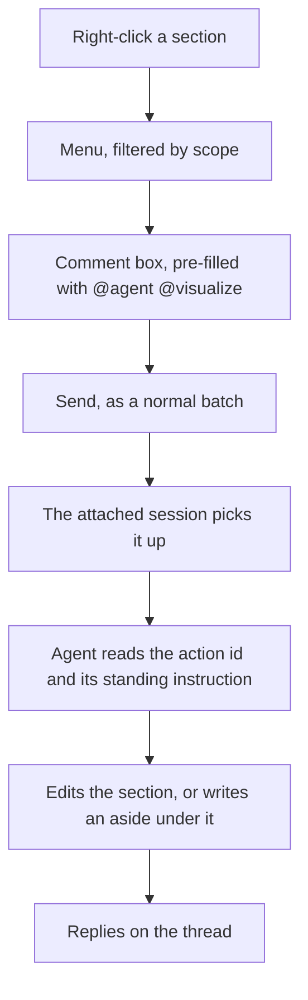

# Context menu actions: what I actually ask agents to do

## TL;DR

<!-- sf:box class="panel" -->

Across 318 review comments on 22 specs, **212 are a repeated action** asked of the agent, and they resolve to **22 distinct actions** in **8 buckets**. Because 30 comments ask for two things at once, those 212 comments carry **242 action instances**, which is the denominator every percentage below uses.

The largest bucket is **Structure** at 71 instances (29%): organising the information and filling the gaps in it, both about content rather than how it looks. The two most-asked single actions are **Explain this simply** (24) and **Visualize this** (23), and neither asks the spec to change what it claims.

**Eleven actions are selected** ([§6](#recommendations)), covering 166 instances, 69%, across all eight buckets. Each carries a written standard the agent applies, which is what makes it a menu entry rather than a shortcut: the instruction is longer than the comment you would have typed, not shorter. Eight run on whatever you point at and three on the whole spec.

**An action is a comment** ([§9](#how-it-runs)). Picking one from the menu fills the comment box with `@agent @visualize` and you send it like any other comment, so the feature adds no channel to the agent and no way for the browser to write the spec.

Where the result lands follows from one rule ([§7](#types)): an action edits **in place** when it changes the form of content already there, and opens an **aside** when it produces content that is not there yet. Restructure, Tighten and the two spec-wide actions edit; the other five write an aside, a section of the spec stored after the one it came from and shown in a panel beside the document, which you import or dismiss.

- **318**human comments mined
- **242**action instances in 212 of them
- **22**distinct actions, in 8 buckets
- **11**selected, covering 69%

## 1 · Question

Which actions do you ask agents to perform on a spec block often enough to be worth a one-click affordance, how do they group, and where does each one put its result?

The answer is derived from what you have already typed, not from what a context menu could plausibly offer. An invented menu is a guess about your habits; a mined one is a record of them.

Sections [3](#findings) to [6](#recommendations) answer the first two questions from the corpus and end in a selected set. Sections [7](#types) to [9](#asides) are the design that follows: the kinds of action, the menu, and the asides the additive ones write into.

#### Out of scope

- The build. No stages, no plan, no interfaces. This settles what the actions are, what they are called and where their output goes; an implementation spec follows.
- Whether an action is easy to implement. Ranking on effort before you have ranked on value would let the cheap actions win by default.
- Actions on a whole spec rather than a block (export, share, approve). Those already have homes in the review layer.

## 2 · Method

Every human comment in the store was read, classified by hand, and counted. The corpus was extracted with `scripts/mine-spec-actions.mjs`, which walks `~/.specforge/specs/*/comments.json` and prints each human comment with the spec, the section it was left on, the HTML tag of the block, and whether it addressed the agent.

| Figure | N | How it was obtained |
| --- | --- | --- |
| Specs with comments | 22 | Directories under the store holding a non-empty `comments.json`. |
| Human comments | 318 | Comments with `kind: "human"`. Agent replies are excluded: they are not asks. |
| Addressed to the agent | 297 | Containing `@agent`. The other 21 are notes to yourself or to a reviewer. |
| Classified as a repeated action | 212 | Read one by one and assigned to an action. The remaining 106 are answers to the agent's questions, acknowledgements, and one-off content edits, none of which a menu entry would serve. |
| Action instances | 242 | The per-action counts in [§3](#findings) sum to this, not to 212, because 30 comments ask for two things at once ("Cleanup the workbench section. Rewrite it completely" is both Restructure and Cut). Every percentage in this spec uses 242, since the question is how often an action is wanted rather than how many comments were typed. |

<!-- sf:callout variant="note" -->

> The classification is judgement, and the counts move by a few either way depending on where you draw a line. What does not move is the shape: a small number of actions, asked over and over, with a long tail of things asked once. Every action below carries verbatim quotes so you can check the call.

#### What counted as an action

A comment counted when it asks the agent to *do something to this block or section*. Three examples of the boundary:

| Comment | Counted | Why |
| --- | --- | --- |
| "Again simple words please" | yes | An operation on existing text, repeated across specs. |
| "Two options: either move modelregistry to public OR break the dep. Evaluate both" | yes | Content-specific, but the shape ("weigh these options for me") recurs. |
| "yeah celery_worker_schema to be precise" | no | An answer to a question the agent asked. Nothing to invoke. |

## 3 · The action inventory

<!-- sf:section id="findings" -->

22 actions, ordered by how often you asked. Each carries the comments it was drawn from, so a count can be argued with.

| # | Action | N | Bucket | What you said |
| --- | --- | --- | --- | --- |
| 1 | **Explain this simply** | 24 | Comprehension | "Absolutely no idea what this means as I don't have deep architecture understanding of this codebase. Explain to me in simple terms." · "Again simple words please" · "Please use simple language. no jargon please." · "Help me understand in simple language." · "Please rewrite it to make it easier to understand" · "you can't be more confusing here tbh" |
| 2 | **Visualize this** | 23 | Presentation | "Can you draw the final directory structure here as a diagram?" · "Can we have diagrams or images, wireframes for each rule. easier to read that way" · "visual?" · "Visualizations preferred." · "For overly verbose sections make the presentation very clear using illustrations, diagrams, tables, charts" · "a mermaid diagram of all tables, in terms of layers" |
| 3 | **Go deeper on this** | 22 | Structure | "I want to understand these better. Why do these exist, what are they used for, what were they added for." · "Dive into these more." · "Need more details on this. Who added this, when, what for" · "Again more details" · "go deep into their history to understand their role and future" · "I want a deep analyis of each table in terms of its design" |
| 4 | **Verify this against the code** | 20 | Grounding | "Please understand the service architecture as well first. look at specs and current design, terraform and then see if your suggestions still hold." · "Also check if we already have such checks in place or not." · "Look this up in git history and find this." · "Please verify this as it looks weird" · "double check these values against real numbers" |
| 5 | **Restructure this section** | 16 | Structure | "Cleanup the workbench section. Rewrite it completely. right now its a mess." · "The steps here and components in how to built it are all over the palce." · "Divide this into separate sections per class so that i can comment on each separeartety" · "its better to organize this section with sections in sidebar and the UI mocks on the right" |
| 6 | **Delete this** | 15 | Compression | "Now that weve cut these. remove this section to cleanup the spec a bit" · "Remove section" · "why do i still see 7 here. didn't i ask to remove it from here?" · "Remove ones which are fixed or resolved already" · "this is still visible in the html. lets remove as its resolved" · "remove first_party. not required. remove checked_on" |
| 7 | **Make this decidable** | 15 | Decision | "how can i answer any of these questions till you give me the details for each ? to help me make a call." · "Are these really open questions or open work? I don't understand whats the question in half of these." · "why is this still open? what do you need from me ?" · "Give me a solid reason to keep it or remove it." · "Give me 1-2 ideas on how this can be done." |
| 8 | **Show me an example** | 13 | Comprehension | "Can you give an example of where is this happening ?" · "Mind crafting an example big enough to help me understand." · "Can we get some examples of these please." · "can i get python code samples for code that filters shots against channel rules" · "Can we codify each channel like we did in our example above" |
| 9 | **Fix the naming** | 12 | Vocabulary | "the naming is not consistent." · "Rule is too generic. ChannelRule is better imo" · "The right terminology is orientation (main,back,side,detail,look)" · "use my exact terminology that i provided for these in my earlier comment" · "Can we atleast have a common terminology. Name each node of the pipeline" · "rename properly" |
| 10 | **Consistency pass** | 11 | Coherence | "Take one final pass on the spec and check for consistency, contradictions within the spec itself" · "No claim or decision should be repeated or should contradict each other." · "The sidebar contents seem to be dupliacted for section 4. please fix" · "is section 4 updated? is the spec consistent overall. take a pass and fix" |
| 11 | **Split this into its own spec** | 10 | Structure | "Shall we carve this out into a dedicated spec in itself" · "Lets move this to a new and different spec that we will tackle later." · "A lot of detail has bled into this spec, which shouldn't be here. Move all screens related sections into a new dedicated spec" · "Lets create a small spec and link it from Here." |
| 12 | **Document every field** | 9 | Structure | "whats source ?, first_party ? checked_on ? I want documentation inline for each field." · "why are comments following the attribute? shouldn't it be reverse" · "Please add a column for each one with a list of fields" · "Can we add table definition for all tables as well ? in code blocks" |
| 13 | **Define this term** | 8 | Structure | "whats this ? need more detail" · "Whats a shoot builder ? is it photoshoot ?" · "suite => test suite or what ?" · "can we define what a \<unit> is ?" · "are these called integration tests or component tests ? or maybe both are required ? can you clarify this a bit" |
| 14 | **Research this externally** | 8 | Grounding | "Can we do a deep research on this and gather EXACT, LATEST (2026) requirements" · "why don't you fetch some 5-10 catalog images for each channel and then verify and fix your assumptions and data gaps" · "double check these values against real numbers seen online on forums, platforms, youtube" |
| 15 | **Name the source** | 7 | Grounding | "Whats the source of each rule. where is it coming from. Do we have best practices rules in here as well ?" · "Ensure that these are best practices wrt docker and infra files." · "What is the best practice guideline for API, data model design" |
| 16 | **Canonicalize the spec** | 6 | Structure | "Now that the spec is complete and implemented. Consolidate and canonicalize the spec." · "Freeze every open thread." · "Restructure from chronology to logic." · "Rewrite in declarative present tense." |
| 17 | **Add a column to this table** | 5 | Presentation | "Add another column called implemented." · "Can we keep 2 tables for fields. One business logic related and another db/functional oriented" · "Please add a column for each one with a list of fields of each rendered in cell." |
| 18 | **Make references clickable** | 4 | Presentation | "No references without links. Through out the spec." · "Name upated of this spec. please update here" · a spec id pasted raw in prose, four times |
| 19 | **Turn this into a checkable rule** | 4 | Grounding | "what can we learn from this from treegenerator point of view? i think we should note it down as a validator rule. Can we generalize this rule" · "bake this into agents' knowledge base" · "bake the finding into generator rules" |
| 20 | **File this as work elsewhere** | 4 | Decision | "lets file a bug with the suggest fix in it. we will tackle it later on." · "Lets create a bug for this in the trialroomai codebase." · "Make a note of it." · "remind me to tackle tests in the end" |
| 21 | **Tighten this** | 4 | Compression | "Just summarize this section and remove all excessive details. not important anymore" · "Ensure that its not too wordy but at the same time it presents the UX architecture and design choices clearly" · "Compress exploration into Alternatives Considered... option, why rejected, 2-3 lines each" |
| 22 | **Shrink this diagram** | 2 | Presentation | "Reduce size of the svg diagram and organize it as a tree. its too much in the face right now. Idea is to be able to see it in 1 screen height." · "reduce font size in the svg a bit" |

<!-- sf:callout variant="note" -->

> **Delete and Tighten are different asks.** "Remove ones which are fixed or resolved already" wants the content gone. "Just summarize this section and remove all excessive details" wants the same ground covered in fewer words. Merging them would produce one action that sometimes deletes what you wanted kept, so they are counted and listed apart.

### 3\.1 · Where these get asked

The section a comment lands on is recorded, and the distribution is not even. Seven sections carry 190 of the 318 comments.

| Section | Comments | What gets asked there |
| --- | --- | --- |
| `open-questions` | 52 | Make this decidable, above everything else. This is the section that generated the template prompt in the verification design. |
| `findings` | 38 | Verify this, go deeper, delete what is resolved. |
| `design` | 21 | Visualize this, restructure this. |
| `work-map` | 16 | Visualize this, restructure this. |
| `fieldmap` | 16 | Document every field, fix the naming, show me an example. |
| `requirements` | 13 | Go deeper, define this term. |
| `target` / `current-state` | 18 | Go deeper, verify this, fix the naming. |

### 3\.2 · The long tail

106 comments were not classified as a repeated action. They break down as: answers to the agent's own questions (roughly half, including 14 that are one word), content-specific instructions that would never repeat, and acknowledgements. A menu serves none of them, and a menu that tried would be a menu nobody opens.

## 4 · Buckets

The 22 actions group by *what you are trying to get*, not by what the agent does to the document. Two actions belong together when a failed one sends you to the other.

| Bucket | Actions | Instances | What it is for, and the tell that you want it |
| --- | --- | --- | --- |
| **Structure** | 6 | 71 | The information is in the wrong order, the wrong place, or not all there. Two halves, both about content and its flow rather than how it looks: *organise it better* (Restructure, Split into its own spec, Canonicalize) and *fill the gaps in it* (Go deeper, Document every field, Define this term). The largest bucket, and the one whose actions read as editorial rather than cosmetic. |
| **Grounding** | 4 | 39 | You do not trust the claim. Either it was never checked against the code, or the number arrived without a source. *Verify against the code · Research externally · Name the source · Turn this into a checkable rule.* |
| **Comprehension** | 2 | 37 | You cannot follow what the block says, and the fix is in how it is worded rather than in what is missing. The tell is a complaint about language: "explain in simple terms", "no jargon". *Explain simply · Show me an example.* |
| **Presentation** | 4 | 34 | You can follow it but reading it is work, because it is in the wrong visual form. Prose that should have been a table, structure that should have been a diagram. *Visualize · Add a column · Make references clickable · Shrink this diagram.* |
| **Compression** | 2 | 19 | There is too much of it. Two different asks: *Delete this* when it is stale, resolved or cut, and *Tighten this* when the ground still needs covering in fewer words. |
| **Decision** | 2 | 19 | You are being asked to decide and cannot, because the question arrived without the material to answer it. *Make this decidable · File this as work elsewhere.* |
| **Vocabulary** | 1 | 12 | The spec calls one thing several names, or uses a name you already replaced. *Fix the naming.* |
| **Coherence** | 1 | 11 | The spec disagrees with itself, or says the same thing twice. Always asked over the whole document, never over one block. *Consistency pass.* |

#### Two levels: local and global

An action either works on what you pointed at, or it only means anything over the whole spec. Nothing needs a third level: a section is just a bigger block, and every action that works on one works on the other.

| Level | Buckets | What it means for a menu |
| --- | --- | --- |
| **Local** block or section | Structure, Grounding, Comprehension, Presentation, Compression, Decision, Vocabulary | Runs on whatever you invoked it from. Seven of the eight buckets, and 231 of the 242 instances. The same action reads sensibly on a paragraph and on a section: "Go deeper" on either is the same request. |
| **Global** whole spec | Coherence, plus Canonicalize from Structure | Meaningless over one block: a consistency pass needs both halves of the contradiction. 17 instances, and they want a spec-level surface rather than a block one. |

## 5 · Analysis

#### The biggest bucket is about content, not delivery

Structure is 71 of the 242 instances, 29%, and it is the largest by a clear margin. Its two halves are organising what is there (38) and filling what is missing (39), which is close to an even split. That reframes the feature: the most common thing you want is not a better rendering of the spec, it is a more complete or better ordered one.

Delivery is the second story rather than the first. Comprehension and Presentation together are 71 instances, also 29%, and neither asks the spec to say something different: both ask it to say the same thing in a way you can absorb. Those are still the requests where a click loses least, because the agent needs nothing further from you to act on them.

#### What makes an action menu-shaped

Not brevity. The test is whether a good standing instruction can be written for it, once, and applied every time. "Explain this simply" carries "rewrite for a reader without this codebase in their head"; "Restructure this section" carries "rebuild it on a deliberate pattern, top-down or bottom-up"; "Make this decidable" carries "give the reader what the call needs, including the risks and what each option costs". None of those need you to type anything, and all three are longer than the comments you actually wrote.

The actions that fail this test fail for one reason: the missing piece is a fact only you hold. "Fix the naming" needs the replacement term. "Verify this against the code" needs to know which claim and against what. No instruction written in advance supplies either.

This is the same mechanism as the section prompts in the verification design: guidance stored once, applied at the moment of writing. An action is that prompt, aimed at a block you chose rather than at a section the template chose.

#### Grounding is the bucket a menu helps least

39 instances, second by volume, and largely resistant. "Verify this against the code" is a real repeated ask, but which code, and against what claim, is different every time. A menu entry would produce a plausible verification of the wrong thing. This bucket wants a better authoring rule rather than a faster correction, and two of its four actions are already global verification rules from the earlier design (`file-refs-are-real`, `prescriptions-name-their-source`).

#### Almost everything is local

231 of 242 instances work on whatever you point at, and 17 need the whole spec. That is lopsided enough that a block-level surface carries the feature on its own, and the spec-level pair (Consistency pass, Canonicalize) can wait without costing much. It also means the block and section distinction earns nothing: every action that reads sensibly on a paragraph reads sensibly on a section.

#### Overlap with verification already shipped

Six of the 22 actions correspond to a rule the verification gate now enforces at creation. That is not duplicated work: a rule stops the defect being written, a menu action fixes one that got through. Where both exist, the menu action should get rarer over time, and if it does not, the rule is not working.

| Action | Rule that now prevents it |
| --- | --- |
| Explain this simply | the open-questions and decisions section prompts |
| Make this decidable | the open-questions prompt |
| Fix the naming | `terms-are-stable` |
| Consistency pass | `no-repeated-claims` |
| Make references clickable | `references-are-links` |
| Name the source | `prescriptions-name-their-source` |

#### What argues against building this

Two things. First, an `@agent` comment already works, costs one line of typing, and carries context a click cannot: "explain in simple terms, I don't know this codebase" is a better instruction than "Explain". A menu is faster but lossier, and for the actions where you routinely add a qualifier it may be worse than what you do today. Second, the six rows above suggest the highest-frequency asks are the ones verification is already trying to eliminate at the source. Building a fast path for a defect you are also trying to prevent is worth doing only if you expect the prevention to be partial.

## 6 · Shortlist

<!-- sf:section id="recommendations" -->

Eleven actions, selected in review. Ordered by how often you asked, local first.

<!-- sf:callout variant="note" -->

> **An action is a stored instruction, not a verb.** The first cut of this list excluded Restructure and Make this decidable because their comments carry a specific complaint that a click would discard. That was the wrong test. What a menu entry carries is not the word on the button, it is a written standard the agent applies every time: "restructure this using a deliberate pattern, top-down or bottom-up" is a complete instruction without you typing anything. The criterion is therefore *can a good standing instruction be written for it*, not *is the ask short*. Same mechanism as the section prompts in the [verification design](http://127.0.0.1:4180/spec/543ebb7b12).

| # | Action | N | Scope | The standing instruction it carries |
| --- | --- | --- | --- | --- |
| R1 | **Explain this simply** | 24 | local | Rewrite for a reader who does not have this codebase in their head. Define or replace every term of art at first use. Most asked in the corpus, and the instruction never varies. |
| R2 | **Visualize this** | 23 | local | Choose the form the content actually wants, diagram, table, or mock, and build it. The agent picks better than the instruction does, which is why this is the most expensive one to type by hand. |
| R3 | **Go deeper on this** | 22 | local | For each named thing: what it is, why it exists, what it is for, when it was added and by whom where that is knowable. The qualifier is nearly always those same questions. |
| R4 | **Restructure this section** | 16 | local | The section is not presenting its information well and is not organised well. Rebuild it on a deliberate pattern: top-down from the concept, bottom-up from the parts, or another established shape that fits the material. One structure throughout, not a mix. |
| R5 | **Make this decidable** | 15 | local | Give the reader everything the call needs: what is being decided, why it matters, what each option costs, what the risks are, and what happens either way. Plain words first, then the technical terms the choice turns on. Never open ended. Matters most on open questions and decisions. |
| R6 | **Show me an example** | 13 | local | Build a worked example big enough to carry the concept, in code where the subject is code. What you reach for when "explain simply" was not enough. |
| R7 | **Tighten / summarize** | 4 | local | Cover the same ground in fewer words. Cut the excessive detail, keep what the section is for. Distinct from deleting: nothing here is stale, there is just too much of it. |
| R8 | **Consistency pass** | 11 | global | Read the whole spec and fix what contradicts itself: claims made twice, decisions stated two ways, numbers that disagree between a table and the prose around it, and table-of-contents entries that no longer match the sections. Needs both halves of a contradiction, so it cannot run on one block. |
| R9 | **Canonicalize the spec** | 6 | global | Freeze every open thread into a decision, restructure from chronology to logic, rewrite in declarative present tense, and cut what implementation has since made untrue. Four separate instructions in the corpus, pasted verbatim more than once, which makes this the strongest single case here for a button. |
| R10 | **Verify this against the code** | 20 | local | Check the claims here against the tree and report what disagrees: the claim, what the code actually does, and the file it is in. Do not correct the spec. Needs a line from you naming the claim and where to look, typed into the comment before you send it ([D7](#decisions)). |
| R11 | **Fix the naming** | 12 | global | Replace one term with another everywhere it appears, including headings, tables, diagrams and the table of contents, and leave no instance of the old one. Needs the replacement term, typed into the comment before you send it ([D7](#decisions)). |

Those eleven are 166 of the 242 action instances, **69%**, across all eight buckets. Eight run on whatever you point at and three run on the whole spec, which is the split settled in [D2](#decisions).

#### Deliberately not in the shortlist

| Action | N | Why not |
| --- | --- | --- |
| Delete this | 15 | Your call in review: this is a section affordance rather than an agent action. When you want a section gone you already know it, so there is no judgement for an agent to add, and an icon on the section does the job without a round trip. Not proposed for now. |
| Split this into its own spec | 10 | Creates a second document and rewrites the first. Not reversible from a click, and the new spec needs a title and a type that only you can give it. |

## 7 · Three kinds of action

<!-- sf:section id="types" -->

Right-clicking a block, a section, or the page background opens a menu. What lands in it is one of three kinds, and the kind decides where the result goes.

| Kind | Who does it | Where the result lands | What it is for |
| --- | --- | --- | --- |
| **Direct** | the browser | nowhere in the spec | Operations with no judgement in them that also do not change the document. One survives review: Copy link. No round trip, no agent, no waiting. |
| **Agentic, in place** | the agent | the spec, replacing what was there | The content is right and its form is wrong. The result supersedes the input, so there is nothing to keep alongside. |
| **Agentic, aside** | the agent | a section of the spec, stored after the one it came from and shown in a panel beside it | Something that does not exist yet: an explanation, a diagram, an example, the material behind a decision. You read it, comment on it if you want, and import it if it earns a place in the document's argument. See [§10](#asides). |

#### The rule that decides which

<!-- sf:callout variant="decision" -->

> An action edits **in place** when it changes the form of content that is already there. It opens an **aside** when it produces content that is not there yet.

That rule places all eleven shortlisted actions without a judgement call, and it explains the ones that look borderline. Tighten reduces existing prose and Restructure reorders it, so both replace their input. Explain, Visualize, Go deeper, Make this decidable and Show an example each write something the section did not contain. The three spec-wide actions edit in place, since a consistency pass, a canonicalization and a rename all rewrite what is already in the document. Verify against code is the one that reads oddly at first and comes out right: it produces a report that does not exist yet, so it opens an aside rather than editing the claims it checked.

#### Why the direct column is nearly empty

The first draft of this table had Edit and Delete in it. Both are out, for two different reasons that arrive at the same place. Delete came out in review as a section affordance rather than an action. Edit came out because the browser never writes the spec file: [§9](#how-it-runs) routes every change through a comment, and a second write path that bypasses it would be the largest thing this feature adds. Copy link stays because it reads a value that already exists and changes nothing.

#### Why additive actions default to an aside

An aside is strictly more capable than an in-place edit, because import turns it into one and the reverse is not available. Generating into an aside costs a click to accept and saves an undo when the output is wrong, which for a diagram or a rewritten decision is the common case.

The argument does not run the other way. An aside whose only sensible next step is "import and delete the original" is a slow edit with extra steps, which is why Tighten and Restructure do not get one.

## 8 · The menu

<!-- sf:section id="menu" -->

Labels are verb-first and short enough to scan. Each carries the standing instruction from [§6](#recommendations), which is what the agent actually runs. Entries are grouped by kind and ordered by how often you asked inside a kind, so the two that rewrite your text never sit between the six that only add a draft beside it.

#### Agentic actions, on a block or a section

| Icon | Label | Kind | N | Notes |
| --- | --- | --- | --- | --- |
| &#128161; | **Explain simply** | aside | 24 | Most asked in the corpus. The original prose stays: a spec is a technical document and the precise wording is often the point, so the plain-language version sits under it rather than over it. |
| &#9712; | **Visualize** | aside | 23 | The agent chooses the form the content wants, diagram, table or mock. Aside matters most here: a bad diagram is worse than no diagram, and this is the action whose output you will reject most often. |
| &#128270; | **Go deeper** | aside | 22 | Produces the most volume of any action in the corpus. Landing that in the section directly is how a spec doubles in length without anyone deciding it should. |
| &#10003; | **Verify against code** | aside | 20 | Reports what disagrees rather than correcting it, because a confident fix built on a misreading turns a true claim into a false one silently. Type the claim and where to look before sending ([D7](#decisions)). |
| &#9878; | **Help me decide** | aside | 15 | Named for what you want rather than what the spec lacks. Gathers options, costs and risks, which is bulky enough that you want to see it before it lands. Import is the expected path, not an afterthought. |
| &#10077; | **Show an example** | aside | 13 | Often long, often illustrative rather than normative. Many will be read and discarded, which is exactly what an aside is for. |
| &#9776; | **Restructure** | in place | 16 | Rebuilds the section on a deliberate pattern. The most destructive action in the menu, since it rewrites everything in scope and nothing keeps the old version ([D4](#decisions)). |
| &#9986; | **Tighten** | in place | 4 | Covers the same ground in fewer words. Nothing is added, so nothing needs reviewing beside the original. |

#### Agentic actions, on the whole spec

| Icon | Label | Kind | N | Notes |
| --- | --- | --- | --- | --- |
| &#127991; | **Fix the naming** | in place | 12 | Spec-wide because a rename applied to one section leaves the document saying two things, which is the complaint being answered. Type the replacement term before sending ([D7](#decisions)). |
| &#8644; | **Consistency pass** | in place | 11 | Needs both halves of a contradiction, so it is meaningless on one block. Overlaps the `no-repeated-claims` rule the verification gate already runs at creation; the difference is that the gate reports and this one fixes. |
| &#128220; | **Canonicalize** | in place | 6 | Rewrites the whole document once the work it describes is done. The lowest count in the shortlist and the most expensive instruction to type, which is the case for a button rather than against one. |

#### Direct actions

| Icon | Label | Scope | Notes |
| --- | --- | --- | --- |
| &#128279; | **Copy link** | block, section | The anchor URL. Sections already have stable ids, so this reads something that exists and writes nothing. The only direct action left after review, for the reasons in [§7](#types). |

<!-- sf:callout variant="note" -->

> The glyphs mix geometric symbols with three emoji, matching the home page row menu, which already uses &#128465; &#128228; &#128279; beside &#9998; and &#8593;. If the menu should be monochrome throughout, &#128161; &#128270; and &#128220; are the three to replace.

#### What the menu shows where

Scope comes from what you right-clicked, and the rule from [§4](#buckets) holds: a section is a bigger block, and every local action reads sensibly on either.

| Right-click on | Menu |
| --- | --- |
| **A block** | The eight local actions, plus Copy link. |
| **A section** | The same list. Restructure and Tighten read most naturally here, and the two of them are the reason the section scope exists at all. |
| **The page background** | Consistency pass, Canonicalize and Fix the naming, plus the existing spec menu items. No block is selected, so nothing block-scoped appears rather than appearing disabled. |

## 9 · How an action runs

<!-- sf:section id="how-it-runs" -->

An action is a comment. Clicking a menu entry opens the comment box on what you right-clicked, pre-filled with `@agent @visualize`. You send it the way you send any comment. The session attached to the spec picks it up, reads the action id, applies that action's standing instruction from [§6](#recommendations), edits the spec, and replies on the thread.

<!-- sf:callout variant="decision" -->

> The feature adds no channel between the browser and the agent, and no way for the browser to write the spec. It writes a comment, which is the one thing the browser already does.

#### What this reuses

| Step | What it runs on |
| --- | --- |
| Writing the request | The comment composer, anchored to the block you right-clicked. The menu fills the box; it does not replace it. |
| Sending it | The existing batch. An action can travel with typed comments in the same send. |
| Reaching the agent | The batch watcher already running in the attached session. |
| Showing progress | The states the review UI already shows: picked up, then working on comments. |
| Reporting back | A reply on the thread, which is where the record of what was asked and what was done stays. |

#### What follows from it

- **You can type an action by hand.** `@agent @visualize` in the comment box is the action. The menu is discoverability, not capability, and nothing breaks if you never open it.
- **You can add words to any action.** The composer is a text box, so a qualifier costs nothing to offer. This is what reopens Verify this against the code and Fix the naming, which were excluded only because a click had nowhere to put the detail. Open as [Q8](#open-questions).
- **Actions batch.** Right-click three sections, pick an action on each, send once.
- **Nothing new is stored.** No action queue, no job record, no status field. The comment is the queue.

#### The two things that have to hold

An action id is a lowercase token with underscores, `@help_me_decide` rather than `@help me decide`, so that it can be matched in a comment body without ambiguity. The comment carries the id and not the instruction, so improving an instruction later does not require rewriting comments already sent.

#### What it costs

An action is as slow as a comment round trip. There is no immediate feedback: you send it and the spec changes when the agent reaches it, which for a one-word request like Tighten will feel slower than an edit. And an action sent while no session is attached to the spec sits unread until one is, exactly like a comment sent the same way.

## 10 · Asides

An **aside** is a section of the spec carrying `data-sf-aside="<sourceSectionId>"`, placed in the document immediately after the section it was produced from. That is the model, and nothing filters it. The review layer *renders* it somewhere else: lifted out of the flow into a panel beside the document.

<!-- sf:callout variant="decision" -->

> **Modelled as a section, rendered in a panel.** The two are separate decisions and only the second is about presentation. In the file, in the markdown export and to the verification gate, an aside is a section sitting after its source. On screen it is a panel, because a draft you have not accepted should not push the document you are reading down the page.

| Property | Behaviour |
| --- | --- |
| Stored as | A `<section data-sf-aside="…" data-sf-action="…">` in the spec file, with id `<sourceSectionId>-aside-<n>` and an `<h3>` reading *Aside: \<action label>*. Persistence, live reload and survival across sessions are behaviours sections already have. |
| Placed | Immediately after the closing tag of its source section. Several asides on one section stack in the order they were run, one per run. |
| Rendered | Moved at boot into `#sf-asides`, a right-hand panel. The move is a DOM relocation of the same nodes, not a copy, so there is one aside and not two. Each carries a header strip with the action's icon and label from [§8](#menu) and its two buttons. |
| How you know one exists | A marker at the top right of the source section, carrying the icon of each aside attached to it. Clicking it opens the panel at that aside. The marker is a direct child of the section rather than part of any block, because a comment anchors to a block's text and chrome inside one would change that text and orphan the threads already on it. |
| Commentable | Yes, in the panel. The nodes moved but they are still the document, so `querySelectorAll(BLOCK_SEL)` still finds them. The panel's own chrome is excluded and its content is not, which is the distinction `inUI()` already draws everywhere else. |
| Actions on it | **&#8592; Import into spec** and **Dismiss**, in the header strip. Both are comments, like every other action ([§9](#how-it-runs)): they send `@agent @import` and `@agent @dismiss` on the aside. |
| Import | Merges the content into the source section and deletes the aside. The originating action's instruction decides the form, so Visualize imports as a figure and Explain simply as a callout. Threads on the imported blocks travel with them, because they anchor to blocks rather than to the aside. |
| Dismiss | Deletes the section and its threads. Same as deleting any section that has been commented on. |
| If its section is deleted | The aside goes with it. An aside is about the section above it, and one left behind attaches itself to whatever section happens to precede it, which is worse than losing a draft you had not imported. |

<!-- sf:callout variant="note" -->

> **Import goes through the agent rather than the browser.** A button that merged the aside itself would be the browser writing the spec file, which nothing does today and which [§9](#how-it-runs) exists to avoid. The cost is that accepting a draft takes a round trip rather than being instant. The gain beyond the write path is that the agent places the content, so an imported diagram lands as a figure in the right part of the section instead of being appended to the end of it.

#### The panel shares the right gutter

SpecForge already puts two things there: the comments rail and the comments drawer, and they already take turns, since `railShouldShow()` returns false while the drawer is open. The asides panel joins that rule rather than inventing a third region to fight over the same 340px. Opening it hides the rail, closing it brings the rail back and re-measures, which is the behaviour the drawer has had all along.

#### What the placement still buys

The rendering moved; the model did not. These three still hold, and none of them needed code written for them.

| Surface | What happens |
| --- | --- |
| Markdown export | `html-to-md.mjs` iterates `getSectionIds(html)` in document order, so the aside exports as an `##` section directly under the one it belongs to. The exporter is unchanged, and a test asserts the heading order to keep it that way. |
| A shared link | A visitor reads the aside. This is the cost of not filtering: an unimported draft is visible to whoever you send the link to, and dismissing or importing before sharing is the only thing between them. |
| The verification gate | Rules run over the aside's prose like any section's. An aside that is a stub or contradicts the document fails the gate, which is the behaviour you want from content that travels with the spec. |

#### The two rules that have to change

`toc-in-sync` is blocking and reads every `<section id="…">` in the file, so it reports an aside as *sections not linked* and fails the gate on a finished spec. The floating contents drawer builds itself from `section[id]` on a spec that has no curated table of contents of its own, so an aside appears in it there. Both skip `data-sf-aside`, and asides get no entry in either: an aside lives until you import or dismiss it, and rewriting the outline on every action run is not what a table of contents is for.

#### The design this replaced

A separate store for agent output, rendered by its own code and deliberately not commentable. It is rejected: everything an aside needs already exists for sections, and "not commentable" is *more* work rather than less. The review layer collects comment targets with `querySelectorAll(BLOCK_SEL)` over the whole document, so a section of paragraphs and figures is commentable by default and stopping it means writing an exclusion. Building a parallel system to avoid a behaviour you get for free is wrong in both directions.

Rendering the aside inline, in the flow under its source section, shipped first and was wrong. It reads as the next part of the argument rather than as a draft awaiting a decision, and a long one pushes the document you are reading off the screen. The panel is what "a differently rendered section" meant.

## 11 · Decisions

Settled in review. Each was an open question above it before it was one of these.

| # | Decision | Why | What it costs |
| --- | --- | --- | --- |
| D1 | **An action is a comment.** Clicking a menu entry pre-fills the comment box with `@agent @<action>` and you send it like any other comment. [§9](#how-it-runs) | The path from a comment to an agent that edits the spec already exists and is used daily. Anything else is a second path to the same place. | An action is as slow as a comment round trip, and one sent with no session attached waits. |
| D2 | **Spec-wide actions ship with the block-level ones.** Consistency pass and Canonicalize live on the page background menu. [§8](#menu) | They are 17 of 242 instances and Canonicalize is the most expensive instruction in the corpus to type by hand. With D1 they need no mechanism of their own. | A second surface to build and explain, for 7% of the instances. |
| D3 | **Explain simply is one menu entry.** It writes an aside; the spec is untouched until you import it. | Two entries that sound alike is the pair people pick wrong. Import gives you the in-place outcome in one more click. | The "just rewrite it clearly" case takes two steps rather than one. |
| D4 | **In-place actions edit the spec directly.** Restructure and Tighten rewrite the section with no preview and no stored previous version. | Specs are files. Adding versioning to the store for two actions is a larger feature than the one being built. | A rewrite you dislike is not recoverable inside SpecForge. Real, and accepted. |
| D5 | **An aside is deleted with its section.** [§10](#asides) | An aside is about the section above it. One left behind attaches itself to whatever section happens to precede it. | Deleting a section silently discards drafts you had not imported. |
| D6 | **An aside is modelled as a section and rendered in a panel.** It is stored after its source and filtered from nothing, so it travels into the export and shared links; the review layer lifts it into `#sf-asides` to read. [§10](#asides) | Storing it as a section means export, anchoring, comments and the gate all work with no code written for them. Rendering it in a panel means a draft you have not accepted does not push the document you are reading down the page. | A link shared mid-draft shows drafts you have not imported, and the panel takes the right gutter from the comments rail while it is open. |
| D7 | **The two actions that need a detail from you are in the menu.** Verify against code and Fix the naming pre-fill the comment box like any action; you type the claim or the replacement term before sending. [§8](#menu) | They are the second and third most asked things that were left out, worth 32 instances, and D1 already gives them the field they were missing. Nothing is built for this beyond two more menu entries. | Two entries that do something unhelpful if sent bare. Their instructions have to ask rather than guess. |

## 12 · Open questions

- Nothing is open. Every question below was settled in review; the answers are the decisions in [§11](#decisions).
- [x] **Q1 — resolved** Which actions ship. Eleven, listed in [§6](#recommendations): eight local and three spec-wide, 166 of 242 instances.
- [x] **Q2 — resolved** Does an action ask you a question before it runs? No. It writes a comment instead, which you can add to before sending. [D1](#decisions).
- [x] **Q3 — resolved** Do spec-wide actions ship now? Yes, in the same feature. [D2](#decisions).
- [x] **Q4 — resolved** Does Explain simply need an in-place twin? No. One entry, writing an aside, with Import as the second step. [D3](#decisions).
- [x] **Q5 — resolved** What undoes an in-place action? Nothing. Restructure and Tighten edit the spec directly. [D4](#decisions).
- [x] **Q6 — resolved** What happens to an aside when its section is deleted? It is deleted with it. [D5](#decisions).
- [x] **Q7 — resolved** Which surfaces show an aside? All of them. Nothing filters `data-sf-aside`, and one rule changes, `toc-in-sync`. [D6](#decisions).
- [x] **Q8 — resolved** Do the two actions that need a detail from you come into the menu? Yes, both. [D7](#decisions).

## 13 · Implementation plan

<!-- sf:section id="impl-plan" -->

Stages & Tasks. One stage = one PR. Tests-first.

### Stage 0 — A way to test the review layer (PR 183)

- [x] 0.1 Extract the jsdom boot helper into `test/helpers/review-dom.mjs`, taking a body and returning the booted window.
      verify: the five existing review tests pass against the extracted helper with no change to their assertions.
- [x] 0.2 Add a fixture spec with three sections, one carrying a list and a table, for the menu and aside stages to point at.
      verify: booting the fixture collects the expected number of comment targets from `BLOCK_SEL`.
- [x] 0.3 Add a helper that dispatches a `contextmenu` event at a named block in the fixture.
      verify: a test asserts the event arrives with that block as its target.

The menu, the composer and the aside all live in browser code, so every stage after this one needs a way to load that code in a test and fire clicks at it. This stage builds only that, using the jsdom pattern already in `test/review-highlight.test.mjs`.

### Stage 1 — The action registry (PR 184)

- [x] 1.1 `lib/actions/index.mjs` with `defineAction`, validating that an id is a lowercase token with underscores, that kind is one of direct, in-place or aside, and that scope is local or global.
      verify: unit tests reject an id containing a space, a dash and a capital, for the same reason rule ids reject a comma.
- [x] 1.2 `lib/actions/all.mjs` carrying the eleven agentic actions of [§6](#recommendations) with their standing instructions, plus Copy link, for twelve entries in all.
      verify: a test asserts twelve entries, unique ids and labels, nine local and three global, and the kind of each against a literal list.
- [x] 1.3 A `specforge actions` command printing the registry as JSON, so the skill and a human can read the same list.
      verify: the command prints twelve entries and exits 0, narrows on `--scope`, and fails rather than printing nothing on an id it does not know.

One file that lists the eleven actions: what each is called, its icon, whether it edits in place or writes an aside, and the instruction the agent follows. Nothing reads it yet, which is what makes it a stage on its own.

### Stage 2 — The menu, and what clicking does (PR 185)

- [x] 2.1 A context menu in `review.js`, opening on right-click over a block or section and closing on Escape, click-away and scroll.
      verify: a jsdom test opens it on a paragraph and asserts each of the three closes it.
- [x] 2.2 Entries built from the registry, filtered to local scope, with icon and label.
      verify: right-clicking a paragraph lists the nine local entries, Copy link among them, in the order of [§8](#menu).
- [x] 2.3 Picking an entry opens the composer on that block, pre-filled with `@<id>` and the cursor after it. The `@agent` is added by the audience chip on send, not written here.
      verify: picking Visualize leaves the composer holding `@visualize ` anchored to the clicked block, and sending it posts `@agent @visualize`.
- [x] 2.4 Copy link writes the anchor URL to the clipboard.
      verify: the written string is the spec URL plus `#<sectionId>`, and a clipboard that rejects reports the failure instead of a success.
- [x] 2.5 The menu is clamped inside the viewport, and counts as review chrome so that picking a row is not also a page click.
      verify: a browser test opens it at the bottom-right corner and asserts every row is on screen and hit-testable; a jsdom test asserts an open composer survives picking an action.

Right-clicking a block opens a list of actions. Picking one puts the action's shorthand into the comment box on that block, and you send it yourself like any other comment.

### Stage 3 — Teaching the agent what an action means (PR 186)

- [x] 3.1 `parseActions(body)` returning the actions a comment names, each with its standing instruction and whatever the reader typed alongside it. Built on `mentionNames()`, so an action inside code is quotation rather than a request.
      verify: tests cover a bare action, an action with typed text after it, two actions in one comment, a repeat, a person's name, a comment with none, and both forms of code.
- [x] 3.2 The review-spec skill reads the registry rather than carrying its own copy of the instructions, and states the in-place versus aside rule from [§7](#types) and what to do when a `needsDetail` action arrives bare.
      verify: a test asserts the skill names every id, names none the registry lacks, and restates no instruction; that last one is what stops the two drifting.

A comment arrives saying `@agent @visualize`. This stage is what turns that token into the instruction the agent follows. In-place actions work end to end after it; the ones that write an aside have nowhere to put it until stage 4, and say so in their reply.

### Stage 4 — Asides (PR 187)

- [x] 4.1 Render `section[data-sf-aside]` inline with its header strip, action icon, label and collapse toggle. The action is named by `data-sf-action` on the section, not read out of the heading.
      verify: a fixture with an aside renders the strip, the toggle hides the body without removing it, and an aside naming a renamed action keeps its buttons and loses only its label.
- [x] 4.2 `toc-in-sync` skips sections carrying `data-sf-aside`, and so does the floating contents drawer when it is built from sections.
      verify: a spec with an aside passes the rule, the same spec with the attribute removed fails it, and a browser test on a spec with no curated table of contents asserts the drawer lists the sections and not the aside.
- [x] 4.3 `import` and `dismiss` join the registry at a new `aside` scope, and render as buttons on the aside rather than in any menu.
      verify: clicking Import leaves the composer holding `@import ` anchored inside the aside, and sending it posts `@agent @import`.
- [x] 4.4 The skill gains the markup an aside is written in, the import and dismiss instructions, and the rule that deleting a section deletes its asides ([D5](#decisions)).
      verify: exporting a spec with an aside places it directly after its source section in the markdown, with the exporter unchanged.

Six of the eleven actions write something new rather than changing what is there. That output lands in a section directly under the one you clicked, with two buttons on it: import it, or throw it away.

### Stage 5 — The three spec-wide actions (PR 188)

- [x] 5.1 Scope comes from what is under the pointer: a block gives the local list, and nothing commentable gives the spec-wide one. One menu, re-aimed.
      verify: the background menu lists Fix the naming, Consistency pass and Canonicalize and nothing block-scoped; a browser test drives the real gesture, a right-click in the margin beside the content column.
- [x] 5.2 A spec-wide action anchors its comment to the title, falling back to the first commentable block on a spec that has no `h1`.
      verify: the composer's anchor is the `h1`, and a spec with the `h1` removed still opens a composer rather than throwing.
- [x] 5.3 The skill says a spec-wide action is scoped to the document and that its anchor is a place to hang the thread rather than the thing to change.
      verify: the Stage 3 registry-versus-skill test covers all fourteen ids.

Right-clicking empty space offers the three actions that only make sense over the whole document. It is last because everything before it works without it.

### Stage 6 — Render asides in a panel, and make the agent write one

- [x] 6.1 Move `section[data-sf-aside]` into `#sf-asides`, a right-hand panel that joins the rail-and-drawer turn-taking rather than inventing a third region.
      verify: the aside's nodes are inside the panel and not in the flow, opening the panel hides the comments rail, and closing it brings the rail back.
- [x] 6.2 A marker at the top right of the source section carrying the icon of each aside on it, opening the panel at that one. A direct child of the section, never inside a block.
      verify: a section with two asides shows two icons; the marker is not a comment target; and the source section's blocks keep the normalized text their threads anchor to.
- [x] 6.3 Aside content stays commentable inside the panel, and the panel's own chrome does not.
      verify: clicking a paragraph in the panel opens a composer anchored to it, and clicking the header strip does not.
- [x] 6.4 A `specforge aside` command that writes the section: correct attributes, correct id, correct placement. The agent runs it instead of hand-writing markup it can get wrong.
      verify: the command places the section after its source, numbers a second aside on the same section `-aside-2`, refuses an unknown action or section, and the spec still passes the gate afterwards.
- [x] 6.5 The skill points at that command and states the rule that an aside action never edits the source section.
      verify: a test asserts the skill names the command, and that every aside-kind action is listed as writing one.

Two defects found by using the thing. An aside renders in the document instead of beside it, and nothing makes an agent produce one at all: the first Visualize run wrote its diagram straight into the spec with no way to reject it.

## 15 · Design decisions (implementation time)

<!-- sf:section id="impl-decisions" -->

Filled during implementation: choices made where the spec was ambiguous.

- **The menu writes `@<id>`, not `@agent @<id>`.** [§9](#how-it-runs) describes the comment as `@agent @visualize` without saying which half writes the mention. The composer already carries an audience chip that prepends `@agent` and is the single thing deciding routing, so the menu seeds the action alone and lets the chip do what it already did. A comment addressed to a person still behaves like one. PR #185.
- **The seed carries a trailing space, and an open draft rides along.** Picking an action while the composer already holds text prepends the action rather than replacing it, so `@visualize the retry path is the confusing bit`. Picking a second action keeps the first, which is how two actions travel in one comment. Not in the spec; the alternative silently discarded a sentence you had typed. PR #185.
- **Spec-wide actions are omitted from a published copy.** A reviewer's composer defaults to discussion rather than the agent, so an action picked on a shared link would post a comment nothing ever reads. The injected list is omitted for the `poll` transport, the same way the Reconnect path already is, and a page with no list opens no menu at all. PR #185.
- **The registry holds twelve entries, not eleven.** The eleven agentic actions of [§6](#recommendations) plus Copy link, which [§8](#menu) lists but the shortlist never did. PR #184.
- **Reading an action back out reuses the `@agent` mention rule.** `parseActions` is built on `mentionNames()` rather than its own regex, which buys the property that matters most: a mention inside code is quotation, not addressing. This spec documents its own syntax, and so do the pull requests implementing it, so an action named inside backticks must not queue work.
- **One qualifier serves every action in a comment.** Splitting the typed text between two actions would need to know which words belong to which, and nothing in the body says. `@visualize @go_deeper on the retry path` applies to both.
- **An aside names its action in `data-sf-action`, not in its heading.** [§10](#asides) specifies the heading as *Aside: \<action label>* without saying where the review layer reads the action from. Parsing a label out of prose would break on a heading the reader edited, and the heading has its own job: it is what the markdown export shows, where there is no header strip. So both exist, and the attribute is the one the code reads.
- **Import and Dismiss are registry actions at a new `aside` scope.** They could have been buttons that write a fixed string, but then two of the fourteen instructions the agent follows would live outside the one place instructions live. The scope keeps them out of every menu without a special case: the context menu already filters by scope.
- **One menu, aimed by what is under the pointer.** [§8](#menu) describes a block menu and a background menu as two lists without saying whether they are two objects. They are one: the right-click handler asks for a commentable block, and the absence of one is what makes the scope global. A second menu would need its own open, close, position and clamp, all of which already exist.
- **A spec-wide action anchors to the title.** The comment has to hang somewhere, and the place the reader was standing is not the thing being changed. A spec with no `h1` falls back to the first commentable block: a menu that throws on right-click is worse than one anchored a line off.
- **The panel overlays the document rather than reflowing it.** Same as the comments drawer, which is fixed at the right edge and has never pushed the page. Giving this one panel a different behaviour would be the inconsistency; the two now share `--sf-side-w`, and a test asserts they measure the same width.
- **An open composer overrides the panel, the way it already overrides the width rule.** The rail hides while the panel is open, and the composer lives in the rail, so commenting on an aside was a dead end: an open panel and no way to say anything about it. The composer now brings the rail back and CSS shifts it clear of the panel. Found by a browser test, because in jsdom the click resolved and nothing was measurably wrong.

## 16 · Deviations

Filled during implementation: intentional departures from the spec, and why.

- **Stage 0.1 migrated one review test file, not five.** The task says the five existing review tests pass against the extracted helper. Only `review-client.test.mjs` was migrated, and its 242 tests pass unchanged. The other three each stub a different global (Prism, mermaid, the contribute API) and boot by appending a script element on a different clock, so folding them in would change timing that 200 or more passing tests depend on, for no gain to this feature. The helper's header comment records which files keep their own and why. PR #183.
- **Stage 2 gained a fifth task.** Viewport clamping and treating the menu as review chrome are not in the plan. Both came out of running the thing: the menu is nine rows tall, so a right-click in the last 300px of a page put rows off screen where they could not be clicked, and because the document click handler runs in the capture phase, picking a row was also collapsing whatever thread was open. Every jsdom test passed on the first, which is what the browser tier is for. PR #185.
- **Asides shipped rendered inline, which was a misreading.** "An aside is just a differently rendered section" meant the section is the model and the panel is the rendering. It was read as "render it in the flow", and the panel was deleted along with the reveal affordance. Stage 6 puts the rendering back; the model was right all along and does not change.
- **The first real Visualize wrote its diagram straight into the spec.** On spec `c8fb987ad0`, comment `@agent @visualize`, the agent produced the figure in place with no `data-sf-aside` wrapper and no way to reject it. Prose in a skill is not a mechanism: stage 6.4 adds a command that writes the section, so the markup cannot be got wrong by an agent that skims.
- **The contents drawer needed the aside exemption too.** [§10](#asides) names one rule that has to change, `toc-in-sync`. The floating drawer the review layer injects builds itself from `section[id]` when a spec has no curated table of contents of its own, so an aside appeared in it on exactly those specs. Same exemption, second place. Found by writing the browser test rather than by reading. PR #187.

## 17 · Tradeoffs

Filled during implementation: alternatives considered and why the chosen path won.

- **Inject the action list, or fetch it.** The list goes into `window.SPECFORGE` at serve time, beside the block components that were already injected the same way, rather than reaching the client through an endpoint. It costs a few hundred bytes on every page and saves a round trip and an error path on every open of the menu. The instructions are left behind: the client never reads them, they are several kilobytes of prose, and a client-side copy could drift from the one the agent runs.
- **Reuse `.sf-menu-row`, or give the context menu its own row style.** Reused. An action row and a launcher row are both "pick a thing from a list", and the two menus appearing on the same page in different clothes is a cost with nothing on the other side. Only the container is new, because it is placed at a pointer rather than anchored to a corner.
- **Show a reduced menu on a published copy, or none.** None. Copy link would have worked for a reviewer, but a one-entry menu that appears where a nine-entry one appears for the owner reads as breakage, and the code to build it is code to maintain for one row.

## Sources

1. The review corpus: `~/.specforge/specs/*/comments.json`, 22 specs, 318 human comments, read on 2026-08-16.
2. `scripts/mine-spec-actions.mjs`, which extracted the corpus with the spec, section, block tag and agent-addressing of each comment. Re-runnable, and the counts above reproduce from its output.
3. [Spec verification: rules that run after a spec is written](http://127.0.0.1:4180/spec/543ebb7b12), for the six actions that now have a preventing rule and for the section prompts.
4. `scripts/mine-spec-comments.mjs`, the earlier mining pass over the same corpus that produced the verification rule list. Same data, different question.
