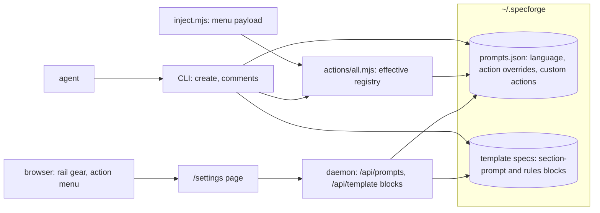

# Configuration pane: prompt customization

## TL;DR

<!-- sf:box class="panel" -->

A Configuration pane at the bottom of the home page's left rail, managing the prompt text that steers agents across SpecForge. The feasibility finding: SpecForge already has five distinct prompt surfaces, three of them already data-driven with delivery paths built (section prompts at `create`, rules at `verify`, action instructions at comment resolution), so the build reduces to storage plus a UI over seams that exist. This spec is the requirements pass: the inventory, the customization axes, and the scope. Review settled the scope on 2026-08-18: all five prompt axes ship in v1, including custom actions; store-wide only; users can hide, remove and edit shipped actions with a per-class reset to shipped values; the language preamble rides wherever the language contract already reaches; shipped rules get no severity UI. The design puts store-wide customizations in a new `prompts.json`, keeps per-type ones in the template blocks they already live in, merges action customizations inside the registry's existing exports so every consumer inherits them with zero call-site changes, and serves the pane as a `/settings` route behind a gear row in the rail. The plan is 5 stages, one PR each ([§11](#impl-plan)).

## 1 · Overview

SpecForge steers agents with written instructions everywhere: what a section should contain, what a spec type is judged against, what Visualize means, how spec prose must read. Today those instructions ship with the plugin, and changing any of them means editing source or editing a template spec's HTML by hand. A user who wants specs in a different register, a stricter open-questions discipline, or a Visualize that always prefers tables has no surface to say so.

The pane makes prompt text a first-class, user-owned setting: one place in the home page UI where the instructions agents receive can be read, edited, and returned to default.

## 2 · Prompt surfaces today

<!-- sf:section id="inventory" -->

Measured from the tree on 2026-08-18. This table is the ground the requirements stand on: column four is what the pane would change, column five is the delivery path the pane inherits for free.

| Surface | What it holds | Lives in | Customizable today? | Reaches the agent |
| --- | --- | --- | --- | --- |
| Section prompts | Per-type authoring guidance attached to one section. 2 ship: open-questions (mined from 44 corrections) and decisions (from 9). | Defaults in `lib/rules/template-defaults.mjs`; per-type overrides as a block in the template spec, parsed by `templatePrompts(type)` | partly by hand-editing template spec HTML; no UI | At `create`: returned in the `prompts` array, stripped from the scaffolded file |
| Rules | What a spec is judged against: 32 global rules plus per-type additions (research 5, design-impl 7, impl 7, design 1, general 1) and one override (deck turns `no-aphorisms` off). Each rule's `ask` and `fix` are agent-facing prose. | Global list in `lib/rules/global.mjs`; per-type blocks in template specs via `templateRules(type)` | partly per type by editing the template block; the global list is code | At `verify`: FIX / JUDGE / ADVISORY report |
| Action instructions | 15 actions (Visualize, Go deeper, Dismiss, ...), each an `instruction`; aside actions also an `importInstruction`. Mined from 242 action instances in 318 review comments. | `lib/actions/all.mjs`, hardcoded | no | At comment resolution: `specforge comments` hands the instruction to the agent on the thread |
| Language contract | The register every spec is written in: the sentence filter, the banned list, formatting rules. | `references/spec-language.md` + `templates/house-rules.md`, shipped files; the mechanical slice in `lib/spec-language.mjs` | no | Read by the authoring skills before writing; linted as `spec-language` |
| Templates | What a new spec starts from: shell, sections, TOC. | One protected template spec per type in the store | yes edited as a spec, full UI | Scaffolded at `create` |
| Skill instructions | The workflows themselves: how create-spec and review-spec operate. | 8 `SKILL.md` files in the plugin | no and loaded by Claude Code at session start, outside any SpecForge surface | Skill invocation |

<!-- sf:callout variant="note" -->

> The pattern already established twice: defaults ship in code, the store's copy wins when present, and an emptied or missing store copy falls back to the default. Templates did it first, PR #171 did it again for rules and prompts. The pane extends the same pattern to the surfaces that lack it, rather than inventing a new one.

## 3 · Requirements

#### Problem

The user who runs SpecForge daily wants agents steered their way: their language register, their section discipline, their meaning of each action. The instruction text exists and the delivery paths exist, but the only editing surfaces are source code and raw template HTML, so in practice nobody customizes anything.

#### Product requirements

| # | Requirement | Satisfied when |
| --- | --- | --- |
| P1 | One entry point | A Configuration affordance sits at the bottom of the home page's left rail, below Collections, and opens the pane. |
| P2 | Read before write | Every customizable prompt is visible in the pane with its current effective text, including the ones still at their shipped default. |
| P3 | Edit and revert | A prompt can be edited and saved, and a customized prompt can be returned to its shipped default in one action. The default text is never lost. |
| P4 | Changes take effect without restarts | The next `create`, `verify`, or action resolution reads the customized text. No daemon restart, no plugin reinstall. |
| P5 | Provenance is visible | The pane distinguishes shipped-default from customized at a glance, because a user debugging odd agent behaviour needs to know which prompts are theirs. |
| P6 | Reset per class | Each class of settings (Language, Sections, Rules, Actions) resets to its shipped values in one action, discarding every customization in that class. Owner requirement, 2026-08-18. |
| P7 | Templates live here too | The template specs are reachable from the configuration screen: a strip at the bottom of `/settings`, one card per type, each opening the template's own page for editing as usual. The home page's bottom-of-page strip is removed. Owner requirement, 2026-08-18: at the foot of the home page the templates sit below every spec and are hard to find. |

#### Engineering requirements

| # | Requirement | Satisfied when |
| --- | --- | --- |
| E1 | One override pattern | Custom prompts follow the existing rule: default in code, store copy wins, blank-or-missing falls back. No prompt has two competing override mechanisms. |
| E2 | Existing template blocks keep working | A section prompt or rule already customized in a template spec is not orphaned, duplicated, or silently outranked by the pane. |
| E3 | Comments stay resolvable | An action id referenced by an old comment (`@visualize` in a thread from May) resolves forever, whatever the pane does to instructions. Ids are immutable; only text changes. |
| E4 | Upgrade-safe | A plugin upgrade that improves a shipped default does not clobber a customization, and a customization does not pin the user to a stale default elsewhere. |
| E5 | Exportable | Customizations live in the store as data a future `import`/`export` or the SaaS org-templates path (spec f674e339c2, R8) can carry. Nothing lives only in UI state. |

## 4 · Customization axes

<!-- sf:section id="axes" -->

What the pane governs, ordered by how much machinery already exists. Q1 settled the scope at A through E; F is the one axis deferred (Q4).

| Axis | What the user can change | Machinery today | New build |
| --- | --- | --- | --- |
| A · Language direction | A store-wide authoring preamble: register, tone, verbosity, natural language ("write specs in Hindi", "shorter sentences", "no metaphors even in asides"). Delivered wherever an agent writes spec prose: create, review replies, asides. | The contract is shipped prose; nothing reads a user extension | Storage + a read point in `create`'s prompt payload and the comments payload. Small. |
| B · Section prompts | Add, edit, or remove the per-section guidance for each spec type, beyond the 2 that ship. | exists end to end parse, strip, deliver (PR #171). Only the editing UI is missing. | Pane UI writing the template spec's block. None of the pipeline. |
| C · Rules | Per type: switch a rule off, drop it to advisory, or raise it to blocking; add custom rules (`ask` + `fix`); edit the text of shipped per-type rules. | exists end to end severity overrides, custom rules, the deck precedent. Only the editing UI is missing. | Pane UI writing the template spec's rules block. |
| D · Action instructions | Edit any action's `instruction` and `importInstruction`; hide or remove shipped actions from the menu. A removed action's id still resolves on old threads (D3): removal is menu visibility, never registry deletion. | Registry is data in code; comments resolution reads it; no override layer | Storage (an overrides file), a merge in the registry, pane UI. |
| E · Custom actions | Create new actions: id, label, icon, kind, scope, instruction. | The registry validates ids and kinds; nothing loads user entries | Everything D needs plus creation UX, id collision rules, and menu placement. The costly axis, and in scope by owner decision (Q1). |
| F · Per-project scoping | A prompt that differs by project (client A's specs in their house style). | `.specforge/config.json` per project exists for machine settings; nothing scopes prompt text | A second override layer and a precedence rule. Doubles the mental model. |

## 5 · Goals & non-goals

<!-- sf:section id="goals" -->

#### Goals

- The pane exists at P1's location and covers axes A through E, satisfying P2 through P7.
- Every customization flows through the one override pattern (E1) and survives upgrades (E4).
- The requirements questions in [§8](#open-questions) are settled by review before any design detail is fixed. Settled 2026-08-18; the answers are recorded there and folded into [§7](#decisions).

#### Non-goals

| Out of scope | Why |
| --- | --- |
| Editing skill workflows (`SKILL.md`) | Loaded by Claude Code at session start from the plugin directory; SpecForge has no delivery path, and a stale-until-restart setting breaks P4's promise. |
| Editing the global rule list's text, or a severity UI for shipped rules | The 32 global rules are the product's opinion and the floor under every spec. The pane adds custom rules only (Q5, owner 2026-08-18); the deck-style severity override remains a hand edit to the template block. |
| Per-user prompts (multi-tenant) | The store is single-user. The SaaS spec (f674e339c2) owns org scoping; E5 keeps the data portable for it. |
| Prompting the model directly (temperature, model choice, system prompts) | BYOA: the agent is the customer's. SpecForge steers through instruction text it hands over, never through model configuration. |

<!-- sf:callout variant="constraint" -->

> KISS. Solve the problem in front of you, not a speculative future one. Cut anything not needed now.

## 6 · Design

#### Summary

A gear row pinned at the bottom of the left rail links to a server-rendered settings page at `/settings`, organized by axis: Language, Sections, Rules, Actions. Each entry shows the effective text, marked default or customized (P5), with edit and reset (P3); each class carries a reset-all-to-shipped control (P6). The Actions tab also creates custom actions and toggles shipped ones out of the menu. Storage splits by scope: per-type customizations (sections, rules) stay in the template specs' existing blocks (E2); store-wide ones (language, actions) live in a new `prompts.json`. Delivery needs no new channel: the action registry's existing exports become effective-set readers, so the browser menu, the CLI resolver and the aside routes pick up customizations with zero call-site changes.

#### Concepts

| Concept | What it is (plain words) | Inputs | Outputs |
| --- | --- | --- | --- |
| Prompt surface | A place where SpecForge hands written instructions to an agent | Shipped default text, optional store override | The effective text, delivered on its existing path |
| Override | The user's version of one prompt, stored as data in `~/.specforge` | Pane edits | Wins over the default while present; deletion restores the default |
| Effective text | What the agent actually receives: override if present, else default | The two above | One string per surface, shown verbatim in the pane |
| Class | One tab's worth of surfaces: Language, Sections, Rules, or Actions | The axes A through E, grouped by scope | The unit P6's reset operates on |

#### Architecture



Legend: added `prompts.json`, `/settings`, the two API routes · changed `actions/all.mjs`, `create`, `comments`, `inject.mjs`, the left rail · everything else untouched.

#### Current state, grounded in code

| Component | Current state (file ref) | Supports new design? | Change required |
| --- | --- | --- | --- |
| Action registry | 15 shipped actions; `menuActions()`, `menuGroups()`, `actionById()`, `forScope()`, `ALL_ACTIONS` are the only consumers' entry points · `lib/actions/all.mjs`, `lib/actions/index.mjs` | partly | The exports read shipped defaults merged with `prompts.json`: text overrides applied, hidden ids dropped from menus, custom actions appended. Signatures unchanged. |
| Menu delivery | `inject.mjs:222` embeds `menuActions()` in the served page | yes | Nothing: it inherits the effective set through the registry. |
| Action resolution | `specforge comments` resolves ids via `actionById()` · `lib/specforge-cli.mjs:676-689` | yes | Nothing: same inheritance. A hidden action still resolves (D6). |
| Section prompts and rules | Parsed from template-spec blocks; defaults seed at first run · `lib/store-templates.mjs`, `lib/rules/template-blocks.mjs` | partly | A write path: `updateTemplateBlocks(type, {prompts, rules})` re-rendering the block region of a template spec's HTML, plus daemon routes for the pane. |
| Language contract | Shipped prose; no user extension anywhere | no | `prompts.json.language`, delivered in `create`'s payload and the `comments` payload; the create-spec and review-spec skills read the field. |
| Left rail | Projects, Shared with me, Views, Collections · `server/index-page.mjs` | partly | A gear row pinned after Collections linking to `/settings`. |
| Templates strip | Rendered at the foot of the home page, below every spec group; hidden while filters are active · `server/index-page.mjs` (`tplCard`, `.tpls`) | partly | Moves to the bottom of `/settings` (P7): `tplCard` is reused, the home page's strip and its filter special-casing are deleted. |
| Store-wide JSON settings | `ui.json`, `project-shares.json`, `subscriptions.json`, each a small module with sanitize-on-read | yes | `lib/store-prompts.mjs` follows the same shape. |

#### Data model

`~/.specforge/prompts.json`, absent until first customized, sanitized on read like every store-wide file. Fields, before the table uses them: `language` is the preamble string; `hidden` lists shipped action ids kept out of menus; `overrides` maps a shipped id to replacement text; `custom` holds user-created action definitions.

```
{
  "language": "Write terse. No metaphors, even in asides.",
  "actions": {
    "hidden": ["summarize"],
    "overrides": {
      "visualize": { "instruction": "Prefer a table unless the content is a graph. ..." }
    },
    "custom": [
      { "id": "x_glossary", "label": "Glossary", "icon": "📖", "kind": "aside",
        "scope": "local", "group": "understand",
        "instruction": "Define every term of art in this block, one line each." }
    ]
  }
}
```

| Concern | Rule |
| --- | --- |
| Custom ids | Prefix `x_`, then the shipped id grammar. The prefix partitions the namespace, so a future shipped action can never collide with an existing custom one (E4 in both directions). A custom id, once used in a comment, is as immutable as a shipped one (D3): deleting the definition hides it from menus but resolution keeps answering from a tombstone of its last instruction. |
| Override keys | Only `instruction` and `importInstruction`. Label, icon, kind, scope and group of shipped actions are identity, not text, and stay fixed. |
| Reset (P6) | Language: delete the key. Actions: delete `hidden`, `overrides` and `custom`. Sections and Rules: re-render each template spec's block from `template-defaults.mjs`; the template's own content is untouched, because the block is the pane's territory and the shell is the Templates feature's. |
| Sanitize | Unknown keys dropped, ids validated, instructions capped at 4,000 characters (the longest shipped instruction is under 700; 4,000 leaves headroom without letting a paste of a whole document in). |

#### Interfaces

| Interface | Between | New or changed | Change |
| --- | --- | --- | --- |
| `readPrompts()` / `writePrompts(patch)` / `resetPromptClass(cls)` | store-prompts → registry, CLI, daemon | new | The `lib/store-prompts.mjs` module, shaped like `global-prefs.mjs`. |
| `ALL_ACTIONS`, `menuActions()`, `actionById()`, `forScope()` | registry → inject, CLI, store-api | changed semantics | Same signatures; the returned set is now defaults + overrides + custom, with `menuActions()` excluding hidden ids and `actionById()` not. |
| `create` output | CLI → agent | changed | The payload gains `language` beside `prompts`; empty when unset. |
| `comments` output | CLI → agent | changed | Top-level `language` field; the review-spec skill instructs the agent to honor it in replies and asides (D8). |
| `GET/PUT /api/prompts`, `POST /api/prompts/reset` | settings page → daemon | new | Read and patch `prompts.json`; reset takes `{class}`. |
| `GET/PUT /api/template/:type/blocks` | settings page → daemon | new | Read parsed prompts and rules for a type; PUT re-renders the blocks via `updateTemplateBlocks`. |
| `GET /settings` | browser → daemon | new | The pane, server-rendered like every page. |

#### The settings page

Four tabs matching the classes. Every entry renders the effective text with a default-or-customized marker (P5), an edit control, and a per-entry reset (P3); the tab header carries the class reset behind a confirm (P6). The Actions tab lists shipped actions with visibility toggles and edit affordances, then custom actions with create and delete. Sections and Rules tabs are grouped by spec type, mirroring where their data lives. The page reuses the home page's shell CSS and theme machinery; no build step, no framework.

Below the tab content, on every tab, sits the Templates strip (P7): one card per spec type, each a link to `/spec/template-<type>`, where a template is edited the way it always has been. It sits under the tabs rather than in one, because a template is the object the Sections and Rules tabs write into: whichever tab is open, the thing being configured stays one click away. The home page's `.tpls` strip is deleted in the same change, and the templates keep their store ids, protection and collection, so nothing about how a template works changes; only where you find it does.

#### Wireframes

Structure and affordances, not styling: boxes are placement, the shipped CSS supplies the look. One figure per surface.


<!-- sf:svg id="design-1" -->

*WF1 · The entry point: a gear row pinned at the bottom of the home page's left rail.*


<!-- sf:svg id="design-2" -->

*WF2 · The Language tab: one preamble, its provenance marker, save and both resets.*


<!-- sf:svg id="design-3" -->

*WF3 · The Actions tab: shipped list with visibility and an expanded editor, then custom actions with create.*


<!-- sf:svg id="design-4" -->

*WF4 · The Sections tab: per-type section prompts, edited where they already live.*


<!-- sf:svg id="design-5" -->

*WF5 · The Rules tab: shipped rules read-only per D9, custom rules editable, per type.*


<!-- sf:svg id="design-6" -->

*WF6 · The Templates strip at the bottom of the settings page, replacing the home page's foot-of-page strip (P7).*

#### Design options considered

| Option | Pros | Cons | Verdict |
| --- | --- | --- | --- |
| Dedicated `/settings` route | Testable with the same jsdom harness as every page; room for four tabs of textareas; the rail gear is a link, which cannot break the home page | A navigation, not an overlay; the "pane" is one click away rather than in place | chosen |
| In-page drawer over the rail | Zero navigation, literal reading of "pane" | Four classes of editable lists inside the home page's already 1,800-line renderer; every settings bug becomes a home page bug | rejected |
| Merge inside `actions/all.mjs` exports | Every consumer inherits the effective set; zero call-site changes; one place to test | The module gains a store read, where it was pure data | chosen |
| A parallel `effectiveActions()` API consumers migrate to | Keeps the pure module pure | Three call sites to migrate and a permanent trap: a new consumer importing the raw list bypasses customization silently | rejected |

## 7 · Decisions

D1 through D4 were provisional and stand; D5 through D9 record the review answers of 2026-08-18.

| # | Decision | Choice | Rationale |
| --- | --- | --- | --- |
| D1 | One override pattern or a new config system | Extend the existing default-in-code, store-copy-wins pattern | It has shipped twice (templates, then rules and prompts in PR #171) and its failure modes are known. Overturned only if Q4 demands per-project layering, which this pattern does not model. |
| D2 | Where the pane edits per-type prompts and rules | In the template spec's existing blocks, through the pane | E2. The blocks are already authoritative; the pane is a better editor for the same data, not a rival store. |
| D3 | Action ids under customization | Immutable; text-only edits | E3: the id is what an old comment carries, and `@visualize` in a May thread must resolve in September. Custom actions (axis E), if chosen in Q2, get new ids that never collide with shipped ones. |
| D4 | Does the pane hold machine settings too (port, tunnel, theme)? | No: prompts only | The ask is prompt customization, theme already has a toggle, and mixing "what agents are told" with "how the daemon runs" buries the feature's one idea. Overturned if the rail cannot justify two settings entry points later. |
| D5 | v1 scope | Axes A through E: language, section prompts, rules, action editing, custom actions | Owner, Q1. The wide option costs the creation UX and id governance up front and removes a second pane release from the roadmap. |
| D6 | What hide and remove mean for a shipped action | Menu visibility only; the registry entry and its id survive | Owner, Q2, bounded by E3: an id referenced by an old comment resolves forever, so removal can never be deletion. |
| D7 | Recovery from customization | Per-prompt reset (P3) plus per-class reset to shipped values (P6) | Owner, Q2. A class reset is what makes free-handed editing safe to offer: any tangle is one click from the shipped state. |
| D8 | Language direction's reach | The preamble travels with the language contract: every surface where an agent writes spec prose under the contract today (create, review replies, asides) also receives the preamble | Owner, Q3 ("wherever it reaches today"), read as the contract's current reach. The contract already governs all three surfaces, so one voice everywhere is the no-new-scope reading. |
| D9 | Shipped rules in the pane | Custom rules can be added; shipped rules get no severity control and no text editing | Owner, Q5. The deck-style override remains a hand edit to the template block; the pane never presents the floor as adjustable. |
| D10 | Pane form | A dedicated server-rendered `/settings` route; the rail gear is a link | Four classes of editable lists exceed a drawer, and a route is testable with the page harness every other page uses. The drawer alternative puts settings bugs inside the 1,800-line home renderer. |
| D11 | Where the customization merge lives | Inside `actions/all.mjs`'s existing exports | Zero call-site changes and no bypass trap: a parallel effective-set API would let a future consumer import the raw list and silently skip customization. Cost accepted: the module gains a store read. |
| D12 | Custom action id namespace | Mandatory `x_` prefix; deleted custom ids resolve from tombstones | The prefix partitions user ids from shipped ids permanently, so neither an upgrade nor a customization can collide (E4). Tombstones keep D3's promise for custom ids too. |
| D13 | Where templates are found | A strip at the bottom of `/settings`, under every tab; the home page strip is removed | Owner, 2026-08-18. Templates are configuration, and the Sections and Rules tabs write into them, so the configuration screen is where they belong; the foot of the home page put them below every spec. Editing is unchanged: a card opens the template's own page. Removal, not duplication, because two strips would drift and the home page loses its least-found furniture. |

## 8 · Open questions

These were the requirements gathering. All five were settled by the owner in review on 2026-08-18; each answer is recorded on its question and as a decision in [§7](#decisions).

- [x] **Q1 · resolved: (c), all of A through E Which axes are v1?** In plain words: the pane can start small or start full, and this decides which. (a) **A+B+C**: language direction plus the two axes whose pipelines exist end to end. Smallest build that changes daily authoring; actions stay as shipped. (b) **A+B+C+D**: also editable action instructions. Adds the overrides file and the registry merge; the pane covers every prompt an agent receives. (c) **A through E**: also custom actions. Adds creation UX and id governance; the costly minority of the feature. Recommendation: (b). Axis D is the one axis whose text encodes a personal working style (what Visualize means to you), and E can land later without rework because D builds its storage.
- [x] **Q2 · resolved: hide, remove and edit, with a per-class reset (P6, D6, D7) Can users hide shipped actions from the menu?** In plain words: the menu holds 15 entries; is pruning the menu part of customizing it? (a) **Yes**: a visibility toggle per action, stored with the text overrides. The menu becomes the user's; an id stays resolvable even while hidden (D3). (b) **No**: the menu is fixed; only text changes. One less state to explain, at the cost of menu pruning being absent. Recommendation: (a); it is one boolean beside data axis D already stores.
- [x] **Q3 · resolved: the contract's current reach, which is everywhere the agent writes (D8) How far does language direction reach?** In plain words: when you write "shorter sentences, no headings in asides", who obeys: only new specs, or every agent output? (a) **Create only**: the preamble rides the `prompts` array at scaffold time. Simplest; review replies and asides keep the shipped register. (b) **Everywhere the agent writes**: create, review batch payloads, action resolution. One preamble, one voice; costs a read in the comments path too. Recommendation: (b); a register that switches between the spec body and its asides reads as two authors.
- [x] **Q4 · resolved: (a), store-wide for v0 Store-wide only, or per-project overrides too?** In plain words: can client A's project have different prompts from client B's? (a) **Store-wide only**: one set of prompts for everything. One mental model; per-client styling waits. (b) **Store-wide plus per-project**: a second layer with project-beats-store precedence. Doubles the pane's state space and every "why did the agent do that" investigation. Recommendation: (a) for v1, with E5 keeping the data shaped so (b) can layer on without migration.
- [x] **Q5 · resolved: (b), custom rules only (D9) Can the pane silence global rules per type?** In plain words: the deck template already turns `no-aphorisms` off for decks; does that switch get a UI? (a) **Yes, severity control per rule per type**: off / advisory / blocking dropdowns in the Rules tab, writing the template block that already supports exactly this. The floor's text stays uneditable (a non-goal). (b) **No, custom rules only**: users add rules but cannot soften shipped ones from the UI; the deck-style override stays a hand edit. Recommendation: (a); the capability exists, the UI is a dropdown, and hiding it just preserves the hand edit.

## 9 · Design alignment

| Guidance (quoted) | Aligned / misaligned | How & why | Reference |
| --- | --- | --- | --- |
| "A rule that applies to one spec type lives in that type's template spec, as a sentence you edit in SpecForge" | aligned | D2 keeps template blocks authoritative; the pane is an editor over them, not a second store. | `templates/house-rules.md` |
| "What the comment carries is the id, not the instruction... lets an instruction be improved without rewriting comments already sent" | aligned | D3 is this rule extended to user edits: the id is the contract, the text is the setting. | `lib/actions/index.mjs` |
| "KISS: 2 people, 0 users, pre-funding; cut scope" | aligned | The recommendations in [§8](#open-questions) pick the narrower option in four of the five questions; axis D is argued for on its merits, and axis E and per-project scoping are explicitly deferred. | memory `feedback_kiss_principle` |
| "Org-scoped custom templates... a selling point for the standardization pillar" (R8) | aligned | E5 keeps every customization as store data, which is exactly what the SaaS tier would scope to an org. This feature builds the single-user half of that selling point. | spec f674e339c2, [§11](http://127.0.0.1:4180/spec/f674e339c2) |

## 10 · Invariants

Invariants that held before but are broken or changed by this design. State the old invariant and the new reality so downstream assumptions get revisited.

| Was true before | Now (after this design) | Who / what relied on it |
| --- | --- | --- |
| Two stores with the same plugin version steer agents identically. | Agent behaviour varies per store: the same action, section, or verify run can carry different instructions on different machines. | Debugging by reproduction: "it does X on my machine" stops implying it does X on yours. P5's provenance marking exists for exactly this. |
| An action's instruction text is fixed at plugin build time. | The instruction resolved on a thread is the effective text at resolution time, which a user may have edited since the comment was sent. | Nothing in code (the id-not-instruction rule anticipated this), but a thread's outcome is no longer fully predictable from its comment text alone. |
| The shipped section prompts are the only ones `create` can hand over. | The prompts array carries whatever the pane and template blocks define, including none. | The create-spec skill, which already treats the array as data. |
| Templates render on the home page, in a strip at the foot. | They render at the bottom of `/settings`; the home page does not mention them. | The home page tests that assert the `.tpls` strip and its show-only-when-unfiltered rule; they are rewritten against `/settings` in the same PR (task 3.5). |

## 11 · Implementation plan

<!-- sf:section id="impl-plan" -->

Stages & Tasks. One stage = one PR. Tests first, each new test run red against the unfixed code, and every UI stage ends with a rendered screenshot: three defects in the collaboration work were found by looking, not by green suites.

<!-- sf:callout variant="constraint" -->

> Local only. Nothing here publishes or needs a tunnel; the daemon under test is the in-process one from `test-e2e/harness.mjs`.

### Stage 0 · Test setup (PR 201)

- [x] 0.1 Add `seedPrompts(shape)` to `test/helpers/`: writes a `prompts.json` into the test store and returns the expected effective values per surface.
      verify: a test seeds an override, a hidden id and a custom action, and the helper's report matches a hand count
- [x] 0.2 Add `loadSettingsPage()`: renders `/settings` into a jsdom with `runScripts: 'dangerously'`, mirroring `test/helpers/index-dom.mjs`. Lands with a placeholder route so the harness exists before the page does.
      verify: the harness opens the route and executes its inline script

Two helpers so every later stage tests against a store with known customizations, without each test hand-writing JSON.

**Testing:** the helpers themselves · unit tests

**Verifiable output:** `node --test test/helpers-prompts.test.mjs` green

### Stage 1 · The store module and the effective registry (PR 202)

- [x] 1.1 Create `lib/store-prompts.mjs`: `readPrompts`, `writePrompts`, `resetPromptClass`, sanitize-on-read (unknown keys dropped, `x_` id grammar enforced, 4,000-char cap).
      verify: unit tests over each export, including a malformed file reading as empty rather than throwing
- [x] 1.2 Merge in `lib/actions/all.mjs`: overrides applied, hidden ids dropped from `menuActions()` but resolvable via `actionById()`, custom actions appended to their group, deleted custom ids resolving from tombstones.
      verify: tests per behaviour, run red first; the existing action tests pass unchanged with no prompts file present
- [x] 1.3 Screenshot the served action menu with a custom action present and a shipped one hidden.
      verify: the menu shows the custom entry in its group and omits the hidden one

The data layer and the merge. After this stage, a hand-written `prompts.json` already customizes the product end to end; the pane is not yet built.

**Testing:** the module, the merge, and the no-file degradation · unit tests plus one rendered menu

**Verifiable output:** `npm test` green; the menu screenshot

### Stage 2 · Language preamble delivery (PR 203)

- [x] 2.1 The `create` payload gains `language`; the `comments` payload gains a top-level `language` field. Both empty-string when unset.
      verify: tests seed a preamble and assert both payloads carry it verbatim; unset yields ''
- [x] 2.2 The create-spec and review-spec skills instruct the agent to honor the field in everything it writes.
      verify: both `SKILL.md` files name the field; the wait-batch hook text unchanged

The one axis with no pipeline today gets its two read points, so a hand-written preamble reaches every surface D8 names.

**Testing:** payload presence and passthrough · unit tests on both CLI commands

**Verifiable output:** a `create` run in a seeded store printing the preamble in its JSON

### Stage 3 · The settings page: Language and Actions (PR 204)

- [x] 3.1 Daemon routes: `GET/PUT /api/prompts`, `POST /api/prompts/reset` with `{class}`.
      verify: route tests through the in-process daemon, including reset leaving other classes untouched
- [x] 3.2 `GET /settings`: server-rendered page, Language and Actions tabs; effective text with default-or-customized marking (P5), per-entry edit and reset (P3), class reset behind a confirm (P6), visibility toggles, custom-action create and delete.
      verify: jsdom tests drive edit, reset, hide, create and class-reset against seeded stores, each red first
- [x] 3.3 The gear row pinned at the bottom of the left rail, linking to `/settings`.
      verify: a test asserts the row renders after Collections and carries the link; the home page suite passes unchanged
- [x] 3.4 Screenshot the page in both themes and at 420px.
      verify: both tabs legible in light and dark; no horizontal overflow at 420px
- [x] 3.5 Move the Templates strip (P7, D13): render `tplCard` per type at the bottom of `/settings`, delete the home page's strip and its filter special-casing, rewrite the strip's home-page tests against the settings page.
      verify: settings shows one card per type linking to its template; the home page renders no `.tpls`; a card click lands on the template spec page

The pane itself, covering the two store-wide classes, plus the rail entry point.

**Testing:** routes, every control, the rail row · daemon route tests and jsdom page tests

**Verifiable output:** screenshots of both tabs, both themes

### Stage 4 · Sections and Rules tabs, docs, journeys (PR 207)

- [x] 4.1 `updateTemplateBlocks(type, {prompts, rules})` in `store-templates.mjs`, re-rendering only the block region of a template spec's HTML; routes `GET/PUT /api/template/:type/blocks`.
      verify: a round-trip test writes a prompt and a custom rule, re-reads them through templatePrompts and templateRules, and the template's other content is byte-identical
- [x] 4.2 Sections and Rules tabs, grouped by type; class reset re-renders blocks from `template-defaults.mjs` (D9: shipped rules render read-only, custom rules editable).
      verify: jsdom tests per control; a reset restores the shipped two prompts and leaves the template shell untouched
- [x] 4.3 Docs and journeys: README's configuration section; export this spec to `docs/`; a journey covering customize, deliver, reset.
      verify: the journey seeds an override, sees it in a create payload, resets the class, and sees the default again

The per-type classes, edited where they already live, plus the closing documentation and journey work.

**Testing:** block round-trips, tab controls, the end-to-end journey · unit, jsdom and journey suites

**Verifiable output:** `npm test` green; a screenshot of the Rules tab showing a shipped rule read-only beside an editable custom one

## 13 · Runtime

Built across PRs [\#201](https://github.com/NitinJ/specforge/pull/201), [\#202](https://github.com/NitinJ/specforge/pull/202), [\#203](https://github.com/NitinJ/specforge/pull/203), [\#204](https://github.com/NitinJ/specforge/pull/204) and [\#207](https://github.com/NitinJ/specforge/pull/207), all merged by 2026-08-18.

#### Design decisions (implementation time)

Choices made where the spec was ambiguous.

- **A per-id `setOverride` operation beside the plain patch.** `writePrompts` merges `actions` one level down, so a patch carrying `overrides` replaced the whole map and saving one action dropped every other action's edits. Raised in review of #204.
- **Shipped and effective prompts are compared with whitespace collapsed.** A prompt is rendered into a template as one `<p>` per paragraph and parsed back as joined text, so a byte comparison against the shipped constant never matched and every row on an untouched store read as customized. Found by looking at the rendered tab, not by the suite.
- **Every action row carries its kind and scope.** Two shipped actions are both labelled Delete, one on a block and one on an aside, so the label alone did not say which row you were about to edit. Found by screenshot.
- **An emptied Language box sends `null`, not `''`.** Clearing in the store is explicit; an empty string merges as a no-op and would look like a save that silently did nothing.
- **A template reset names its class.** Sections and Rules share one file and one route, so a reset that named neither cleared both while the confirm named one tab. Raised in review of #207.
- **Enum fields are validated, not coerced.** A custom action declaring `kind: 'inplace'` is refused rather than filed as an aside, because a silent correction produces a menu entry that behaves unlike the one the author described.
- **Custom aside actions get a default import instruction.** `defineAction` requires one on an aside and the create form does not ask for it, so `DEFAULT_IMPORT_INSTRUCTION` is applied and can be edited afterwards.

#### Deviations

Intentional departures from the spec, and why.

- **The daemon gained a same-origin guard on every state-changing request.** Not in the spec. Raised as a P1 in review of #207 against the new reset route: a page on any site can aim a form at 127.0.0.1:4180, and the daemon had no origin check anywhere, so the guard went on the method rather than the route. Requests with no `Origin` are allowed, since that is a non-browser client and a browser cannot omit it on a write.
- **The blocks reset is `POST` on the blocks path with the class in the body.** Task 4.1 named `GET/PUT /api/template/:type/blocks` and did not say where a reset lives. A second route was rejected because the class is a body field on the prompts reset already.
- **Task 3.5 landed in stage 4's PR.** The templates strip moves to the settings page, and stage 3's PR was already in review when the destination existed.
- **Five journeys rather than the one task 4.3 named.** One per class, plus the custom-action lifecycle, in `test/config-journeys.test.mjs`. The single journey the plan described covers Language only, and the other three classes deliver through different readers.

#### Tradeoffs

Alternatives considered and why the chosen path won.

- **Sections and Rules write into the template specs, not a second store.** A store keyed by type would need a precedence rule against the template and a migration for templates already edited by hand. Cost of the choice: a write is whole-file, so resetting one class means reading the other back out and writing it again unchanged.
- **The merge lives inside `lib/actions/all.mjs`'s existing exports.** The alternative was an `effectiveActions()` a caller opts into, which is a second API a future consumer could import instead and silently skip customization. Cost: `SHIPPED_ACTIONS` stays exported for the settings page, which has to show what a reset would restore.
- **Hiding an action does not delete it.** An id inside a comment sent months ago has to resolve whatever the menu looks like today. Cost: two states to render per row, and a tombstone list that only grows.
- **State lives on the server.** Every write answers with the whole state and the page re-renders from it, so what is on screen is what the store holds rather than what the page hoped it wrote. Cost: a round trip per save, which is loopback.
- **The origin guard allows a missing `Origin`.** A per-page CSRF token would also stop a local non-browser attacker. That attacker already has the filesystem the store sits on, so the token buys nothing and would break the CLI and the suite.

#### What rendering caught that the suite did not

Three defects across five stages, none of them visible to a green run.

- Both shipped prompts reading as customized on an untouched store (the whitespace comparison above).
- Two rows both labelled Delete, indistinguishable in the list.
- `npm test` runs with `--test-force-exit`, which truncates the TAP summary: a real failure can show as zero `not ok` lines with exit code 1. The exit code is the only trustworthy signal.

## Appendix

| Reference | What it holds |
| --- | --- |
| `lib/rules/template-defaults.mjs` | The shipped section prompts and per-type rules the pane would override. |
| `lib/actions/all.mjs`, `lib/actions/index.mjs` | The 15 actions, their instructions, and the id-not-instruction rule D3 extends. |
| `lib/store-templates.mjs` | The default-in-code, store-copy-wins pattern D1 extends, and the template-block parsing E2 preserves. |
| `references/spec-language.md` | The language contract axis A extends without editing. |
| spec [f674e339c2](http://127.0.0.1:4180/spec/f674e339c2) | The SaaS research; its R8 (org-scoped templates) is the multi-user future E5 keeps the data shaped for. |
