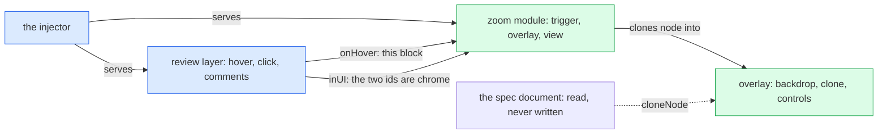
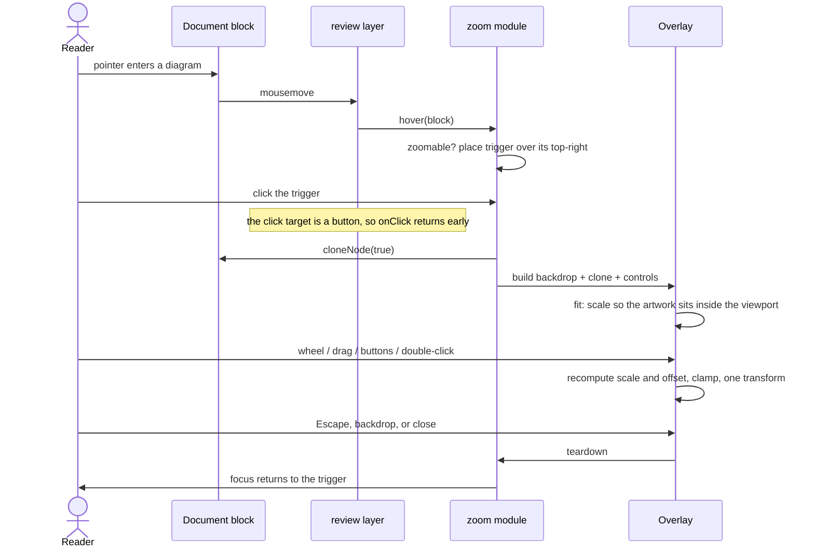

# Full-screen preview for diagrams and images

## TL;DR

<!-- sf:box class="panel" -->

A diagram in a spec is drawn at the document's reading width, around 820px, and several of them are unreadable at that size. This adds a full-screen preview with zoom and pan for the three things a spec draws with: rendered mermaid, inline SVG in a figure, and images. Every one of them opens at fit over a black backdrop, scales anywhere in `[fit / 2, 8]`, and pans by dragging.

The consequential decision is the affordance. A click on a block already means "comment on this", so the preview opens from a hover button that the review layer draws over the diagram rather than from the diagram itself. Nothing about commenting changes, and no markup is added to the document.

The risk is comment anchoring. Mermaid diagrams are anchored against their rendered text, so putting anything inside the block would move every existing comment on it. The preview clones what it shows and never moves the original.

## 1 · Overview

Builds on: spec cb25fc2943 (mermaid diagrams) · Assumes the reader knows: the review layer is injected into a served spec at request time and never written into the file

SpecForge serves each spec as a self-contained HTML file and injects a review layer over it: [`server/inject.mjs`](https://github.com/NitinJ/specforge/blob/main/server/inject.mjs) adds [`review.js`](https://github.com/NitinJ/specforge/blob/main/server/public/review.js) and [`review.css`](https://github.com/NitinJ/specforge/blob/main/server/public/review.css), which draw the comment rail, the header, the context menu and the hover affordances. The document itself is authored HTML and the layer never edits it.

Specs draw in three ways, all of which land in the document at the reading width set by `--maxw`:

| Form | In the document as | Written by |
| --- | --- | --- |
| Mermaid graph | `<pre data-lang="mermaid">`, replaced at render time with `<pre data-sf-mermaid="rendered">` holding an SVG | the author, as mermaid source |
| Hand-drawn picture | `<figure>` containing inline `<svg>` | the author, as SVG |
| Image | ``, usually a data URI | markdown import, which inlines rasters |

None of them can be enlarged. A reader who cannot make out a label opens the spec's HTML file directly, or gives up. This spec adds one way to enlarge all three.

## 2 · Requirements

The problem, and what must be true when this ships. Numbered (P#, E#) so later sections can cite them. No solutions or implementation hints here; the Design section is the "how". A requirement no human has confirmed is marked assumed.

#### Problem

A diagram is drawn at the document's reading width and cannot be made larger. Mermaid sizes an SVG to its content and the review layer caps it with `[data-sf-mermaid] svg { max-width: 100% }`, so a graph with twenty nodes is drawn in the same 820px a graph with three nodes gets, and its labels shrink to fit. The same cap applies to a figure's SVG and to an imported image.

Evidence: [`server/public/review.css`](https://github.com/NitinJ/specforge/blob/main/server/public/review.css) L318 caps diagram SVGs; `--maxw` in every spec shell sets the reading width. Reported by Nitin, 2026-08-26.

#### Product requirements

| # | When this ships, a user can… | Confirmed by |
| --- | --- | --- |
| P1 | Open any rendered mermaid diagram, figure SVG or image full-screen, in one action from where it sits in the document | Nitin, 2026-08-26 |
| P2 | Zoom that preview in and out, and pan it by dragging once it is larger than the viewport | Nitin, 2026-08-26 |
| P3 | See the diagram over a dark backdrop that dims the document behind it | Nitin, 2026-08-26 |
| P4 | Close the preview and be back exactly where they were in the document, with the same scroll position | assumed |
| P5 | Still comment on a diagram by clicking it, exactly as before this shipped | assumed |

#### Engineering requirements

| # | Constraint the design must satisfy | Confirmed by |
| --- | --- | --- |
| E1 | No change to the spec HTML on disk. The preview is review-layer chrome, injected at serve time, and a spec exported or opened as a file is byte-identical to one that was never previewed | assumed |
| E2 | No comment anchor moves. Mermaid blocks are anchored against their rendered text, so nothing may be inserted into or removed from a commentable block | assumed |
| E3 | Zero new runtime dependencies. SpecForge ships Node built-ins only, and the review layer is hand-written ES5-compatible JavaScript with no build step | README, "runtime deps 0" |
| E4 | Works on a published copy, which is served the same review layer with a reduced meta and no write endpoints | assumed |
| E5 | Keyboard reachable and screen-reader safe: the preview takes focus, traps it while open, and returns it to the control that opened it | assumed |

## 3 · Goals & non-goals

<!-- sf:section id="goals" -->

#### Goals

The requirements this spec commits to, as verifiable outcomes. Every goal cites a requirement; a goal with none is cut, or the requirement is added.

| Goal | Success criterion | Satisfies |
| --- | --- | --- |
| One affordance covers all three drawing forms | A jsdom test opens a preview from a rendered mermaid block, a figure SVG and an image, and asserts the same overlay in all three | P1 |
| Zoom from fit to 8x, pan when larger than the viewport | Wheel, buttons and double-click each change the scale; a drag past fit moves the content and is clamped to its bounds | P2 |
| Commenting is untouched | The existing review-client suite passes unchanged, and a click on a diagram body still opens a composer | P5 |
| The document is never modified | A test asserts the served HTML is byte-identical before and after a preview opens and closes, and that the block's `textContent` is unchanged | E1, E2 |
| Usable without a mouse | The trigger is a real button in tab order; Escape closes; focus returns to the trigger | E5 |

#### Non-goals

What a reviewer might expect this work to cover and it deliberately does not.

| Not doing | Reason |
| --- | --- |
| Zooming tables, code blocks or arbitrary text | Out of scope. A table reflows and a code block scrolls, so neither is unreadable at reading width. Only the three drawing forms are capped |
| Downloading or opening the diagram in a new tab | Not worth the cost. Export already writes diagrams as files, and a data-URI image has no meaningful filename |
| Commenting from inside the preview | Out of scope. Comments anchor to blocks in the document, and a second surface that creates them is a second set of anchoring rules |
| Editing, rotating or measuring the diagram | Out of scope. This is a reading aid |
| Per-node interaction in a mermaid diagram | Handled elsewhere: a rendered diagram is deliberately one block ([`review.js`](https://github.com/NitinJ/specforge/blob/main/server/public/review.js) L2600-L2607), and per-node comments are a standing non-goal |

## 4 · Design

#### Summary

The review layer gains one module. It watches for a hover over any of the three drawing forms, draws a small button over that block's top-right corner, and on activation clones what the block shows into a full-screen overlay it owns. The overlay holds a black backdrop at 85% opacity, the clone, and a control strip. Scale and offset are two numbers in the module's own state, applied to the clone as a single CSS transform; nothing else on the page moves.

Three choices carry the design. The trigger is a button rather than a click on the diagram, because a click on a block already means "comment on this". The button is review-layer chrome positioned over the block rather than an element inside it, because a mermaid block's comment anchors are recorded against its rendered text. The overlay shows a clone rather than the original node, because moving the original empties the block and breaks both the block registry and every comment anchored to it.

#### Concepts

Define the concepts and their hierarchy before the boxes. Plain language.

| Concept | What it is (plain words) | Inputs | Outputs |
| --- | --- | --- | --- |
| Zoomable | The artwork the preview opens for a hovered block: a rendered mermaid `pre`, a `figure` holding an `svg` or `img`, an `img`, or the single `img` a block holds | the hovered commentable block | an element, or nothing |
| Trigger | The button drawn over a hovered zoomable. One element, moved between blocks rather than one per block | the hovered zoomable | an activation carrying that block |
| Preview | The full-screen overlay: backdrop, the cloned artwork, and the controls | a zoomable | a modal surface, closed by Escape, the backdrop, or its close button |
| View | The scale and the x,y offset the clone is drawn at. Fit is the scale at which the artwork sits entirely inside the viewport | wheel, drag, buttons, double-click | one CSS transform |

#### Architecture

One responsibility per component. Say why each boundary sits where it does, not only what it is.

| Component | Responsibility (one) | Change |
| --- | --- | --- |
| [`server/public/zoom.js`](https://github.com/NitinJ/specforge/tree/main/server/public) | Everything in this spec: recognising a zoomable, the trigger, the overlay, and the view maths | added |
| [`server/public/zoom.css`](https://github.com/NitinJ/specforge/tree/main/server/public) | The trigger and overlay styling, in the review layer's `--sf-*` tokens | added |
| [`server/inject.mjs`](https://github.com/NitinJ/specforge/blob/main/server/inject.mjs) | Serves the review layer's assets into a spec response; gains two more | changed |
| [`server/public/review.js`](https://github.com/NitinJ/specforge/blob/main/server/public/review.js) | Owns hover and click on blocks; gains a call telling zoom which block is hovered, and one id in `inUI` | changed |

A separate file rather than more of [`review.js`](https://github.com/NitinJ/specforge/blob/main/server/public/review.js): that file is already past 4,000 lines and owns comments, the rail, the menu and the header, none of which this touches. The two things zoom needs from it are a hover signal and an exemption from the comment click, and both are one line.



Legend: changed (blue) · added (green). The document is read and never written, which is E1.

#### Current state, grounded in code

For each component that already exists: exact file path, symbol, and lines you have read. Never from memory. Anything not read is marked unverified.

| Component | Current state (path · symbol · lines) | Supports new design? | Change required |
| --- | --- | --- | --- |
| Hover tracking | [`review.js`](https://github.com/NitinJ/specforge/blob/main/server/public/review.js) · `onHover` / `clearHover` · L2899-L2931. Sets `.sf-hover` on the block under the pointer and clears it on the way out | yes | Two calls: tell zoom which block is hovered, and tell it when nothing is |
| Block click | [`review.js`](https://github.com/NitinJ/specforge/blob/main/server/public/review.js) · `onClick` · L2933-L2953, registered in the capture phase. Opens a composer on the block clicked, unless the target is in the review UI or matches `INTERACTIVE` | yes | None. `INTERACTIVE` is `'a,button,input,textarea,select,summary,label'` (L190), so a `button` trigger is already exempt |
| Chrome test | [`review.js`](https://github.com/NitinJ/specforge/blob/main/server/public/review.js) · `inUI` · L4029-L4046. Walks ancestors for a known review-layer id | partly | Add `sf-zoom` and `sf-zoom-btn`, so hovering or clicking either is not read as touching the document |
| Mermaid render | [`review.js`](https://github.com/NitinJ/specforge/blob/main/server/public/review.js) · L928-L970. Replaces the `pre`'s text with the rendered SVG and sets `data-sf-mermaid="rendered"`; keeps the source on `data-sf-src` | yes | None. `[data-sf-mermaid="rendered"]` is the selector for the first zoomable kind |
| Diagram as one block | [`review.js`](https://github.com/NitinJ/specforge/blob/main/server/public/review.js) · `DIAGRAM_SEL` / `diagramOf` · L2607-L2612. Collapses everything inside a rendered diagram to the diagram itself | yes | None. It already guarantees the trigger has exactly one block to attach to per diagram |
| Escape handling | [`review.js`](https://github.com/NitinJ/specforge/blob/main/server/public/review.js) · L1115-L1123. One document-level `keydown`; returns early when `SFUI.dialogOpen()` so a modal answers Escape first | partly | The overlay registers its own `keydown` and stops propagation, so Escape closes the preview without also collapsing the thread behind it |
| Asset serving | [`server/inject.mjs`](https://github.com/NitinJ/specforge/blob/main/server/inject.mjs) · L278 injects `<script src="/public/review.js" defer>`; [`server/static.mjs`](https://github.com/NitinJ/specforge/blob/main/server/static.mjs) serves `/public/*` from `server/public/` | yes | Two more tags. No new route |
| Published copy | [`review.js`](https://github.com/NitinJ/specforge/blob/main/server/public/review.js) · `isPublishedCopy()`, used to hide the connection chip and the composer | yes | None. Zoom is read-only and is deliberately NOT gated on it (E4) |

#### Interfaces

Every touched boundary (component APIs, service / HTTP APIs, frontend↔backend contracts, events / queues) with its full signature, types, and error contract. Interfaces are the review surface. Two views: the table for agents, the diagram for humans.

| Interface | Between (components) | New or changed | Signature / contract | Errors |
| --- | --- | --- | --- | --- |
| `window.SFZoom.hover(el)` | the review layer → the zoom module | new | `(el: Element\|null) => void`. Called from `onHover` with the block under the pointer, and from `clearHover` with `null`. Moves or hides the trigger | None. Absent `SFZoom` is a no-op, so [`review.js`](https://github.com/NitinJ/specforge/blob/main/server/public/review.js) keeps working if [`zoom.js`](https://github.com/NitinJ/specforge/tree/main/server/public) fails to load (I5) |
| `window.SFZoom.open(el)` | the zoom module → itself; exported for tests | new | `(el: Element) => boolean`. Opens the preview on a zoomable; returns false and does nothing for anything else | Returns false rather than throwing. A block whose artwork cannot be cloned leaves the document untouched |
| `window.SFZoom.close()` | the zoom module → itself; exported for tests | new | `() => void`. Removes the overlay and restores focus to the trigger. Safe to call when nothing is open | None |
| `inUI(t)` | internal to the review layer | modified | before: matches nine review-layer ids · after: the same plus `sf-zoom` and `sf-zoom-btn` | None. A missed id would make the trigger read as document content and open a composer behind the overlay |

#### What the reader does, and what happens

The whole interaction. Nothing here reaches the server: the preview is client-side and the document is read, never written.



#### The view, exactly

| Input | Effect | Bound |
| --- | --- | --- |
| Open | Scale is *fit*: `min(1, viewportW / artW, viewportH / artH)` against a viewport inset by 48px. Offset is centred | Never opens larger than 1x, so a small image is not blurred on arrival |
| Wheel, or pinch | Multiplies scale by `exp(-deltaY / 400)`, anchored on the pointer so the point under the cursor stays under it | Clamped to `[fit / 2, 8]` |
| Drag | Adds the pointer delta to the offset | Clamped so the artwork's bounding box always overlaps the viewport by at least 64px on each axis |
| Double-click | Toggles between fit and 2x, anchored on the pointer | The same clamp |
| Buttons: −, reset, + | Steps scale by a factor of 1.4, anchored on the viewport centre; reset returns to fit and re-centres | The same clamp |
| Keyboard: `+` `-` `0`, arrows | The same steps as the buttons; arrows nudge the offset by 64px | The same clamp |

Scale and offset are applied as one `transform: translate(x,y) scale(s)` on a wrapper around the clone, so the browser composites it rather than re-laying-out an SVG on every frame.

#### Failure paths

| Failure | What happens | What the reader sees |
| --- | --- | --- |
| [`zoom.js`](https://github.com/NitinJ/specforge/tree/main/server/public) fails to load or throws at boot | `window.SFZoom` is absent; [`review.js`](https://github.com/NitinJ/specforge/blob/main/server/public/review.js)'s call is guarded | The document exactly as it is today. No trigger, and commenting is unaffected |
| A mermaid diagram that never rendered (`data-sf-mermaid="error"`) | Not a zoomable: its content is source text, not artwork | No trigger on it. The existing error box is unchanged |
| An image whose `src` is broken | The clone carries the same broken `src` | The overlay opens on a broken-image box, which is what the document already shows. Not special-cased |
| The block is removed while the preview is open (a live reload) | The clone is independent of the original, so the overlay is unaffected | The preview stays until closed. Closing returns focus to the document, and the trigger is re-placed on the next hover |
| Artwork with no measurable size | Fit falls back to scale 1 and a centred offset | The artwork at its natural size, pannable |

#### Design options considered

2-3 real alternatives, honest tradeoffs, no strawmen.

| Option | Pros | Cons | Verdict | Evidence that would change it |
| --- | --- | --- | --- | --- |
| **Hover trigger, cloned artwork** | Leaves the comment click alone. Adds nothing to the document, so anchors and the block registry are untouched. One overlay, one trigger, whatever the page holds | A hover affordance is invisible until hovered, and invisible entirely on a touch device until the trigger is also placed on tap | chosen It is the only option that satisfies both P5 and E2 without qualification | A reader failing to discover the trigger. The answer would be a persistent low-opacity trigger rather than a hover one, which is a CSS change |
| Click the diagram to zoom, comment some other way | Needs no affordance to be discovered: a reader who clicks a picture expects it to enlarge. No trigger to place or style | Takes the click away from commenting on diagrams, which is where a design review's comments already sit, and every existing comment on a diagram was made that way | rejected Breaks P5, which is the one thing this feature must not cost | Nothing short of dropping per-diagram comments |
| Modifier-click or double-click the diagram | No trigger. The plain click stays with commenting | Undiscoverable without being told. Double-click on a text-bearing SVG selects text first, and a modifier is a different key on each platform | rejected Fails P1's "in one action from where it sits", since the action has to be learned first | Measuring that readers find it. There is no way to measure it: SpecForge has no telemetry |
| Move the original node into the overlay, put it back on close | No clone, so no risk of the two diverging. Half the memory on a large SVG | The block is empty while the preview is open. The block registry reconciles against the page, and any live reload or reconcile during that window sees a diagram that has lost its content | rejected Breaks E2, and the failure is silent: comments would re-anchor and nobody would know why | Nothing. Reconcile runs on a timer that cannot be suspended safely |
| A library (medium-zoom, panzoom) | Written and tested by someone else. Handles pinch and inertia | A runtime dependency, which SpecForge has none of, and the review layer has no build step to bundle one with | rejected Breaks E3 | The maths turning out to be more than about 150 lines. It is a transform and two clamps |

## 5 · Testing

The strategy, not the test list. Tests at interfaces over tests coupled to internals; the failure paths from [§4](#design) covered, not only the happy path.

#### Coverage by layer

| Layer | What it covers | Why at this layer |
| --- | --- | --- |
| Unit | The view maths as pure functions: fit, the anchored zoom step, and the pan clamp | They are arithmetic with edge cases (zero-size artwork, a viewport smaller than the minimum inset) that a DOM test would exercise only by accident |
| Integration (jsdom) | Everything else: recognising each of the three zoomable forms, placing the trigger, opening and closing, focus behaviour, and that the document is unchanged throughout | The existing review-layer suite is jsdom and boots the real [`review.js`](https://github.com/NitinJ/specforge/blob/main/server/public/review.js) against a real DOM, so a zoom test sits beside comment tests and catches interaction between them |
| Browser | One walkthrough: open a preview on a real rendered mermaid diagram, wheel-zoom, drag, close | jsdom has no layout, so `getBoundingClientRect` is zero everywhere and neither fit nor the clamp can be observed there. This is the layer where the maths is actually seen |

#### Risk and invariant coverage

One row per risky tradeoff in [§4](#design) and per invariant in [§9](#invariants). An invariant with no row is untested.

| Risk / invariant | Exercised by | Failure path covered |
| --- | --- | --- |
| I1: the document is never written | jsdom: capture `document.body.innerHTML` outside the review layer before opening, open, close, compare | Any future change that reaches for the original node instead of a clone |
| I2: no commentable block's text changes | jsdom: `textContent` of the diagram block before and after, plus a comment anchored to it still resolving | A trigger accidentally rendered inside the block |
| I3: a click on a diagram still opens a composer | jsdom: the existing composer test re-run with [`zoom.js`](https://github.com/NitinJ/specforge/tree/main/server/public) booted | The overlay or trigger swallowing the click that commenting needs |
| I4: Escape closes the preview and nothing else | jsdom: open a thread, open a preview over it, press Escape, assert the preview is gone and the thread is still open | The document keydown collapsing the thread behind the modal |
| I5: a broken [`zoom.js`](https://github.com/NitinJ/specforge/tree/main/server/public) cannot break [`review.js`](https://github.com/NitinJ/specforge/blob/main/server/public/review.js) | jsdom: boot [`review.js`](https://github.com/NitinJ/specforge/blob/main/server/public/review.js) with `window.SFZoom` deleted, and again with one that throws | The guard being dropped when the call site is refactored |
| I6: scale stays within its bounds | Unit: 200 random wheel and step sequences, asserting the invariant after each | An anchored zoom that clamps the scale but not the offset, letting the artwork leave the viewport |

#### Test infrastructure to build first

- A jsdom fixture body carrying all three zoomable forms plus a non-zoomable paragraph and an errored mermaid block, so every test names the case it means rather than counting.
- A rect stub for jsdom, since it reports every element as 0x0. One helper that gives named elements a size, so fit and clamp are observable in the integration tier.
- An extension to [`test/helpers/review-dom.mjs`](https://github.com/NitinJ/specforge/blob/main/test/helpers/review-dom.mjs) to inject [`zoom.js`](https://github.com/NitinJ/specforge/tree/main/server/public) beside [`review.js`](https://github.com/NitinJ/specforge/blob/main/server/public/review.js), matching how the server serves them.

#### Deliberately not tested

- Pinch on a real touch screen. Pointer events are tested, but no device is available in CI and the browser tier is driven headless.
- Rendering fidelity of the cloned SVG. It is the same node the browser already drew; asserting it looks right is asserting the browser works.

## 6 · Decisions

One row per consequential decision: controversial, reversible-but-expensive, or one a future maintainer will ask about. The full reasoning stays in [§4](#design); cite it. A decision the agent made alone is marked so reviewers scrutinise it first.

| # | Context | Decision | Consequences | Status · accepted by |
| --- | --- | --- | --- | --- |
| D1 | A click on a block already opens a comment composer, and a diagram is a block like any other | The preview opens from a hover button, not from the diagram ([§4](#design) Design options considered) | easier: commenting is untouched · harder: the affordance has to be discovered · forecloses: nothing, since a click could be added later without removing the button | proposed · agent |
| D2 | Mermaid comment anchors are recorded against rendered text, so any node added inside the block moves them | The trigger is review-layer chrome positioned over the block, never a child of it ([§4](#design) Architecture) | easier: no anchor risk, one trigger for the whole page · harder: the trigger must be repositioned on scroll and resize · forecloses: a per-diagram toolbar with several buttons, which would need the same treatment | proposed · agent |
| D3 | The overlay needs the artwork, and the document needs to keep it | Clone the node into the overlay; the original never moves ([§4](#design) Design options considered) | easier: the block registry and reconcile never see a change · harder: a large SVG exists twice while the preview is open · forecloses: nothing | proposed · agent |
| D4 | SpecForge ships zero runtime dependencies and the review layer has no build step | The zoom and pan maths is written here, about 150 lines ([§4](#design) The view, exactly) | easier: no bundling, no supply chain · harder: pinch, inertia and accessibility are ours to get right · forecloses: nothing | proposed · agent |
| D5 | A published copy is served the same review layer with no write endpoints | The preview works there, ungated ([§4](#design) Current state) | easier: a reviewer holding a link can read a diagram · harder: nothing, since it writes nothing · forecloses: nothing | proposed · agent |
| D6 | A small image blown up to fill a large screen looks worse than it does in the document | Fit never exceeds 1x on open; the reader zooms past it deliberately ([§4](#design) The view, exactly) | easier: the preview never looks broken on arrival · harder: a small diagram opens no larger than it already was, so the first action is always a zoom · forecloses: nothing | proposed · agent |
| D7 | A new file competes with putting this in [`review.js`](https://github.com/NitinJ/specforge/blob/main/server/public/review.js) | [`zoom.js`](https://github.com/NitinJ/specforge/tree/main/server/public) is its own module, injected beside [`review.js`](https://github.com/NitinJ/specforge/blob/main/server/public/review.js) ([§4](#design) Architecture) | easier: [`review.js`](https://github.com/NitinJ/specforge/blob/main/server/public/review.js) does not grow, and zoom can fail without taking commenting with it · harder: one more asset to inject and one more file in the test harness · forecloses: nothing | proposed · agent |

## 7 · Open questions

Everything genuinely unresolved, each with a recommendation. Set `data-sf-q` to `resolved` or `dropped` once settled. If nothing is open, say so here rather than removing the section.

- [x] **Q1 resolved** Should the trigger also appear on a plain tap on a touch device, where there is no hover? Why it matters: on a phone or tablet the feature is unreachable as designed, because the trigger only appears on hover and a tap goes straight to the comment composer. Options: leave it desktop-only / show the trigger permanently at low opacity on coarse-pointer devices / make a tap place the trigger and a second tap open it. Shipped: the permanent trigger at 60% opacity under `@media (pointer: coarse)`, one CSS block and no new interaction. Reversing it is deleting that block. Nitin still owns the taste call on whether the quiet trigger reads as clutter on a tablet.
- [x] **Q2 resolved** Should the preview cover the comment rail, or sit beside it? Why it matters: a reader zooming a diagram to answer a comment loses sight of the comment. Options: full-screen over everything / leave the rail visible and use the remaining width. Shipped: full-screen, because the rail is 380px of the very width the diagram needs, and the comment is one Escape away.

## 8 · Design alignment

#### Traceability

Every requirement maps to a design element and a stage. A requirement with no row is uncovered; a design element serving no requirement is listed last and either justified or cut.

| Requirement | Design element ([§4](#design)) | Stage ([§10](#impl-plan)) | Gap |
| --- | --- | --- | --- |
| P1 open any of the three forms | Zoomable recognition; the trigger | 2 | none |
| P2 zoom and pan | The view, exactly | 3 | none |
| P3 dark backdrop | Preview concept; [`zoom.css`](https://github.com/NitinJ/specforge/tree/main/server/public) | 2 | none |
| P4 close and return unchanged | Preview teardown; focus restore | 2 | none |
| P5 commenting unchanged | Trigger as a `button`, already exempt via `INTERACTIVE` | 2 | none |
| E1 document never written | Clone, not move; chrome, not children | 2 | none |
| E2 no anchor moves | Trigger positioned over the block, never inside it | 2 | none |
| E3 zero dependencies | The view maths written here | 1 | none |
| E4 works on a published copy | Ungated by `isPublishedCopy()` | 2 | none |
| E5 keyboard and screen reader | Real button, focus trap, focus restore | 4 | none |
| none | Keyboard zoom shortcuts (`+ - 0`, arrows) | 4 | Stays. E5 requires the preview be usable without a mouse, and a preview that opens but cannot be zoomed by keyboard satisfies the letter of it and not the point |

#### Conformance with existing guidance

Docs, for_agents / agent docs, memory docs, gotchas, RFCs, style guides, architectural patterns, and past specs. Quote the guidance, say how this design aligns or diverges, link the source. A deviation is allowed; a deviation reviewers discover themselves is a spec defect.

| Guidance (quoted) | Aligned / misaligned | How & why | Reference |
| --- | --- | --- | --- |
| "Node built-ins only at runtime." | aligned | No dependency is added. The view maths is written in the module | [`README.md`](https://github.com/NitinJ/specforge/blob/main/README.md), Contributing |
| "Comments explain why, not what. If a line is surprising, say what it prevents." | aligned | The clone, the chrome-not-child rule and the Escape stopPropagation each carry the defect they prevent | [`README.md`](https://github.com/NitinJ/specforge/blob/main/README.md), Contributing |
| "Per-node comments are a deliberate non-goal in v1; this is what makes that true rather than merely intended." | aligned | The preview does not comment at all, and a rendered diagram stays one block | [`review.js`](https://github.com/NitinJ/specforge/blob/main/server/public/review.js) L2600-L2606 |
| "KISS. 2 people, 0 users, pre-funding; cut scope." | aligned | Non-goals cut downloading, rotating, measuring, commenting from the preview, and zooming anything that is not artwork | house guidance |
| "No em dashes, no filler, claims separable from confidence." | aligned | This spec is written to it; the advisory lint is clear | [`references/spec-language.md`](https://github.com/NitinJ/specforge/blob/main/references/spec-language.md) |

## 9 · Invariants

The contract implementation agents must never break, written for an implementer who follows it literally. Each invariant is a falsifiable assertion ("no two X ever share a Y"), not an aspiration.

#### Invariants this design introduces

| # | Assertion | Enforced by | On violation |
| --- | --- | --- | --- |
| I1 | No node outside the review layer is added to, removed from, or moved within the document by anything in this feature | test `zoom-document-untouched`: the body's HTML outside review chrome is byte-identical across an open and close | The preview shows artwork the document no longer has, and reconcile re-anchors comments on the next pass |
| I2 | No commentable block's `textContent` changes while a preview is open or after it closes | test `zoom-anchors-hold`: `textContent` compared, and a thread anchored to the diagram still resolves | Every comment on that diagram re-anchors, silently, and points at the wrong block |
| I3 | A click on a zoomable's body still opens a comment composer on it | test `zoom-click-still-comments`, run with [`zoom.js`](https://github.com/NitinJ/specforge/tree/main/server/public) booted | Diagrams become uncommentable, which is the one cost this feature must not have |
| I4 | Escape closes the preview and changes nothing else on the page | test `zoom-escape-scoped`: a thread open behind the preview is still open afterwards | A reader loses an unposted draft to a keypress meant to close a picture |
| I5 | Every call from [`review.js`](https://github.com/NitinJ/specforge/blob/main/server/public/review.js) into [`zoom.js`](https://github.com/NitinJ/specforge/tree/main/server/public) is guarded, so an absent or throwing [`zoom.js`](https://github.com/NitinJ/specforge/tree/main/server/public) leaves [`review.js`](https://github.com/NitinJ/specforge/blob/main/server/public/review.js) working | test `zoom-absent-is-safe`: [`review.js`](https://github.com/NitinJ/specforge/blob/main/server/public/review.js) booted with `SFZoom` deleted, and with one that throws | One broken asset takes commenting down with it |
| I6 | Scale stays within `[fit / 2, 8]` and the artwork always overlaps the viewport by at least 64px on each axis | unit tests over the view functions, including randomised sequences | The reader pans the artwork off screen and has no way back except closing |
| I7 | The preview holds focus while open and returns it to the trigger on close | test `zoom-focus-returns` | A keyboard reader is dropped at the top of the document every time they close a picture |

#### Existing invariants this design touches

Found by reading code, tests, assertions, schema constraints, and prior specs, not by assumption. If none are affected, say so and state how that was verified.

| Invariant (as established) | Established / enforced at | Effect | Detail |
| --- | --- | --- | --- |
| A rendered mermaid diagram is exactly one commentable block | [`review.js`](https://github.com/NitinJ/specforge/blob/main/server/public/review.js) `DIAGRAM_SEL` / `diagramOf` L2607-L2612; asserted in the block-targeting tests | preserved | The trigger is not a block and is not inside one, so `commentableBlocks()` returns the same set with zoom loaded |
| Review chrome is never treated as document content | [`review.js`](https://github.com/NitinJ/specforge/blob/main/server/public/review.js) `inUI` L4029-L4046 | preserved | Extended with the two new ids, which is what keeps it true rather than what weakens it |
| A modal answers Escape before the document handler does | [`review.js`](https://github.com/NitinJ/specforge/blob/main/server/public/review.js) L1115-L1120, via `SFUI.dialogOpen()` | preserved | The overlay's own handler stops propagation, achieving the same outcome by the same rule |
| The block registry reconciles against what is on the page | [`reconcile.js`](https://github.com/NitinJ/specforge/blob/main/server/public/reconcile.js), driven from [`review.js`](https://github.com/NitinJ/specforge/blob/main/server/public/review.js) on load and after a live reload | preserved | I1 is exactly the statement that reconcile sees no difference |
| The review layer writes nothing to the spec file | [`server/inject.mjs`](https://github.com/NitinJ/specforge/blob/main/server/inject.mjs): injection happens per response, never on disk | preserved | Two more injected assets, no new write path |

## 10 · Implementation plan

<!-- sf:section id="impl-plan" -->

Stages & Tasks. One stage = one PR. Tests-first. Stage 0 is always test setup, so every later stage can be tested end-to-end by agents without human input. Every stage carries its testing steps and ends in an output an agent can verify. The final stage also carries a documentation-updates task ([§13](#doc-updates)) and a testing-journeys task ([§14](#test-journeys)).

<!-- sf:callout variant="note" -->

> Test locally. Default to the local or emulator harness; no prod or staging deploy unless a stage genuinely needs it. Move \[human\]-gated setup steps into Stage 0. For UI stages, list new / modified / reused components and reuse before building. A stage that fixes a defect names the test that stops it coming back.

### Stage 0 — Test setup

- [x] 0.1 Add a `ZOOM_BODY` fixture to [`test/helpers/review-dom.mjs`](https://github.com/NitinJ/specforge/blob/main/test/helpers/review-dom.mjs): a rendered mermaid `pre`, a `figure` with an inline `svg`, a bare `img`, an errored mermaid block, and a plain paragraph.
      verify: a test names each by class and finds exactly one of each
- [x] 0.2 Add a `sizeElements(window, map)` helper that stubs `getBoundingClientRect` for named selectors and sets `innerWidth` / `innerHeight`.
      verify: a test reads back a stubbed rect and a stubbed viewport
- [x] 0.3 Teach `bootReviewLayer` to inject [`zoom.js`](https://github.com/NitinJ/specforge/tree/main/server/public) beside [`review.js`](https://github.com/NitinJ/specforge/blob/main/server/public/review.js), with an opt-out for the tests that assert [`review.js`](https://github.com/NitinJ/specforge/blob/main/server/public/review.js) survives without it.
      verify: booting with the opt-out leaves `window.SFZoom` undefined; without it, defined

Give the jsdom harness the two things it lacks: a page carrying every zoomable form, and element sizes. jsdom reports every element as 0x0, so without a rect stub neither fit nor the pan clamp can be observed at all.

**Testing:** the helpers themselves, by the first tests that use them · unit

**Verifiable output:** `npm test` green, and a test can assert a fit scale in jsdom

### Stage 1 — The view maths

- [x] 1.1 Add [`server/public/zoom-view.js`](https://github.com/NitinJ/specforge/tree/main/server/public) exporting `fit(art, viewport)`, `zoomAt(view, factor, point, bounds)` and `clamp(view, art, viewport)`, as one `window.SFZoomView` object.
      verify: unit tests for each, including zero-size artwork and a viewport smaller than the 48px inset
- [x] 1.2 Assert I6 with randomised sequences: 200 wheel and step operations from random starts, checking the scale and overlap bounds after every one.
      verify: the property test passes, and fails when the clamp is removed

The arithmetic, as pure functions with no DOM: fit, an anchored zoom step, and the pan clamp. Written first because it is the part with edge cases and the part a DOM test would only exercise by accident.

**Testing:** every function, its bounds, and the randomised property · unit

**Verifiable output:** the view functions are green and importable with no DOM present

### Stage 2 — Trigger and overlay

- [x] 2.1 Add [`server/public/zoom.js`](https://github.com/NitinJ/specforge/tree/main/server/public): recognise the three zoomable forms, and place a single `#sf-zoom-btn` over the hovered one.
      verify: hovering each of the three places the trigger; hovering a paragraph or an errored mermaid block does not
- [x] 2.2 Add [`server/public/zoom.css`](https://github.com/NitinJ/specforge/tree/main/server/public) and inject both assets from [`server/inject.mjs`](https://github.com/NitinJ/specforge/blob/main/server/inject.mjs).
      verify: a served spec response carries both tags, and the static route returns them
- [x] 2.3 Build the overlay on activation: backdrop, cloned artwork centred at fit, and a close button. Escape, backdrop click and the button all close it.
      verify: opening from each form yields one `#sf-zoom`; each of the three closes it
- [x] 2.4 Wire [`review.js`](https://github.com/NitinJ/specforge/blob/main/server/public/review.js): call `SFZoom.hover` from `onHover` and `clearHover`, guarded; add both ids to `inUI`.
      verify: I3 and I5 tests pass, including [`review.js`](https://github.com/NitinJ/specforge/blob/main/server/public/review.js) booted with a throwing SFZoom
- [x] 2.5 Assert the document invariants: I1, I2 and I4.
      verify: HTML and `textContent` identical across open and close; a thread open behind the preview survives Escape

The feature at its simplest: hover a diagram, get a button, click it, see the artwork full-screen over a dark backdrop, close it. No zoom or pan yet, so this stage is where the invariants about the document are proved.

**Testing:** recognition, trigger placement, open and close, and the four document invariants · jsdom integration

**Verifiable output:** a preview opens and closes on all three forms, and the existing review-layer suite passes unchanged

### Stage 3 — Zoom and pan

- [x] 3.1 Apply the view as one `transform` on a wrapper around the clone, recomputed on wheel with the pointer as the anchor.
      verify: a wheel event changes the transform, and the point under the pointer is unmoved to within a pixel
- [x] 3.2 Add pointer-based pan with the clamp from stage 1, and double-click to toggle fit and 2x.
      verify: a drag past the clamp stops at the bound rather than continuing
- [x] 3.3 Add the control strip: −, reset, +, and a live scale readout.
      verify: each button steps the scale; reset returns to exactly fit

Connect the view maths to the overlay: wheel, drag, double-click and the control strip. This is the stage that makes the preview worth opening.

**Testing:** each input against the transform it produces, and the bounds · jsdom integration over the stage 0 rect stub

**Verifiable output:** every input in [§4](#design)'s view table changes the transform as that table says

### Stage 4 — Keyboard, focus, docs and the walkthrough

- [x] 4.1 Trap focus in the overlay, restore it to the trigger on close, and label the overlay `role="dialog"` `aria-modal="true"` with the diagram's accessible name.
      verify: I7 test passes; Tab from the last control returns to the first
- [x] 4.2 Add the keyboard steps: `+`, `-`, `0` and the arrows.
      verify: each key produces the same transform as its button
- [x] 4.3 Documentation updates per [§13](#doc-updates).
      verify: the table in [§13](#doc-updates) has no pending row
- [x] 4.4 Walk the journey in [§14](#test-journeys) and record the result in [§12](#runtime).
      verify: it passes, with the observations written down

Make it usable without a mouse, and close the spec out: documentation, and the one human walkthrough that catches what jsdom cannot see.

**Testing:** focus behaviour and key handling · jsdom, plus one human walkthrough in a real browser

**Verifiable output:** the preview is fully operable from the keyboard, and the walkthrough passes in a real browser

## 12 · Runtime

Filled during implementation, append-only. Records where the design changed after review, for the human who approved [§4](#design)\-[§9](#invariants). An entry belongs here only if keeping the spec truthful requires editing [§4](#design)\-[§10](#impl-plan); dependency choices, code organization, branch / PR process, and tooling fixes go in commits and PR descriptions.

#### Design decisions (implementation time)

Ambiguities the design left open, resolved during coding. Each: the ambiguity, the resolution, why, who decided, timestamp.

- **The clone is sized in pixels, and the copy inside it is stretched to fill.** [§4](#design) said the artwork is cloned and drawn at a scale; it did not say what the artwork's size is. Mermaid writes `width="100%"` on its SVG and keeps the authored size only in the `viewBox`, so a clone dropped into a container with no size of its own collapses to a few hundred pixels: the picture arrives smaller than it was in the document. Natural size is resolved in this order: `naturalWidth`, the `viewBox`, the rendered rect, the `width` and `height` attributes, the viewport. Agent, 2026-08-25.
- **The artwork is drawn on a panel-coloured card.** A mermaid SVG has a transparent background and black edges, and over the black backdrop [§4](#design) asks for, half of every diagram was invisible. The card is a `box-shadow` spread of 24px rather than padding, so the holder's box stays exactly the artwork's size and the view maths keeps working on the number it was given. Agent, 2026-08-25.
- **Answering [Q1](#open-questions): a touch device gets the preview in two taps, and the trigger is always visible at 60% opacity.** The first tap on a diagram places the trigger and opens a comment composer, which is what tapping a block has always done; the second tap on the trigger opens the preview. Chromium synthesizes a `mousemove` ahead of a tap's `click`, so the hover the trigger is built from arrives without a mouse. Walked in a `hasTouch` context at 900x1200. Agent, 2026-08-26.
- **Answering [Q2](#open-questions): the preview covers the comment rail.** Full screen is what the reader asked for, and the rail is 380px of the width the diagram needs. Agent, 2026-08-26.

#### Deviations

What the spec said, what the code does instead, why. The matching [§4](#design)\-[§10](#impl-plan) section is updated to match: this list is the audit trail, the design sections are the truth.

- **A zoomable is resolved from the hovered block, and a block holding exactly one image resolves to that image.** The appendix listed `img` as a zoomable, which reads as "every image previews". It does not: `review.js` hands over the commentable block, and `img` is not in its block list, so in a real spec the block is the card or the table cell wrapping the picture. Resolving only `figure` and a bare `img` left every gallery in the store with no preview at all, which the browser walk found on the first image it tried. A block holding two images resolves to neither: it names no single picture. [§4](#design) Concepts and the appendix now say this.
- **The trigger is chrome that belongs to its block, and a hover report naming it is not a hover of nothing.** [§4](#design) has `review.js` report the block under the pointer and `zoom.js` follow it, and the trigger is review chrome: the moment the pointer crossed onto it, `review.js` reported nothing and the button deleted itself the instant the reader reached for it. The feature could not be used with a real mouse at all. Two changes: `review.js` returns early rather than clearing when the pointer is on `#sf-zoom-btn`, and `zoom.js` holds a clear until the pointer leaves the trigger for something that is not its block. The trigger has `mouseenter` and `mouseleave` of its own, which is the second listener [D2](#decisions) was written to avoid, and it is confined to the button rather than the document.
- **The hovered block is also resolved from `pointerdown`, not only `mousemove`.** A touch screen reports no hover, and the trigger is built from one. Chromium synthesizes a `mousemove` ahead of a tap's `click`, so the tap path worked without this; a browser that does not synthesize one would leave the preview unreachable on a touch screen. `pointerdown` arrives on every device and lands before the click, and on a mouse it resolves the block already hovered, so the handler returns without doing anything. A tap and a scroll begin with the same `pointerdown`, and the browser says which one it was by taking the gesture over with `pointercancel`: that clears the hover, so a reader swiping past a diagram is not left scrolling with a highlighted block and a trigger they never asked for.
- **The clone carries the artwork's styling across with it, in two pieces.** [§4](#design) says the preview clones the artwork, which is true of the nodes and wrong about everything that colours them: a mermaid diagram's appearance is entirely CSS, and none of it is in the SVG. Half is a document-level sheet mermaid writes and scopes by the SVG's id, lost the moment the clone's id was removed. The other half is `review.css`, which themes a diagram through about forty descendant selectors rooted on the block's `data-sf-mermaid` attribute, lost the moment the clone left its block. With neither, every node box drew solid black and every edge, having lost `fill: none`, drew as a blob the width of the diagram. The clone now takes an id of its own and a rewritten copy of the sheet written for it, and sits in a wrapper carrying the block's attribute. Node fill, node stroke, label colour, edge fill and edge stroke were compared against the original in both themes and match exactly.
- **The wheel is bound to the whole overlay, not to the artwork.** The artwork covers a fraction of the screen, so a wheel over the backdrop scrolled the document behind the preview and closing it dropped the reader somewhere they had not chosen, against [P4](#requirements). Page Up, Page Down, Home, End and Space are consumed for the same reason.

#### Journey result

[§14](#test-journeys) walked on 2026-08-26 in Chromium against the local daemon, on this spec's two mermaid diagrams and on the figures and images in spec b711396ea7.

| Step | Result | Observed |
| --- | --- | --- |
| 1, 2 | pass | Moving a driven mouse onto the diagram puts the trigger over its top-right corner. Moving on to the trigger leaves it there, and clicking it opens the artwork at its authored 1463x222, centred, scale 1, over a backdrop at 85% black. No composer. |
| 3, 4 | pass | Four wheel notches over a label take it to 439% with the anchored point unmoved to three decimal places. A drag moves it by exactly the pointer delta and stops at 64px of overlap. |
| 5 | pass | `0` returns the transform to the opening value exactly and the readout to 100%. Escape closes it, the document is at the scroll position it was at, and the trigger is visible and focused. |
| 6, 7 | pass | Clicking the diagram opens a composer. The submitted comment stores an anchor whose block text is the diagram's own node labels, and after a reload the single marked block on the page is that diagram. |
| 8 | pass | A `figure` holding an SVG opens at 720x330 and is announced by its caption. A 1024x1536 image opens at 73%, its fit, and is announced by its alt text. Both needed the resolution fix recorded above. |
| 9 | not walked | Covered by the suite, which boots the review layer on a published copy and opens a preview. No share link was created for it. |
| touch | pass | Not in the journey as written, and added after review asked whether a coarse pointer can reach the feature at all. In a `hasTouch` context at 900x1200: the first tap on a diagram places the trigger and opens a composer, the second tap on the trigger opens the preview. |
| 6, again | pass | Re-checked with a driven mouse after the trigger changes, since [I3](#invariants) is the one thing this feature must not cost: clicking the diagram body still opens a composer. |
| 2, again | pass | Re-checked after the styling defect Nitin found in a screenshot. Node fill, node stroke, label colour, edge fill and edge stroke on the clone compared against the original in both themes: all five match, in light and in dark. |
| swipe | pass | Also added from review. A swipe begun on a diagram, driven through CDP touch events rather than a tap: the page scrolls, and afterwards the block carries no highlight and the trigger is hidden. |

Six defects reached the browser, and none of them was visible to a green suite: jsdom runs no layout and dispatches no real pointer, so a rect is always zero and a wheel never scrolls anything. The trigger did not follow the page when it scrolled; a mermaid diagram opened smaller than it was in the document; the artwork's black edges were invisible over the black backdrop; a wheel over the backdrop scrolled the document behind; no image in the store could be previewed at all; and the trigger deleted itself the instant a real pointer arrived on it. Each is now covered by a test written from what the browser showed.

A seventh arrived after the feature was merged, in a screenshot: every diagram opened in solid black. The walk had checked that the preview opened, at what size and at what scale, and never that it looked like the diagram it came from. A step that opens a picture and does not compare it to the original is not checking the thing the feature exists for. The comparison is now five computed properties against the source, run in both themes.

The reachability defect is the one the walk itself nearly missed, and it is the reason the journey is walked with a driven pointer rather than a scripted one. Every step above was first run by calling `click()` on the trigger, which reaches a button whether or not a pointer could ever have got to it; the suite did the same. The defect surfaced when a real mouse was moved onto the trigger and the button disappeared under it. The walk was then re-run through `page.mouse.move` and `page.mouse.click`, and again in a `hasTouch` context for the tap path.

#### Tradeoffs

Guarantees weakened or work deferred under implementation pressure, each with its follow-up task id in [§11](#task-tracker).

- **Pinch is not implemented.** [§4](#design) lists it beside the wheel. A touch device gets the always-visible trigger, the overlay, the control strip and double-click; two-finger scaling needs a pointer-pair gesture that nothing else in the review layer has, and no task carries it. Raise it when a reader asks.
- **Step 9 of [§14](#test-journeys) was asserted rather than walked.** The published-copy path is covered by a test that boots the review layer on a share response and opens a preview. No share link was created, because creating one is the reader's call and not a side effect of finishing a stage.

## 13 · Documentation updates

<!-- sf:section id="doc-updates" -->

Every documentation artifact this change makes stale or requires: READMEs, runbooks, API references, onboarding docs, architecture diagrams, comments on public interfaces. Part of the definition of done, landed as a task in the final stage. If none is affected, say so and why that is plausible for a change of this size.

| Artifact (file / location) | What changes | Status |
| --- | --- | --- |
| [`README.md`](https://github.com/NitinJ/specforge/blob/main/README.md), "Review it in the browser" | New feature. Two lines: hovering a diagram or image offers a preview, and the preview zooms and pans | done 4.3 |
| [`components/structure.mjs`](https://github.com/NitinJ/specforge/blob/main/components/structure.mjs), the `figure` component | New behaviour on an existing component: a figure holding artwork gains a preview in the review layer. One line in its comment | done 4.3 |
| [`server/public/review.js`](https://github.com/NitinJ/specforge/blob/main/server/public/review.js), the hover and `inUI` comment headers | New collaborator. Both gain a line saying zoom is told about hovers and that its two ids are chrome | done 4.3 |
| [`test/helpers/review-dom.mjs`](https://github.com/NitinJ/specforge/blob/main/test/helpers/review-dom.mjs) header | The helper now injects a second module and can stub rects. Its comment explains what each is for | done 4.3 |
| Spec cb25fc2943 (mermaid diagrams) | Nothing. It describes rendering, which is unchanged; this reads the result | done verified while writing [§4](#design) |

## 14 · Testing journeys

<!-- sf:section id="test-journeys" -->

The final human gate, walked once after all agent-run verification passes: the primary happy path, the most important failure and recovery path, and any journey exercising a risky decision in [§6](#decisions). Written for someone who did not build the system; every step copy-pasteable. Total human time under 30 minutes. Landed as a task in the final stage.

<!-- sf:box class="card" -->

#### add · J1 — Read a diagram that is too small, and comment on it afterwards

**Exercises:** P1 to P5, D1 (the trigger rather than the click) and D6 (fit never exceeds 1x). This is the journey the feature exists for, and its second half is the thing the feature must not break. Around 8 minutes.

**Preconditions and setup:** `node lib/specforge-cli.mjs start`, then open any spec that holds a mermaid diagram. This spec holds two.

| # | Step | Expected observation |
| --- | --- | --- |
| 1 | Move the pointer over a rendered mermaid diagram | A small preview button appears over its top-right corner. The diagram highlights as it always has |
| 2 | Click the button | The diagram fills the screen over a black backdrop. The document behind is dimmed and does not scroll. No comment composer opened |
| 3 | Scroll the wheel over a label | The diagram scales up and that label stays under the pointer |
| 4 | Drag | The diagram moves with the pointer, and stops rather than leaving the screen |
| 5 | Press `0`, then `Escape` | The diagram returns to fit, then the preview closes. The document is at the same scroll position, and the preview button is focused |
| 6 | Click the diagram itself | A comment composer opens on it, exactly as before this feature |
| 7 | Type `@agent` and a note, submit, then reload | The comment is anchored to the diagram, not to a paragraph near it |
| 8 | Repeat steps 1 and 2 on a `figure` holding an SVG, and on an image | The same trigger and the same overlay for both |
| 9 | Open the same spec through a share link and repeat step 2 | The preview works there too, and there is no composer to open |

**Pass:** steps 2 and 6 both do what they say, and step 7 anchors to the diagram · **Fail:** the trigger opens a composer, the comment anchors elsewhere, the document scrolls behind the overlay, or the preview cannot be closed by keyboard

## Appendix

Overflow only: raw data, extended benchmarks, full schema dumps, long code listings, meeting notes, rejected-option deep dives. Nothing load-bearing; every item here is referenced from a body section, or cut.

#### Zoomable selectors, in full

Referenced from [§4](#design) Concepts. Resolution starts at the hovered commentable block and takes the first match. The order matters: a `figure` wrapping an image is one zoomable, not two, so the outermost match wins.

```
closest [data-sf-mermaid="rendered"]   a rendered mermaid diagram
closest figure:has(svg), :has(img)     a hand-drawn picture or a captioned image
the block itself, when it is an img    an image that is a block in its own right
the block's only img                   the picture a card, cell or paragraph holds
```

A `figure` whose only content is a caption is not a zoomable: the selectors require artwork. Nor is a block holding two images, which names no single picture.
