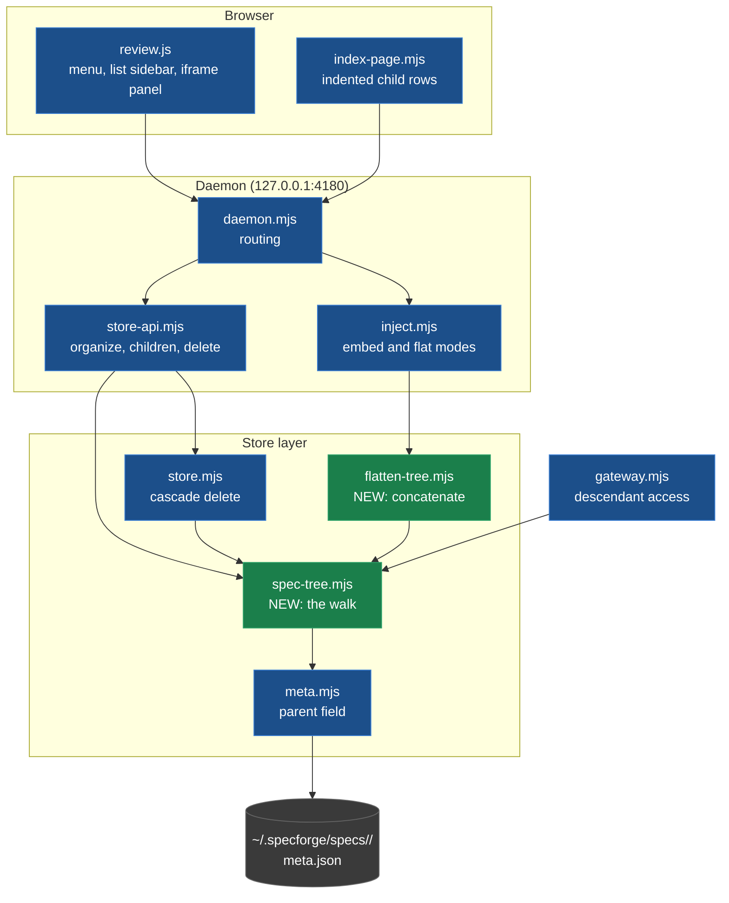
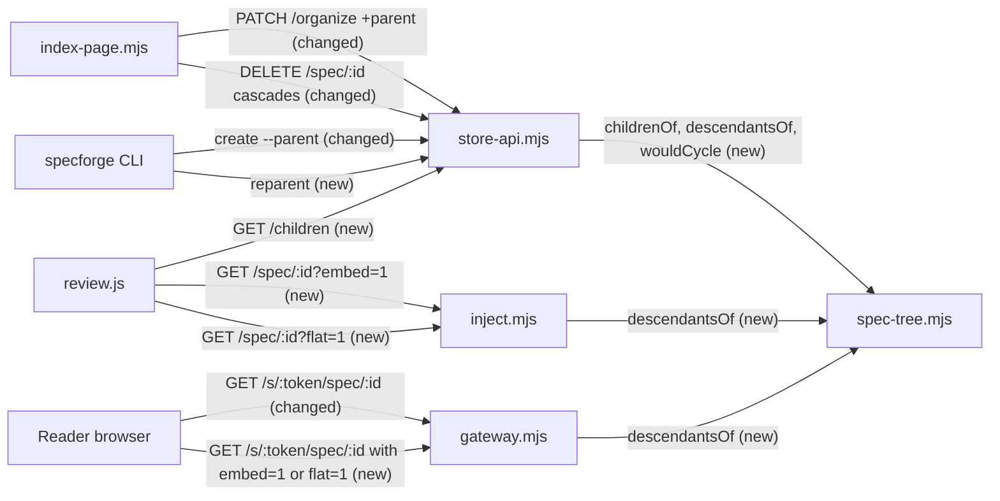
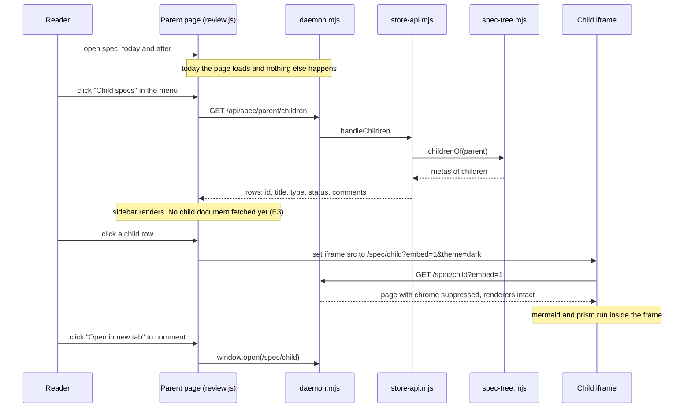
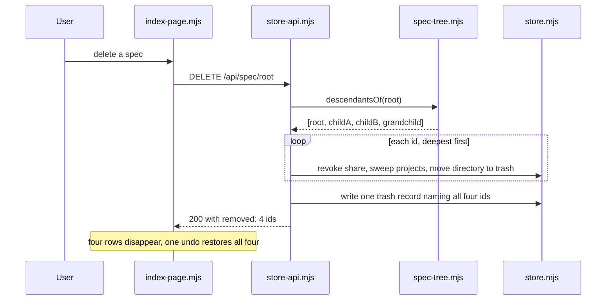

# Child specs

## TL;DR

<!-- sf:box class="panel" -->

A spec names another spec as its `parent`. One area of concern (code grounding, research, testing) lives in a spec of its own that stays attached to the spec it came from. The size this addresses: 25 of 192 specs carried more than 12,000 words and the largest carried 23,000 (measured 2026-09-06, HTML tags and style blocks stripped).

A child is a full spec: its own id, its own `/spec/<id>` URL, its own status, its own comment threads and review batches. Deletion is the only lifecycle tie, and it covers the whole subtree.

A child renders inside its parent as an `<iframe>` pointed at `/spec/<childId>?embed=1`, read only, fetched when the reader opens it (D5). Every `spec.html` carries its own inline CSS, so two of them in one DOM collide.

Two behaviours outside child specs change with it. Deletion moves each directory into `~/.specforge/trash/` and is restorable as one unit (D13). A share token becomes a standing grant over a subtree: publishing a parent publishes every descendant under the same token, including children added after the token was issued (D7). Risk R3 in [§8](#invariants) tracks the second.

## 1 · Overview

Builds on: no prior spec; child specs are the first spec-to-spec relation in the store · Assumes the reader knows: the SpecForge daemon serves specs from `~/.specforge/specs/<id>/` and injects the review layer at request time

SpecForge stores each spec as a directory under `~/.specforge/specs/<id>/`. The directory holds `spec.html` (the whole document, self contained, with its own inline CSS), `meta.json` (title, type, status, project, collection), `comments.json` (review threads), and several derived files. The daemon at `server/daemon.mjs` serves `GET /spec/<id>` by reading `spec.html` from disk and injecting the review layer into the response. The file on disk is never modified by the server.

Specs are flat. The only grouping is two string labels in `meta.json`, `project` and `collection`, which decide where a spec sits on the home page. No spec references another spec by id anywhere in the store today.

This spec adds one field, `parent`, holding another spec's id. That single edge produces a tree, and the tree gets four surfaces: a list sidebar and a read-only panel inside the parent's review UI, indented rows on the home page, subtree-wide sharing, and tree-aware export.

The work is being done now because the review cost of an oversized spec is paid again on every review pass, and 106 of 192 specs already exceed 5,000 words.

## 2 · Requirements

The problem, and what must be true when this ships. Numbered (P#, E#) so later sections can cite them. No solutions or implementation hints here; the Design section is the "how". A requirement no human has confirmed is marked assumed.

#### Problem

A single spec accumulates several distinct areas of concern. A design spec ends up carrying its own code grounding, its background research, and its testing strategy in one document. The reader who wants any one of those reads past the other three. The author who amends any one of them re-renders a document nobody can hold in their head.

The size is measurable. Across 192 specs in this store on 2026-09-06, counting words after stripping HTML tags, `<style>` and `<script>` blocks: median 5,307 words, mean 6,789, 106 specs over 5,000 words, 52 over 8,000, 25 over 12,000, largest 23,000 (`caeb3c5a12`, a design-impl spec with 18 sections).

Evidence: measurement above, run over `~/.specforge/specs/*/spec.html`. Store layout at `lib/store.mjs` L6-L11. No spec-to-spec relation exists to split against: grep for `parent`, `child` and `related` across `lib/` and `server/` returns about thirty hits on 2026-09-06, and not one is a relation between specs. Every match is a process child (`lib/publish.mjs`, `lib/setup-tunnel.mjs`, `lib/daemon-client.mjs`) or a DOM parent (`lib/html-to-md.mjs`).

#### Product requirements

| # | When this ships, a user can… | Confirmed by |
| --- | --- | --- |
| P1 | Ask an agent to put one area of a spec into a child spec, and get a separate spec that records which spec it belongs to. | Nitin |
| P2 | Read a child spec from inside its parent without leaving the parent's page, with diagrams, code highlighting and interactive components rendering as they do on the child's own page. | Nitin |
| P3 | Comment on a child by opening it in its own tab, where it behaves as an ordinary spec with its own review cycle. | Nitin |
| P4 | See on the home page which specs a spec owns, without the children adding rows to the top-level list. | Nitin |
| P5 | Find a child that has open comments through the saved views, without opening its parent first. | Nitin |
| P6 | Share a parent with one action and have the recipient able to read every descendant. | Nitin |
| P7 | Delete a parent and have the whole subtree go with it, and restore all of it together from trash. | Nitin |
| P8 | Detach a child from its parent, after which the parent's deletion no longer removes it. | Nitin |
| P9 | Export a parent to markdown and receive the whole tree; export to Google Docs or PDF and receive one flattened document. | Nitin |

#### Engineering requirements

| # | Constraint the design must satisfy | Confirmed by |
| --- | --- | --- |
| E1 | No migration of existing spec directories. All 210 `meta.json` files in the store stay valid and unedited (192 specs plus templates and component fixtures, counted 2026-09-06). | Nitin |
| E2 | Spec ids stay flat and keep matching `assertSpecId()`'s `/^[A-Za-z0-9][A-Za-z0-9_-]{0,63}$/` (`lib/store-paths.mjs`), which is the path-traversal guard. | Nitin |
| E3 | A child's document is not fetched until the reader opens it. Opening a parent that has children costs no additional document load. | Nitin |
| E4 | A child's CSS never applies to the parent's document, and the parent's never applies to the child's. | Nitin |
| E5 | The relation is stored in exactly one place. No denormalised copy that can disagree with itself. | Nitin |
| E6 | Depth is unbounded in storage and in the API. No code path assumes a maximum. | Nitin |
| E7 | No runtime dependency is added. SpecForge ships with zero runtime dependencies (`package.json`). | Nitin |
| E8 | A reader holding a share token can read descendants of the shared root and no other spec. | Nitin |

## 3 · Goals & non-goals

<!-- sf:section id="goals" -->

#### Goals

The requirements this spec commits to, as verifiable outcomes. Every goal cites a requirement; a goal with none is cut, or the requirement is added.

| Goal | Success criterion | Satisfies |
| --- | --- | --- |
| A spec can record which spec it belongs to. | `meta.json` carries `parent`; a store with no `parent` anywhere behaves exactly as it does today, verified by the existing suite passing unchanged. | P1, E1, E5 |
| The relation forms a tree of unbounded depth and never a cycle. | Setting `parent` to a descendant returns HTTP 409 and leaves `meta.json` unchanged; a chain 5 deep resolves its ancestry and its descendant set correctly. | E6 |
| A parent's reader can read any child in place. | Opening a child in the panel renders its mermaid diagrams, highlighted code and interactive components; the parent's computed styles are unchanged before and after opening. | P2, E4 |
| Children cost nothing until opened. | Loading a parent with 3 children issues zero requests for child documents; the first request for `/spec/<childId>?embed=1` occurs on open. | E3 |
| Children are visible on the home page without lengthening the top-level list. | A store with 10 specs, 4 of them children, renders 6 top-level rows and 4 indented rows; the attention views render all 10 flat. | P4, P5 |
| A share covers the subtree. | With a token issued on the parent, `/s/<token>/spec/<descendantId>` returns 200 and `/s/<token>/spec/<unrelatedId>` returns 404. | P6, E8 |
| Deletion and restore treat the subtree as one unit. | Deleting a parent with 2 children and 1 grandchild removes 4 directories and revokes 4 shares; restoring returns 4 directories with `parent` intact. | P7 |
| A child can be detached. | `PATCH /organize` with `{"parent": null}` leaves the spec at top level; the former parent's deletion then removes 1 directory, not 2. | P8 |
| Export carries the tree. | Markdown export of a parent returns a zip whose entries follow the tree; `?flat=1` returns one document containing every descendant's sections. | P9 |

#### Non-goals

What a reviewer might expect this work to cover and it deliberately does not.

| Not doing | Reason |
| --- | --- |
| Extraction: moving existing sections out of an oversized parent into a new child. | Out of scope. It is the change that would help the 25 specs already over 12,000 words, and it is also where the difficulty is: moving sections means relocating their comment threads, re-anchoring them against a document whose block indices have all shifted, and handling asides attached to a moved section. It gets its own spec once this foundation exists. |
| Anchoring a child to a section of its parent, with an inline marker in the parent's body. | Not worth the cost now. Decided in D6. A child that has no single home in the parent, such as a testing child, would get a marker in an arbitrary section. |
| A UI affordance for creating a child. | Not worth the cost. Every spec in this store is agent-authored, and a child scaffolded from a button has no brief. |
| A new action kind in the context-menu action registry for requesting a child. | Not worth the cost. Decided in D8. Requests arrive as ordinary comments. |
| Deriving a parent's status from its children. | Handled by design. Status in this store is informational, so coupling it would block a parent on a research child that is never meant to reach `final`. |
| An index of the relation, or a cached descendant set. | Not worth the cost at 192 specs. The reverse edge is a scan, matching how `specsOfType()` already resolves type to specs. |
| Rendering more than one level of nesting on the home page. | Future stage, if needed. Grandchildren appear indented under their own parent when that parent's row is shown. |

## 4 · Design

#### Summary

One nullable field, `parent`, is added to `meta.json`. It holds another spec's id, or null. That is the entire stored model: there is no `children` array, because a second copy of the same fact can disagree with the first. A parent's children are found by scanning `listSpecs()` for metas whose `parent` matches, which is how `specsOfType()` already resolves a type to its specs.

Everything else is a consumer of that field. A new module `lib/spec-tree.mjs` owns the four questions the consumers ask: who are this spec's children, what is its full descendant set, what is its ancestry, and would setting this parent create a cycle. The review UI gains a menu row, a list sidebar and a panel that holds an iframe. The home page indents children under their parent. The gateway resolves descendants of a shared root. Export gains a bundle mode and a flatten mode.

Two choices carry the design. The relation is a single pointer stored once, which makes attach, reparent and detach the same one-field write and makes the tree impossible to corrupt into an inconsistent state. The child renders in an iframe rather than as injected HTML, because each `spec.html` is a self-contained document with its own inline CSS, and two of them in one DOM collide with no general fix.

#### Concepts

Define the concepts and their hierarchy before the boxes. Plain language.

| Concept | What it is (plain words) | Inputs | Outputs |
| --- | --- | --- | --- |
| Child spec | A complete spec that records which spec it belongs to. It has its own id, URL, status, comments and review batches. It differs from any other spec in exactly one way: its `meta.json` has a non-null `parent`. | A title, a type, and a parent id | A spec directory under `~/.specforge/specs/<id>/`, same shape as every other |
| Parent | The spec named by a child's `parent` field. A parent is not a special kind of spec and stores nothing about its children. | Nothing; being a parent is a property of other specs' metas | Nothing stored |
| Subtree | A spec together with every spec reachable by following `parent` edges downward from it. The unit of deletion, restore and sharing. | A root spec id | An ordered list of spec ids, root first |
| Ancestry | The chain from a spec up to the root of its tree, following `parent` upward. Used for the panel breadcrumb and for the cycle check. | A spec id | An ordered list of spec ids, root first |
| Embed view | The spec page served with the review chrome suppressed: no menu, no comment rail, no contents rail, no context menu. Rendering stays intact: mermaid, code highlighting and interactive components all run. Zoom does not: its trigger is drawn by the chrome's own hover reporting, so the view does not ship the asset. | `GET /spec/<id>?embed=1` | A page safe to display inside an iframe, read only |
| Flat view | A parent and all its descendants concatenated into one document, descendants appended in depth-first order as appendix sections, served in the embed view's mode so the diagrams draw. | `GET /spec/<id>?flat=1` | One HTML document, for printing and for Google Docs export |
| Bundle export | A zip holding one markdown file per spec in the subtree, in directories that mirror the tree. | `GET /api/spec/<id>/md` on a spec with children | A zip |
| Trash record | A JSON file written by one delete action, naming every spec that action removed. It exists so a subtree deletion can be undone as a unit rather than one spec at a time. New in this spec: deletion today is unrecoverable (see Current state). | The root id and the descendant set, at delete time | `~/.specforge/trash/<deletionId>.json`, and the moved spec directories beside it |
| Deletion id | The name of one delete action. Generated by `newSpecId()`, so it is the same 10-character shape as a spec id and passes `assertSpecId`. It is used as a filesystem path segment and as a URL segment, so it is validated by that same guard before either use: a new identifier gets the traversal check E2 exists to give spec ids, rather than being trusted because it is ours. | Nothing; generated at delete time | A directory name under `~/.specforge/trash/` and the id in the restore route |
| Restore | Moving every directory named in one trash record back into the store, with each spec's `parent` as it was. Invoked from the home page's undo control after a delete, and from the CLI by deletion id. | A deletion id | The spec directories back in `~/.specforge/specs/`, and the trash record removed |

#### Architecture

One responsibility per component. Say why each boundary sits where it does, not only what it is.

The boundary that matters is `lib/spec-tree.mjs`. Four modules walk the same edge directly: `lib/store-api.mjs` (children, reparent, delete), `lib/store.mjs` (the cascade), `lib/flatten-tree.mjs` (assembling a subtree) and `lib/gateway.mjs` (membership). Two more reach it through the API rather than the field: `server/index-page.mjs` and the CLI. A walk written four times is four chances to disagree about cycles, about ordering, and about what happens when a `parent` points at a spec that no longer exists. The module owns the walk; nobody else reads the `parent` field to traverse.

| Component | Responsibility (one) | Change |
| --- | --- | --- |
| `lib/spec-tree.mjs` | Resolve the `parent` edge in every direction: children, descendants, ancestry, and whether a proposed edge would form a cycle. | added |
| `lib/flatten-tree.mjs` | Concatenate a subtree's documents into one HTML document. | added |
| `lib/meta.mjs` | Define and persist a spec's metadata. Gains `parent` in `defaultMeta`. | changed |
| `lib/store.mjs` | Create and delete spec directories. `deleteSpec` becomes subtree-aware and writes a restorable trash record. | changed |
| `lib/store-api.mjs` | Handle the store's HTTP requests. Gains `parent` in `organize`, a children handler, and the descendant check for reader access. | changed |
| `server/daemon.mjs` | Route requests. Gains one route and passes two query flags through. | changed |
| `server/inject.mjs` | Inject the review layer at serve time. Gains the `embed` and `flat` modes. | changed |
| `server/public/review.js` | The review UI in the browser. Gains the menu row, the child list sidebar and the iframe panel. | changed |
| `server/index-page.mjs` | Render the home page. Gains indented child rows and flat attention views. | changed |
| `lib/gateway.mjs` | Serve shared specs to readers on a separate socket. Resolves any descendant of the shared root. | changed |
| `lib/specforge-cli.mjs` | The `specforge` command line. Gains `--parent` on `create` and a `reparent` verb. | changed |



Legend: changed (blue) · removed (red) · added (green).

#### Current state, grounded in code

For each component that already exists: exact file path, symbol, and lines you have read. Never from memory. Anything not read is marked unverified.

| Component | Current state (path · symbol · lines) | Supports new design? | Change required |
| --- | --- | --- | --- |
| Spec metadata | `lib/meta.mjs` · `defaultMeta()` · L44. Writes id, title, type, status, origin, attachedSession, heartbeat, tags, collection, project, created, updated. Optional fields are read as `m.field \|\| null`, so a meta file missing a field is valid. | yes | Add `parent: null` to `defaultMeta`. No migration: existing files read as null. |
| Reverse lookup pattern | `lib/meta.mjs` · `specsOfType()` · L112-L113, built on `listSpecs()` · L80. Resolves type to specs by scanning every meta. No index file. | yes | None. `spec-tree.mjs` copies this pattern for parent to children. |
| Spec id validation | `lib/store-paths.mjs` · `assertSpecId()` · L86, `newSpecId()` · L62. Ids are `sha1(uuid)` truncated to 10 characters and must match `/^[A-Za-z0-9][A-Za-z0-9_-]{0,63}$/`. The regex is the path-traversal guard for every filesystem read. | yes | None. Ids stay flat, which is why nested ids were rejected (D2). |
| Spec creation | `lib/store.mjs` · `createSpec()` · L66. Makes the directory, writes `spec.html` and a default meta. | partly | Accepts `parent`, and copies the parent's `project` and `collection` when neither is given (Q3). |
| Spec deletion | `lib/store.mjs` · `deleteSpec()` · L85-L89. The whole body is `if (!readMeta(id)) return false; rmSync(specDir(id), {recursive: true, force: true});`. One directory, unlinked. **Deletion is unrecoverable today.** | no | Two changes, not one. Deletion becomes a move into `~/.specforge/trash/` instead of an unlink, and it spans the descendant set instead of one directory. Both are new behaviour, decided in D11 and D13. |
| Trash and restore | No code path exists. `grep -rn trash lib/ server/` returns nothing. The directory `~/.specforge/trash/` is present on this machine and holds 13 spec directories (each with `spec.html` and `meta.json`), moved there by hand rather than by the daemon; measured 2026-09-06. | no | Both the trash write and the restore path are introduced by this spec. The existing hand-moved directories carry no trash record and are not restorable by the new path; they are left where they are. |
| Organize handler | `lib/store-api.mjs` · `handleOrganize()` · L435. Sets tags, collection and project. Applies only the keys present in the request body, so callers can change one field without touching the others. | yes | Accept `parent`. The partial-body behaviour already gives attach, reparent and detach from one endpoint. |
| Reader field allow-list | `lib/store-api.mjs` · `handlePublicMeta()` · L273, with the rule stated in the comment at L270-L271. A reader holding a share token receives title, status and reviewProgress only. Any field not listed is invisible. | partly | Add `parent` and a child summary list, so a reader's panel can list and open children. |
| Delete handler | `lib/store-api.mjs` · `handleDelete()` · L470. Refuses a template spec with 403, detaches the spec from its session (`detach()`, `lib/attach.mjs`), then calls `deleteSpec`. It does not revoke shares and does not sweep projects. | partly | Run the per-spec teardown across every spec in the descendant set. |
| Delete route | `server/daemon.mjs` L642-L654. The revoke and the sweep live here, wrapped around the handler: `pubs.unshareThen(id, () => handleDelete(id, res)).then(() => pubs.sweepProjects())`. The revoke runs before the handler; the sweep runs after the response. | partly | The cascade cannot sit inside `handleDelete`, because the revoke is an async wrapper the handler cannot call. The loop over the descendant set belongs in the route, which already owns that ordering. |
| Review layer injection | `server/inject.mjs` · `injectReviewLayer(html, {specId, transport, api, servedAt})` · L36. Injects the review UI, the live-reload client and the tracker into the response. The file on disk is never modified. | partly | Two new modes. `embed` suppresses the chrome and keeps the renderers. `flat` serves the concatenated subtree. |
| Review UI menu | `server/public/review.js` · `buildMenuRows()` · L2299. Builds the launcher menu from `menuRow(icon, label, onclick)` entries grouped by `menuGroup()`. | yes | One row, placed below the comments entry. |
| Comments sidebar | `server/public/review.js` · `setSidebar()` · L1599, `renderSidebar()` · L3211. One sliding panel, opened and closed by a single pair of functions. | partly | The child list reuses the sidebar mechanics with its own render function. Only one sidebar is open at a time. |
| Asides panel | `server/public/review.js` · `buildAsides()` · L1905, `setAsidesOpen()` · L2073. A right-hand panel that *moves* `section[data-sf-aside]` elements out of the parent document into itself. The content is already in the DOM. | partly | The child panel copies the panel geometry and open/close behaviour but holds an iframe, because the content is a different document. This is the first panel in SpecForge that loads one. It opens closed on every page load, with the frame's `src` unset, and writes no state to `ui.json`: a reader who reloads a parent gets the parent, and no child document is fetched until they open one. |
| Home page rows | `server/index-page.mjs` · `rowHtml(m, sig)` · L140, `groupByProject()` · L81. Rows are grouped project then collection into `<section class="grp">` blocks; every project's block is in the DOM and switching projects is a DOM toggle, not a fetch. | partly | Children render as indented rows under their parent inside the same block, in the views that show structure. A parent row reports the comment count of its own document: no subtree total, no badge. A child with open comments is reached through the flat attention views (D10). The row also carries a child count, and the drawn address it is filtered by, which for a child is its tree root's (D1, §4 Concepts). |
| Saved views | `server/index-page.mjs` L286-L292. Four buttons filtering the same row set: **All specs** (no filter), **Needs you** (review state `needs` or `replied`), **Live** (an attached session that is currently connected, which is a connectivity filter rather than an attention one), **Shared** (a live share link). | partly | All and Shared render the tree, indented. Needs you and Live render flat with the parent named on each child row, because both answer "what should I look at now" and a child must not be hidden behind a parent that does not match the filter. |
| PDF export | `server/public/review.js` · L2323-L2325. The menu row calls `window.print()`; a print stylesheet hides the review chrome. | no | A child's content is not in the parent's DOM, and the one that is sits in an iframe. For a spec with children the row opens `?flat=1` in a new window and prints it once that window reports its renderers have settled. The window's `load` event fires while mermaid is still running, so printing on `load` produces a PDF of diagram source. The wait is bounded at 20s, after which the row prints what the window has. |
| Public gateway | `lib/gateway.mjs` · L8-L15. A separate socket. Every route lives under `/s/<token>`, and a bare spec id is not reachable. The token is the only authorisation. | partly | A token issued on a root resolves that root and its descendants, and nothing else. |
| Runtime dependencies | `package.json` declares no `dependencies` key at all; only `devDependencies` (jsdom, mermaid, playwright, prismjs). Node ESM, raw `node:http`, vanilla browser JavaScript. | yes | None. The zip writer already used by markdown export stays the only archive path. |

#### Interfaces

Every touched boundary (component APIs, service / HTTP APIs, frontend↔backend contracts, events / queues) with its full signature, types, and error contract. Interfaces are the review surface. Two views: the table for agents, the diagram for humans.

| Interface | Between (components) | New or changed | Signature / contract | Errors |
| --- | --- | --- | --- | --- |
| `childrenOf` | `spec-tree.mjs` → consumers | new | `childrenOf(id: string): Meta[]`. Scans `listSpecs()` for metas whose `parent === id`. Sorted by `created` ascending. Returns `[]` for an unknown id. | None. An unknown id is not an error, it is a spec with no children. |
| `descendantsOf` | `spec-tree.mjs` → consumers | new | `descendantsOf(id: string): string[]`. Depth-first, root first, each id once. A `parent` pointing at a missing spec is ignored, which detaches that branch rather than throwing. | None. Guards against a cycle in stored data by tracking visited ids, so a hand-edited cycle terminates instead of hanging. |
| `ancestryOf` | `spec-tree.mjs` → consumers | new | `ancestryOf(id: string): string[]`. Walks `parent` upward. Root first, the given id last. Stops at a missing spec and at a repeated id. | None. |
| `wouldCycle` | `spec-tree.mjs` → `store-api.mjs` | new | `wouldCycle(id: string, nextParent: string\|null): boolean`. True when `nextParent === id`, or when `nextParent` is in `descendantsOf(id)`. False when `nextParent` is null. | None; the caller turns true into HTTP 409. |
| `PATCH /api/spec/<id>/organize` | `review.js`, `index-page.mjs`, CLI → `store-api.mjs` | modified | Before: body accepts `{tags?, collection?, project?}`, applying only the keys present. After: also accepts `parent?: string\|null`. `{"parent":"<id>"}` attaches, `{"parent":null}` detaches. Response gains `parent`. | 400 when `parent` is not a string or null, or fails `assertSpecId`. 404 when the target spec does not exist. 409 when the edge would form a cycle, with `{"error":"cycle","ancestry":[…]}`. 409 when a subtree delete is holding either end of the requested edge: `{"error":"spec is being deleted"}` for the spec being moved, `{"error":"the parent is being deleted"}` for the requested parent. Nothing is written on any error. |
| `GET /api/spec/<id>/children` | `review.js`, `index-page.mjs` → `store-api.mjs` | new | One level only. Returns `{children: [{id, title, type, status, comments: {open, total}, hasChildren: boolean}]}`. Deeper levels are fetched by calling it again with a child's id, which is what the panel does as the reader descends. | 404 when the spec does not exist. Never recurses, so response size is bounded by one spec's child count. |
| `DELETE /api/spec/<id>` | `index-page.mjs`, CLI → `store-api.mjs` | modified | Before: the route revokes the share, the handler refuses a template with 403, detaches the session and `rmSync`s one directory unrecoverably, and the route sweeps projects behind the response. After: the route resolves `descendantsOf(id)` first, then runs that same sequence per spec, deepest first, with the unlink replaced by a *move* to `~/.specforge/trash/<deletionId>/<specId>/`; finally it writes `~/.specforge/trash/<deletionId>.json` naming every moved id. Response gains `{deletionId, removed: string[]}`. | 404 when the spec does not exist. 403 when it is a template spec, checked before anything is moved; a template anywhere in the subtree refuses the whole delete. Partial failure leaves the already-moved directories in trash and writes no record, so the action is not restorable as a unit; reported as 500 with `{removed, failedAt, reason}`. |
| `POST /api/deletion/<deletionId>/restore` | `index-page.mjs` undo control, CLI → `store-api.mjs` | new | Reads the trash record, moves every directory it names back to `~/.specforge/specs/<specId>/`, and removes the record. Each spec's `parent` is whatever its own `meta.json` carries, so the tree returns as it was without being rebuilt. Shares are not reissued: a share revoked by the delete stays revoked. Response is `{restored: string[]}`. | 404 when the deletion id has no record. 409 when a spec id in the record already exists in the store, naming it; nothing is moved, because overwriting a live spec is not a restore. 500 on a partial move, naming what was restored. |
| `specforge restore <deletionId>` | agent → CLI | new | Calls the restore route. With no argument, lists the trash records with their root title and timestamp. | Exits non-zero on 404 and 409, printing the conflicting spec id on 409. |
| `GET /spec/<id>?embed=1` | `review.js` iframe → `daemon.mjs` → `inject.mjs` | new | The spec page with review chrome suppressed: no launcher, no menu, no comment rail, no sidebar, no context menu, no contents rail. Kept: mermaid rendering, code highlighting, interactive components, live reload, the tracker. Not kept: zoom, whose trigger the chrome's hover reporting draws, so the two assets are not sent. Accepts `&theme=dark\|light` so the frame paints in the parent's theme on first render. The frame carries `sandbox="allow-scripts allow-same-origin allow-popups allow-popups-to-escape-sandbox"`: scripts run so the renderers work, same-origin holds so the daemon's own assets load, popups let an in-frame link open a new tab, and `allow-top-navigation` is withheld so nothing in the child can replace the parent page. Links inside the frame are rewritten to `target="_blank"` at serve time, so a click leaves the panel showing the child. | 404 when the spec does not exist. Serves the same 404 body as the normal route. |
| `GET /spec/<id>?flat=1`<br>`GET /s/<token>/spec/<id>?flat=1` | print window, export → `daemon.mjs` → `flatten-tree.mjs`; reader's print → `gateway.mjs` → `flatten-tree.mjs` | new | One HTML document: the root's body, then each descendant's body in depth-first order, each wrapped in a section titled with the descendant's title and given an id prefixed by its spec id to keep section ids unique. One style block, taken from the root. Served with the review layer in its embed mode: nothing to click, but a mermaid block is source until the layer renders it, and this document exists to be printed. On the token route the flag is bounded by the grant the gateway already resolves, so it flattens the shared subtree and reaches nothing above or beside it. | 404 when the root does not exist. On the token route, 404 for a spec the token does not cover, with the same body as every other refusal there. A descendant that fails to read is replaced by a visible note naming its id, rather than failing the whole document. |
| `GET /api/spec/<id>/md` | browser, CLI → `store-api.mjs` | modified | Before: `.md`, or `.zip` when the spec has diagrams. After: also `.zip` when the spec has children. The zip holds one markdown file per spec in the subtree under directories mirroring the tree, plus each spec's diagram assets alongside it. | 404 when the spec does not exist. Unchanged for a spec with no children. |
| `GET /s/<token>/spec/<specId>` | reader's browser → `gateway.mjs` | modified | Before: the token resolves exactly one spec. After: the token resolves its root and any id in `descendantsOf(root)`. Accepts `?embed=1` so a reader's panel works the same way the owner's does, and `?flat=1` so a reader printing a shared parent gets the subtree the token covers rather than the root alone. | 404 for any id outside the subtree, with the same body as an unknown token so membership is not leaked. 404 for an unknown token. |
| `specforge create --parent <id>` | agent → CLI | modified | Sets `parent` at creation. The printed payload gains `parent` and `parentTitle`. | Exits non-zero when the parent id does not exist. |
| `specforge reparent <id> --to <parentId>\|--detach` | agent → CLI | new | Calls `PATCH /organize`. `--detach` sends `{"parent":null}`. | Exits non-zero on 400, 404 or 409, printing the cycle path on 409. |



#### Data model

Delete this block if the spec touches no data. Prefer nesting new fields under a container over top-level sprawl.

| Table / doc | New or changed | Fields | Owner & lifecycle | Reads / writes, when | Compat & backfill |
| --- | --- | --- | --- | --- | --- |
| `~/.specforge/specs/<id>/meta.json` | modified | `parent: string \| null`. The id of the spec this one belongs to. Default null. | `lib/meta.mjs`. Written at creation when `--parent` is given, and by `PATCH /organize` thereafter. Removed with the file when the spec is deleted. | Written by `handleOrganize` and `createSpec`. Read by `spec-tree.mjs` only; no other component reads it to traverse. | No backfill. `lib/meta.mjs` reads optional fields as `m.field \|\| null`, so all 192 existing files stay valid and unedited and report `parent: null`. |
| `~/.specforge/trash/<deletionId>.json`, with the moved directories at `~/.specforge/trash/<deletionId>/<specId>/` | new | `{deletionId, rootId, rootTitle, deletedAt, specs: [{id, parent}]}`. One record per delete action, naming every spec that action moved. `rootTitle` is carried so the CLI can list trash without reading each moved meta. | `lib/store.mjs`. Written when a delete moves one or more specs. Read and then removed by restore. | Written by `deleteSpec`. Read by the restore path. Nothing else reads it. | New file, no existing data and no migration. A delete of a spec with no children writes a record with one entry, so single deletes and subtree deletes restore through the same path. The 13 directories already sitting in `~/.specforge/trash/` were moved by hand, carry no record, and are not restorable by this path. |
| Reverse index of parent to children | deliberately absent | None. | None. | Computed on demand by scanning `listSpecs()`. | Nothing to migrate or repair. A cached child list is the one structure in this design that could disagree with the `parent` field, so it is not stored (E5). |

Cost of the scan: `childrenOf` reads every `meta.json` in the store. Measured 2026-09-06 by `statSync` over `~/.specforge/specs/*/meta.json`: 210 files, mean 382 bytes, largest 708 bytes, 78 KB in total. It runs on the children endpoint, on delete, on a share read, and on home-page render, and never inside a loop over specs.

#### Request flow

Trace 1-2 representative requests end to end through the components, before and after this design, including the failure path. Reuse the Architecture diagram and overlay the paths: **current flow as a dashed line**, **new flow as a solid line**. Make clear (1) which components a request passes through and (2) how the path changes.

Two requests are traced. The first is a reader opening a child from inside its parent, which is the flow the iframe decision exists to serve. The second is deleting a parent, which is the flow the subtree decision exists to serve.

##### Opening a child from the parent



##### Deleting a parent



#### Failure paths

| Where it fails | What the component does | What the caller sees |
| --- | --- | --- |
| The reader opens a child that was deleted since the sidebar rendered. | The iframe request 404s. The panel does not clear the sidebar. | The panel shows "This child spec no longer exists" with a refresh control. The rest of the parent page is unaffected. |
| A `parent` points at a spec that does not exist, from a hand-edited meta or an interrupted delete. | `descendantsOf` ignores the missing spec. `ancestryOf` stops at it. The child behaves as a top-level spec. | The spec appears at top level on the home page. Nothing throws, and no reader-facing error is shown. |
| A cycle exists in stored data, from a hand-edited meta. | Both walks track visited ids and terminate. The reparent endpoint rejects any new edge that would create one. | The tree renders with the cycle broken at the repeated id. No hang. |
| A reparent request would create a cycle. | `wouldCycle` returns true. Nothing is written. | HTTP 409 with the ancestry path. The CLI prints the path and exits non-zero. |
| A reparent arrives while a subtree delete is holding one end of the edge. | The delete claims its whole planned set before the first revoke. The route refuses the reparent, at either end, and writes nothing. | HTTP 409 naming which end is held. Both alternatives are unrecoverable: moving a held spec out leaves it standing with its share already revoked and no token to restore, and moving an unheld spec in attaches it to a parent the delete is about to remove. A refusal costs a retry. |
| A subtree delete fails partway, on a permissions or filesystem error. | The specs already moved to trash stay in trash. No trash record is written, so the deletion is not restorable as a unit. | HTTP 500 naming the ids that were removed and the id that failed. The home page reloads and shows what remains. |
| Flatten hits a descendant whose `spec.html` cannot be read. | That descendant's section is replaced with a visible note naming its id. The rest of the document is built. | The printed or exported document is complete except for one labelled gap. |
| A reader requests a spec outside the shared subtree. | The gateway checks membership in `descendantsOf(root)` before touching the filesystem. | 404, with the same body as an unknown token, so the reader cannot use the response to learn whether a spec id exists. |

#### Design options considered

2-3 real alternatives, honest tradeoffs, no strawmen.

| Option | Pros | Cons | Verdict | Evidence that would change it |
| --- | --- | --- | --- | --- |
| **Storage:** one `parent` pointer on the child, flat directories. | One field. No migration. Attach, reparent and detach are the same write. Ids stay flat, so every existing route, share token and tool keeps working. Impossible to hold two disagreeing copies of the relation. | Finding a parent's children costs a scan of every meta. | chosen The scan is 192 sub-1 KB file reads and does not run inside a loop over specs. | A store large enough that the scan is measurable on the home-page render. At that point add a cache inside `spec-tree.mjs`, which is the only reader of the field. |
| **Storage:** a `children: []` array on the parent, alongside or instead of the pointer. | Children resolve without a scan. | Two copies of one fact, which can disagree after an interrupted write. Every attach and detach becomes a two-file transaction with no transaction available. | rejected It buys a scan this store does not need and costs a consistency problem it does not have (E5). | Nothing at this store size. |
| **Storage:** nested directories with namespaced ids, `parent/child`. | The tree is visible in the filesystem. Ownership is structural rather than a convention. | `assertSpecId()` rejects slashes, and that regex is the path-traversal guard on every filesystem read. Flat ids are assumed by the store paths, every `/api/spec/<id>/*` route, share tokens, session attachment, the search index and export. | rejected It changes the security-relevant identifier format across the whole codebase to gain a property the pointer already provides (E2). | Nothing. The cost is structural. |
| **Rendering:** iframe at `/spec/<id>?embed=1`. | Full fidelity with no new rendering code, because it is the existing spec page. Style isolation is a property of the element, not something to enforce. On-demand loading is the default: nothing loads until `src` is set. | Theme has to be passed in or synced. Navigation inside the frame has to be constrained. Printing a frame does not work, which is why `?flat=1` exists. | chosen Each `spec.html` carries its own inline CSS, so isolation is the requirement, not a nicety (E4). | A rendering feature that must reach across the frame boundary, such as a shared contents rail spanning parent and child. |
| **Rendering:** fetch the child's body and inject it into a div in the parent. | One DOM. A shared contents rail and cross-document anchors become possible. | Two self-contained stylesheets in one document. Requires scoping or rewriting the child's CSS, re-initialising mermaid and prism against the injected subtree, and keeping the child's headings out of the parent's contents rail and block registry. | rejected The first spec whose CSS leaks into the panel is a defect with no general fix, and every spec in the store has its own CSS. | Specs converging on one shared stylesheet with no per-spec rules, which the stamped component block moves toward but does not yet guarantee. |
| **Rendering:** render the child's markdown export in the panel. | Cheapest to build. No isolation problem. | Drops every diagram, every interactive component and the code highlighting. | rejected A code-grounding child is mostly code blocks and diagrams (P2). | Nothing. |
| **Lifecycle:** independent status, cascade deletion only. | A child is reviewed and approved on its own schedule. The parent is not blocked by a research child that is never meant to reach `final`. | No single signal that a whole tree is done. | chosen Status in this store is informational and no other system reads it. | Status becoming an input to another system, such as a gate on implementation. |
| **Lifecycle:** a child's status derives from its parent. | One place to read whether a tree is finished. | The parent cannot be marked final until every child is, or it silently drags unfinished children over the line. | rejected A code-grounding child is stable long before the design it feeds is approved. | Status becoming load-bearing, at which point a derived indicator on the parent row is the cheaper answer. |
| **Sharing:** the token covers the subtree. | One action shares a readable document. The recipient reads what the author sees. | Sharing a parent shares everything below it, including children added after the share was created. | chosen A share that omits children hands the reader a document with gaps they cannot detect (P6). | A child that must stay private under a shared parent. The answer then is to detach it, not to add a per-child toggle. |
| **Sharing:** the token covers one spec. | Nothing changes in the gateway. Each share is explicit. | The recipient sees child names with no way to open them, which is worse than the single large document this feature replaces. | rejected It makes the recipient's experience worse than before the feature existed. | Child specs being used to hold content deliberately withheld from a parent's audience. |
| **Creation:** ordinary comments, read by the agent during review. | Nothing new to build. No menu entry to design, test and maintain. | No verification that a requested child was actually created. Nothing to click, so the request depends on phrasing. | chosen Requested, and the surface it would ride already exists if that changes. | A batch where the agent replies that a child was created and none was. The registry kind and gate would then be added following the pattern in `lib/actions/aside-gaps.mjs`: one entry in `CUSTOM_KINDS`, an action module, a gate module and a CLI verb. No estimate is offered for that work. |
| **Creation:** a `child-spec` action kind in the context-menu registry, with a completion gate. | A real menu entry, an unambiguous request, and a batch gate that refuses to close when a requested child was not created. | A new kind in `CUSTOM_KINDS`, an action module, a gate module and a CLI verb. | rejected Requested as out of scope for the first cut. | The failure mode above, which is the reason the aside gate exists. |

## 5 · Testing

The strategy, not the test list. Tests at interfaces over tests coupled to internals; the failure paths from [§4](#design) covered, not only the happy path.

#### Coverage by layer

| Layer | What it covers | Why at this layer |
| --- | --- | --- |
| Unit | `spec-tree.mjs` in full: `childrenOf`, `descendantsOf`, `ancestryOf`, `wouldCycle`, against a fixture store containing a 5-deep chain, a wide fan-out, a dangling `parent`, and a hand-written cycle. Also `flatten-tree.mjs` section-id prefixing. | Every consumer depends on this module returning the same answer, so its edge cases are cheapest to pin here rather than through six HTTP routes. |
| Integration | The HTTP surface against a temporary store: `PATCH /organize` attach, reparent, detach, and the 400, 404 and 409 paths; `GET /children` shape; `DELETE` cascade and trash record; `?embed=1` chrome suppression; `?flat=1` assembly; the md bundle zip; the gateway descendant check including the 404 for a non-descendant. | These are contracts other components and the CLI depend on, and the error contracts are the part most likely to regress silently. |
| End-to-end | Browser-driven against a running daemon: open a parent, open the child sidebar, open a child in the panel, confirm no child document was requested before the click, confirm the parent's computed styles are unchanged, descend to a grandchild via the breadcrumb, and open in a new tab. | The iframe decision exists to prevent a class of failure (style collision, eager loading) that only appears in a real browser with real spec documents. |

#### Risk and invariant coverage

One row per risky tradeoff in [§4](#design) and per invariant in [§8](#invariants). An invariant with no row is untested.

| Risk / invariant | Exercised by | Failure path covered |
| --- | --- | --- |
| I1 (no cycle) | Unit: `wouldCycle` over self, direct parent, deep descendant, unrelated spec. Integration: `PATCH /organize` returns 409 and leaves `meta.json` byte-identical. | A reparent that would create a cycle. |
| I2 (single source of truth) | Unit: a grep-style assertion that no module outside `spec-tree.mjs` reads `meta.parent` for traversal, run as a test over the source tree. | A future change reintroducing a second copy of the relation. |
| I3 (no eager child load) | End-to-end: count network requests between page load and the first child-row click. Expected zero for child documents. | The panel being built eagerly rather than on open. |
| I4 (style isolation) | End-to-end: capture `getComputedStyle` on a set of parent elements before and after opening a child whose spec defines conflicting rules, and assert equality. The fixture child carries a deliberately hostile stylesheet. | The rejected inline-fragment failure mode, asserted so a later change back to injection fails loudly. |
| I5 (share confinement) | Integration: with a token on a root, request the root, a child, a grandchild, a detached former child, and an unrelated spec. Expect 200, 200, 200, 404, 404, with identical 404 bodies. | A reader reaching a spec outside the shared subtree, and response-shape leakage of spec existence. |
| I6 (atomic subtree delete and restore) | Integration: delete a root with 2 children and 1 grandchild, assert 4 directories gone, 4 shares revoked, 1 trash record naming 4 ids; restore and assert 4 directories back with `parent` intact. | Partial deletion leaving orphans, and restore returning a broken tree. |
| I7 (no migration required) | Integration: run the whole existing suite against a store fixture whose metas have no `parent` key, and assert no meta file is rewritten by a read. | An accidental write-on-read that would touch all 192 existing files. |
| I8 (unique section ids when flattened) | Integration: `?flat=1` over the `chain5` shape, collecting every `id` attribute and asserting no duplicate. Unit: the id-prefixing function over two specs that both carry a `tldr` section. | A descendant's section id colliding with the root's, which silently breaks every anchor link in the flattened document. |
| Dangling `parent` tolerance | Unit: `descendantsOf` and `ancestryOf` over a fixture whose child points at a missing id. Integration: the home page renders that spec at top level. | An interrupted delete leaving a pointer to a removed spec. |
| Flatten resilience | Integration: `?flat=1` over a subtree with one unreadable `spec.html`. Expect 200 and a labelled gap. | One bad descendant failing a whole print or export. |

#### Test infrastructure to build first

- A store fixture builder: makes a temporary `SPECFORGE_HOME`, writes spec directories with given titles, types, statuses and `parent` values, and returns their ids. Every stage after 0 depends on it.
- Named tree shapes on top of the builder: `flat` (no relations), `chain5` (5 deep), `fan` (one parent, 4 children), `dangling` (a child pointing at a missing id), `cyclic` (a hand-written cycle), `hostile-css` (a child whose stylesheet would break the parent if injected).
- A daemon harness: start the daemon on an ephemeral port against a fixture store, return its base URL, and shut it down. It sends a same-origin `Origin` on writes to match what a browser does; the guard itself accepts a request with no `Origin` at all.
- A gateway harness and a permission probe for the sharing stage, and a mover that fails on a chosen call for the deletion stage.
- A request counter for the end-to-end browser tests, recording which URLs the page fetched and when, so the on-demand assertion is a count rather than a timing guess.

#### Deliberately not tested

- Rendering fidelity inside the frame (mermaid, prism, interactive components). The frame serves the same page the child's own URL serves, and that page is already covered. A test here would assert that an iframe loads a URL.
- Scan performance of `childrenOf`. At 192 specs with sub-1 KB metas there is no threshold worth asserting. If a cache is added later, its correctness gets tests then.
- Google Docs export content. The export path is queued and executed outside the daemon; this spec only changes which HTML it is handed, and that HTML is covered by the `?flat=1` tests.
- Behaviour above depth 5. Depth is unbounded and the walk is uniform, so 5 exercises the same code as 50.

## 6 · Observability

When this misbehaves in production, how a human finds out and diagnoses it. Every signal names its consumer and the decision it informs; a signal with neither is cut.

<!-- sf:callout variant="constraint" -->

> **There is no production and no on-call.** SpecForge is a single-user daemon bound to 127.0.0.1:4180, started on demand and used by one person on one machine. It has no metrics backend, no alerting, and no log aggregation. Adding any of those for this feature would be new infrastructure, not observability of this change.

#### Metrics

None added, and none exist to add to. The diagnosis surfaces are the daemon's stderr, the browser console, and `GET /healthz`, which returns `{service, pid}` and answers only whether a daemon is listening.

#### Logs

Written to the daemon's stderr, which the user sees in the terminal the daemon was started from. No trace spans; there is no tracer.

| Event | Level | Structured fields | Trace span |
| --- | --- | --- | --- |
| `reparent.rejected.cycle` | warn | `specId`, `requestedParent`, `ancestry` | none |
| `tree.dangling-parent` | warn | `specId`, `missingParent`. Emitted once per walk, not once per encounter, so a broken pointer does not flood the terminal. | none |
| `tree.cycle-in-store` | error | `specId`, `visited`. Emitted when a walk terminates on a repeated id, which can only come from a hand-edited meta. | none |
| `delete.subtree` | info | `rootId`, `removed` (ids), `deletionId` | none |
| `delete.subtree.partial` | error | `rootId`, `removed`, `failedAt`, `reason`. No trash record was written, so the deletion is not restorable as a unit. | none |
| `flatten.section-unreadable` | warn | `rootId`, `specId`, `reason` | none |
| `gateway.spec-outside-subtree` | warn | `token` (first 8 characters), `rootId`, `requestedId`. Logged because a reader requesting a non-descendant is either a stale link or a probe. | none |

#### Failure mode → signal

| Failure mode (from [§4](#design)) | Signal that surfaces it | Debugging starts at |
| --- | --- | --- |
| A reparent is refused as a cycle. | HTTP 409 carrying the ancestry path, plus `reparent.rejected.cycle`. The CLI prints the path. | The 409 response body, which names the chain that would have closed. |
| A spec's `parent` points at a removed spec. | `tree.dangling-parent`, and the spec appearing at top level on the home page. | `grep -l '"parent"' ~/.specforge/specs/*/meta.json`, then check each target directory exists. |
| A subtree delete failed partway. | `delete.subtree.partial` and HTTP 500 naming the removed ids and the failure point. | The `~/.specforge/trash/` directory, which holds the moved directories but no record for this deletion. |
| The panel shows nothing after a child row is clicked. | The iframe's request in the browser network panel: a 404 means the child was deleted, no request means the click handler did not fire. | The browser console on the parent page. |
| A reader reports a broken link inside a shared parent. | `gateway.spec-outside-subtree` naming the requested id. | The requested spec's `parent` field, which is usually null because the child was detached after the share was made. |
| A printed parent is missing a child's content. | `flatten.section-unreadable`, and a labelled gap in the printed document naming the spec id. | That spec's `spec.html` on disk. |

## 7 · Decisions

The standing calls, with the constraint that fixes each one. Design detail is in [§4](#design).

| # | Decision | Constraint |
| --- | --- | --- |
| D1 | The relation is one `parent` pointer on the child. No `children` array. | The store has no transactions, so a two-file write can be interrupted and leave the two records disagreeing. |
| D2 | Spec ids stay flat. No nested directories. | `assertSpecId()` rejects a slash, and that check is the path-traversal guard on every filesystem read in the store. |
| D3 | A child's status is its own. Nothing derives it from the parent. | A code-grounding child reaches a settled state long before the design it feeds is approved. |
| D4 | Depth is unbounded in storage and in the API (E6). The home page draws exactly one level of indentation; the panel descends by breadcrumb with no cap. | A stored depth cap is a migration to remove. |
| D5 | A child renders inside its parent as an iframe at `/spec/<id>?embed=1`, not as injected HTML. | Every `spec.html` carries its own inline CSS, so two of them in one DOM collide with no general fix. |
| D6 | A child attaches to the whole parent. No anchor field is stored. | An inline marker is a second record of the relation, living in prose that gets rewritten. |
| D7 | A share token covers the root and every descendant, including children added after the token was issued. | A token serving only its root hands the reader a document with gaps they cannot detect. |
| D8 | A request to create a child arrives as an ordinary comment. No new action kind and no completion gate. | The existing comment path already carries the request; a second mechanism adds a gate with nothing behind it. |
| D9 | Markdown export writes the subtree as a zip mirroring the tree. PDF and Google Docs export one flattened document. | The two have different consumers: a repo or an agent takes files, a reader takes one document. |
| D10 | The default view renders the tree. Needs you and Live render a flat list including children, each child row naming its parent. | A child with open comments must not be reachable only through a parent row the filter excludes. |
| D11 | The subtree is one unit for deletion and for restore. `{"parent":null}` is how a child is kept. | Orphaned fragments at top level carry no context that says where they came from. |
| D12 | All traversal of the `parent` edge lives in `lib/spec-tree.mjs`. No other module reads `meta.parent` to traverse, asserted by I2. | Cycle handling, ordering and dangling-pointer behaviour have one definition or several that drift. |
| D13 | Deletion moves each directory into `~/.specforge/trash/<deletionId>/` and writes one record naming the set. It does not unlink. | A cascade that cannot be undone turns one click into four lost specs. Retention is an open item ([Appendix D](#appendix)). |
| D14 | A reparent is refused with 409 while a subtree delete holds either end of the requested edge. | Both outcomes are unrecoverable: a spec moved out survives with its share already revoked and no token to reissue, and a spec moved in attaches to a parent the delete is about to remove. |

## 8 · Invariants

The contract implementation agents must never break, written for an implementer who follows it literally. Each invariant is a falsifiable assertion ("no two X ever share a Y"), not an aspiration.

#### Invariants this design introduces

| # | Assertion | Enforced by | On violation |
| --- | --- | --- | --- |
| I1 | Following `parent` upward from any spec reaches a spec whose `parent` is null, in a finite number of steps. No spec is its own ancestor. | `wouldCycle()` refuses the write; integration test asserts 409 and an unchanged `meta.json`. Both walks additionally carry a visited set, so a cycle written by hand terminates. | The write is refused with 409 and the cycle path. A cycle already in the store terminates the walk at the repeated id and emits `tree.cycle-in-store` at error level. |
| I2 | No module other than `lib/spec-tree.mjs` reads `meta.parent` in order to traverse the relation. Reading it to display or serialise one spec's own value is permitted. | A test that scans the source tree for `\.parent` reads outside `spec-tree.mjs` and the serialisation sites it allow-lists. | The test fails by naming the file and line. Traversal logic outside the module means cycle handling and dangling-pointer behaviour can diverge. |
| I3 | Loading a spec page issues zero HTTP requests for any other spec's document. A child document is requested only after the reader opens it. | End-to-end request counter between page load and first child-row click. | The count is non-zero and the test fails. A parent with several large children would otherwise load them all on open. |
| I4 | Opening a child in the panel changes no computed style on any element of the parent document, and the child renders identically to its own page. | End-to-end comparison of `getComputedStyle` across a set of parent elements before and after opening a child built with a deliberately conflicting stylesheet. | The comparison fails and names the property. This is the failure the iframe exists to make impossible, so a regression here means the boundary was removed. |
| I5 | A share token resolves exactly the specs in `descendantsOf(root)`, including the root. Every other spec id returns a 404 whose body is byte-identical to the 404 for an unknown token. | Membership check before any filesystem read; integration test over root, child, grandchild, detached former child and unrelated spec. | A reader can read a spec the owner did not share, or can distinguish an existing spec from a non-existent one by comparing response bodies. |
| I6 | A delete either removes every spec in the subtree and writes one trash record naming all of them, or it reports which specs it removed and writes no record. It never removes a strict subset silently. | Integration test over a 4-spec subtree, asserting directory count, share revocations and the record's contents; and a fault-injection test that fails on the third removal. | Orphaned specs remain with pointers to a removed parent, and the deletion cannot be restored as a unit. The partial case is reported as HTTP 500 with the removed ids and logged as `delete.subtree.partial`. |
| I7 | Reading a `meta.json` that has no `parent` key never writes that file. | Integration test over a fixture store of metas without the key, comparing file mtimes and bytes before and after a full read pass. | All 210 meta files in the store would be rewritten on first read, which is the migration E1 forbids. |
| I8 | Every section id in a `?flat=1` document is unique across the whole subtree. | Section ids from descendants are prefixed with their spec id; integration test asserts no duplicate id in the assembled document. | Anchor links inside the flattened document jump to the wrong section, and the printed output has duplicate ids. |

#### Existing invariants this design touches

Found by reading code, tests, assertions, schema constraints, and prior specs, not by assumption. If none are affected, say so and state how that was verified.

| Invariant (as established) | Established / enforced at | Effect | Detail |
| --- | --- | --- | --- |
| A spec id matches `/^[A-Za-z0-9][A-Za-z0-9_-]{0,63}$/`. This is the path-traversal guard for every filesystem read. | `lib/store-paths.mjs` · `assertSpecId()` · L86 | preserved | Ids stay flat and are still generated by `newSpecId()`. The `parent` value is validated with the same function before use, so a hand-edited meta cannot introduce a traversing id through the tree walk (D2). |
| The spec HTML on disk is never modified by the server; the review layer is injected into the response. | `server/inject.mjs` · `injectReviewLayer()` · L36 | preserved | `?embed=1` and `?flat=1` are both serve-time transforms. Flatten reads descendants and assembles a response; it writes nothing. |
| An optional meta field absent from the file reads as null and does not require a migration. | `lib/meta.mjs` L12-L14 | preserved | `parent` is added as one more field read this way, and I7 asserts that reading does not write. |
| A reader holding a share token receives only the fields named in the reader allow-list. | `lib/store-api.mjs` · `handlePublicMeta()` · L273, with the rule at L270-L271 | weakened | The list grows by `parent` and a child summary (id, title, type, status). It still holds that a field is invisible unless named: the two additions are deliberate and are what makes a shared parent readable as a whole document (D7). Nothing about a spec outside the shared subtree is exposed, asserted by I5. |
| A share token authorises exactly one spec. Anything else under `/s/<token>`, including a bare spec id, is unreachable. | `lib/gateway.mjs` L8-L15 | weakened | A token now authorises the root and every descendant, and the set grows as children are added. Justified in D7: a share that omits children hands the reader a document with gaps they cannot detect. What depends on it today: nothing, since no spec has descendants before this ships. Mitigation: membership is checked against `descendantsOf(root)` before any filesystem read, 404 bodies are identical for non-members and unknown tokens, and detaching a child removes it from the share. |
| Deleting a spec removes exactly one directory. | `lib/store.mjs` · `deleteSpec()` · L85-L89; `lib/store-api.mjs` · `handleDelete()` · L470 | broken | Deleting a spec now removes its whole subtree. Justified: the alternative orphans fragments at top level with no record of what they belonged to (D11). What depends on it today: nothing, since no spec has children before this ships; the CLI and home page are the only callers and both go through `handleDelete`. Migration: none needed. Mitigation: `{"parent":null}` detaches a child before the parent is deleted, and the response names every removed id. |
| Deleting a spec unlinks its directory: `rmSync(specDir(id), {recursive: true, force: true})`, with nothing written elsewhere. | `lib/store.mjs` · `deleteSpec()` · L87 | broken | The directory is moved into `~/.specforge/trash/<deletionId>/` instead. Justified: a cascade that cannot be undone turns one mistaken click into four lost specs (D13). What depends on it today: nothing reads or writes trash; `grep -rn trash lib/ server/` returns nothing. Mitigation: the move is per spec and ordered deepest first, a partial failure is reported with the ids already moved, and restore refuses rather than overwrites when a spec id is back in the store (I6). Cost carried: trash grows and nothing prunes it, deferred to [specforge issue 260](https://github.com/NitinJ/specforge/issues/260). |
| The home page's top-level list holds one row per spec in the store. | `server/index-page.mjs` · `rowHtml()` · L140, `groupByProject()` · L81 | broken | Children are rendered indented under their parent and are absent from the top level. Justified: the feature exists to reduce what a reviewer holds in their head, and a child that also keeps a top-level row makes the index longer than before (D10). What depends on it today: the saved views, which filter the same row set. Mitigation: the attention views (Needs you, Live) render a flat list including children, so a child with open comments is still reachable without opening its parent. |
| The review UI's right-hand panel displays content that is already in the parent's DOM. | `server/public/review.js` · `buildAsides()` L1905, `setAsidesOpen()` L2073 | broken | The child panel holds an iframe loading a different document. Justified: every `spec.html` carries its own inline CSS, so injecting one into another collides with no general fix (D5). What depends on it today: the print stylesheet, which hides chrome and prints what is in the DOM; and the block registry and contents rail, which index the parent's own sections. Mitigation: printing a spec with children goes through `?flat=1` in a separate window instead of `window.print()`; the child's sections never enter the parent's block registry or contents rail, which is what keeps comment anchoring correct. |

## Appendix

Overflow only: raw data, extended benchmarks, full schema dumps, long code listings, meeting notes, rejected-option deep dives. Nothing load-bearing; every item here is referenced from a body section, or cut.

#### A · Spec size measurement

Referenced from [§2](#requirements) Problem. Method: for every directory under `~/.specforge/specs/` holding a `meta.json` without `template: true`, read `spec.html`, remove `<style>` and `<script>` blocks and then all remaining tags, and count whitespace-separated tokens. Run 2026-09-06.

| Measure | Value |
| --- | --- |
| Specs counted | 192 |
| Median words | 5,307 |
| Mean words | 6,789 |
| Specs over 5,000 words | 106 |
| Specs over 8,000 words | 52 |
| Specs over 12,000 words | 25 |
| Largest | 23,000 words, 18 sections, `caeb3c5a12`, type design-impl |
| Second largest | 22,320 words, 17 sections, `c9501eee0a`, type design-impl |
| Third largest | 21,485 words, 17 sections, `b711396ea7`, type design |

#### B · The current `meta.json`, for comparison

Referenced from [§4](#design) Current state. A real file, `~/.specforge/specs/d149dc9a09/meta.json`, read 2026-09-06. The only change this spec makes to this shape is one added key.

```json
{
  "id": "d149dc9a09",
  "title": "Share Extension Overhaul: Sheet UX & Open-Figur",
  "type": "design-impl",
  "status": "draft",
  "origin": null,
  "attachedSession": null,
  "heartbeat": 1784018019088,
  "tags": [],
  "collection": "App",
  "created": 1783773934124,
  "updated": 1786548990598
}
```

This file carries no `project` key at all, which is the convention the new field relies on: an absent optional field reads as null and needs no repair pass. Measured across the store on 2026-09-06: 210 `meta.json` files, mean 382 bytes, largest 708 bytes, 78 KB in total.

#### C · Extraction, deferred

Referenced from [§3](#goals) Non-goals. Recorded here so the follow-on spec starts from what was already understood, not so it is decided now.

Extraction moves a range of sections out of an oversized parent into a new child and leaves a reference behind. It is the change that helps the 25 specs already over 12,000 words, because this spec only helps specs written after it ships. Four things make it its own piece of work rather than a stage in this plan:

- Comment threads anchored to a moved section must move to the new spec, and `comments.json` is per spec.
- Every remaining thread's anchor holds a block index (`lib/comments.mjs`, `anchor.block.index`), and removing sections shifts those indices, so the parent's whole registry has to be reconciled.
- Anchor links between sections become links across documents.
- An aside attached to a moved section is a `<section data-sf-aside>` sitting immediately after it, so it moves with its source or is orphaned.

Extraction also revisits D6: a carved-out child has an obvious anchor, the section it came from, and that is where an inline marker would belong. Adding `parentAnchor` at that point is one nullable field and needs no migration, by the same convention that makes `parent` free here.

#### D · Open items

Everything this specification does not settle. Each item names where it is tracked.

| Item | State | Tracked as |
| --- | --- | --- |
| Trash retention | No rule. `~/.specforge/trash/` grows and nothing prunes it. Unchanged from the behaviour before this work, where 13 directories had accumulated by hand (counted 2026-09-06). | [specforge issue 260](https://github.com/NitinJ/specforge/issues/260) |
| Flattened ids, unquoted form | `flatten-tree.mjs` prefixes `id="x"` and `href="#x"` in both quote styles. An unquoted `id=x` in a descendant keeps its id and collides with the root's. No generator in the store writes unquoted attributes, so this is reachable only through a hand-edited spec. | Not filed. |
| Compact listing contract | `specforge listall --compact` emits six fields since the parent column was added. `skills/list-specs/SKILL.md` documents five. | Not filed. |
| Extraction | Deferred, with the four blockers recorded in appendix C. | Not filed. Needs its own spec. |

## H1 · Implementation plan

<!-- sf:section id="impl-plan" -->

<!-- sf:callout variant="note" -->

> **History, not specification.** This section records how the work was carried out. Nothing in it defines behaviour. The specification is [TL;DR](#tldr) through [§8](#invariants).

Stages & Tasks. One stage = one PR. Tests-first. Stage 0 is always test setup, so every later stage can be tested end-to-end by agents without human input. Every stage carries its testing steps and ends in an output an agent can verify. The final stage also carries a documentation-updates task ([H5](#doc-updates)) and a testing-journeys task ([H6](#test-journeys)).

<!-- sf:callout variant="note" -->

> Test locally. Default to the local or emulator harness; no prod or staging deploy unless a stage genuinely needs it. Move \[human\]-gated setup steps into Stage 0. For UI stages, list new / modified / reused components and reuse before building. A stage that fixes a defect names the test that stops it coming back.

### Stage 0 · Test setup (PR 261)

- [x] 0.1 Extend the existing `test/helpers/temp-store.mjs` (`useTempStore` already makes a temporary `SPECFORGE_HOME`, restores the previous value and removes the directory) so a fixture can be written with a given title, type, status and `parent`. Do not write a second store builder.
      verify: a test builds a 3-spec store through the existing helper, reads the metas back, and the temporary directory is gone after teardown
- [x] 0.2 Named tree shapes on that helper: `flat`, `chain5`, `fan`, `dangling`, `cyclic`, `hostile-css`.
      verify: each shape builds and a test asserts its `parent` values match the shape's definition
- [x] 0.3 Daemon harness: start the daemon on an ephemeral port against a fixture store, return the base URL, and shut down cleanly. It sends a same-origin `Origin` header on writes, not because the guard needs one (`sameOrigin` in `server/daemon.mjs` returns true when the header is absent, which is how the CLI writes) but because a browser always sends one and a harness that never does leaves the mismatch branch untested.
      verify: a test starts the daemon, gets 200 from `/healthz`, sees a PATCH with a foreign Origin refused with 403 and the same PATCH with no Origin accepted, and the process exits
- [x] 0.4 Gateway harness for Stage 8: start the public socket against a fixture store, issue a share token on a given spec, and return the token and base URL.
      verify: a test issues a token, fetches the shared spec through it, and gets 404 for an unshared id
- [x] 0.5 Filesystem read spy for Stage 8: record which spec directories were read during one request, so the pre-filesystem membership check is asserted as an absence rather than inferred from a status code.
      verify: a request for a shared spec records a read of that directory; a request for a non-member records none
- [x] 0.6 Playwright browser harness for Stages 5 and 6: launch against a running daemon, open a spec page, and expose the page handle to a test.
      verify: a test opens a spec page and reads its title back
- [x] 0.7 Browser request counter on that harness: record the URLs a page fetched and when, so on-demand loading is asserted as a count.
      verify: a test loads a spec page with no children and asserts the recorded request list contains no `/spec/` entry beyond the page itself
- [x] 0.8 Filesystem fault injector for Stage 3: make the Nth directory move fail on demand.
      verify: a test moves three directories with the third set to fail, and observes exactly two moved
- [x] 0.9 Human-gated setup for Stage 10's live skill runs: a scratch store and a checked-in transcript fixture, prepared here so tasks 10.3 and 10.4 need no human at the time they run.
      verify: an agent runs the create-spec skill against the scratch store with no human input and the spec lands

Build the fixtures and harness every later stage tests against. Nothing user-visible changes in this stage.

**Testing:** the harness itself, by self-tests that build each shape and assert its structure · node:test

**Verifiable output:** `npm test` green, with the new fixture self-tests present and no change to any existing test's result

### Stage 1 · The parent field and the walk (PR 262)

- [x] 1.1 Unit tests first for `spec-tree.mjs` over the six shapes, covering `childrenOf`, `descendantsOf`, `ancestryOf` and `wouldCycle`, including the dangling and cyclic shapes.
      verify: tests fail before implementation, and the cyclic shape's test proves termination rather than timing out
- [x] 1.2 Add `parent: null` to `defaultMeta` in `lib/meta.mjs`.
      verify: a spec created without a parent has `"parent": null`; an existing meta without the key reads as null and its file bytes are unchanged (I7)
- [x] 1.3 Write `lib/spec-tree.mjs` with the four functions, each validating ids through `assertSpecId` and carrying a visited set.
      verify: the unit tests from 1.1 pass
- [x] 1.4 Source-scan test asserting no module outside `spec-tree.mjs` traverses `meta.parent`.
      verify: the test fails when a traversal is added to another module, checked by adding one temporarily (I2)
- [x] 1.5 `createSpec` accepts `parent`, and copies the parent's `project` and `collection` when neither is given explicitly; neither field follows `parent` afterwards (Q3).
      verify: a child created under a parent in project `specforge` lands in `specforge`; changing the parent's project afterwards leaves the child where it is; reparenting the child does not move it

Give a spec somewhere to record which spec it belongs to, and write the one module that walks that link up and down. Nothing over HTTP and nothing on screen changes in this stage.

**Testing:** the field's default and the four walks · unit tests against the fixture shapes, plus a read pass over a store of metas without the key

**Verifiable output:** an agent builds the `chain5` and `cyclic` shapes and gets correct ancestry, descendants and cycle answers from the module

### Stage 2 · Setting and reading the relation over HTTP (PR 263)

- [x] 2.1 Integration tests first, against the fixture store: `PATCH /organize` attach, reparent and detach, plus the 400, 404 and 409 responses; `GET /children` shape and ordering.
      verify: every test fails for the right reason before any implementation lands
- [x] 2.2 Accept `parent` in `handleOrganize`, validating existence and calling `wouldCycle`; return 409 with the ancestry path and write nothing on rejection.
      verify: a reparent onto a descendant returns 409 and the target's `meta.json` is byte-identical afterwards (I1)
- [x] 2.3 Add `GET /api/spec/<id>/children` returning one level with comment counts and a `hasChildren` flag.
      verify: a fan of 4 returns 4 rows sorted by `created`; a leaf returns an empty array; the handler never recurses

Two endpoints: one to attach, move or detach a child, and one to ask a spec who its children are. After this the relation is usable from any client, with nothing yet showing it.

**Testing:** both endpoints including every error contract · node:test integration tests against the daemon harness

**Verifiable output:** an agent creates two specs over HTTP, attaches one to the other, reads `/children`, detaches it, and is refused with 409 when attaching a spec to itself

### Stage 3 · Deletion, trash and restore (PR 264)

- [x] 3.1 Integration tests first: `DELETE` over a 4-spec subtree moves 4 directories and writes 1 record; restore returns all 4 with `parent` intact; restore onto an id that is back in the store returns 409 and moves nothing.
      verify: tests fail before implementation
- [x] 3.2 Change `deleteSpec` from `rmSync` to a move into `~/.specforge/trash/<deletionId>/<specId>/`, taking its mover as an argument so a test can fail one move (D13). Put the cascade in the DELETE route in `server/daemon.mjs`, not in `handleDelete`: the route already owns the revoke wrapper and the sweep, and the handler cannot call them. Per spec, deepest first: refuse on a template, `pubs.unshareThen`, `detach`, move.
      verify: deleting a 4-spec subtree leaves 4 directories under one trash id, revokes 4 shares, detaches 4 sessions, and writes 1 record listing 4 ids (I6)
- [x] 3.3 Add `POST /api/deletion/<deletionId>/restore`: move every directory the record names back, then remove the record.
      verify: restore after 3.2 returns 4 directories and the tree resolves as it did before; a second restore of the same id returns 404
- [x] 3.4 Fault-injection test for a partial delete: fail the third move, assert HTTP 500 naming the moved ids and that no record was written.
      verify: the test passes and the log line `delete.subtree.partial` is emitted

Deleting a spec today unlinks its directory and it is gone. This stage changes deletion to move directories into trash instead, makes it cover the whole subtree, and adds the undo that makes that safe.

**Testing:** the destructive path and its recovery, including partial failure · integration tests against the daemon harness with an injected filesystem fault

**Verifiable output:** an agent deletes a 4-spec subtree, lists trash, restores it by deletion id, and finds four specs with their relations intact

### Stage 4 · The embed view (PR 265)

- [x] 4.1 Integration tests first for `?embed=1`: the response contains no launcher, menu, rail, sidebar, context menu or contents rail, and still contains the mermaid, highlighting and interactive-component initialisers and the live-reload client, and does not contain the zoom assets.
      verify: tests fail before implementation, asserting on marker ids rather than on byte length
- [x] 4.2 Add the `embed` mode to `injectReviewLayer`, driven by the query flag passed through `daemon.mjs`. Accept `&theme=`.
      verify: 4.1 passes; the page still renders identically at its own URL without the flag
- [x] 4.3 Rewrite in-frame links to `target="_blank"` in the embed response, so a click cannot replace the frame with an unrelated page.
      verify: every `<a href>` in the embed response carries the target; the same page without the flag is unchanged

A spec page normally comes with the whole review UI around it. This stage adds a mode that serves the same page with that chrome stripped, so it is safe to show inside another page. Nothing displays it yet.

**Testing:** the embed contract as a response, before any browser is involved · integration tests over the served HTML

**Verifiable output:** an agent fetches a spec with and without the flag and diffs the two responses for exactly the chrome markers

### Stage 5 · The menu row and the child list (PR 266)

- [x] 5.1 End-to-end tests first: the row is present on a parent and absent on a leaf, the sidebar lists one row per child, and opening it closes the comments sidebar.
      verify: tests fail before implementation
- [x] 5.2 Add the "Child specs" menu row in `buildMenuRows()`, below the comments entry, hidden when the spec has no children.
      verify: 5.1's row tests pass
- [x] 5.3 Child list sidebar reusing the sidebar mechanics: one row per child with title, type, status and comment count; only one sidebar open at a time.
      verify: opening the child list closes the comments sidebar and the reverse holds; the rows come from `GET /children` and no child document is fetched

Put a "Child specs" entry in the SpecForge menu, and make it open a sidebar listing the spec's children. Clicking a row does nothing yet; the panel arrives in the next stage.

**Testing:** menu and sidebar behaviour · Playwright end-to-end tests against a running daemon

**Verifiable output:** an agent opens a parent, opens the child list, and reads back the listed titles and statuses

### Stage 6 · The child panel (PR 267)

- [x] 6.1 End-to-end tests first: zero child-document requests before the first click (I3), computed styles unchanged after opening the `hostile-css` child (I4), breadcrumb descent to a grandchild, open-in-new-tab.
      verify: tests fail before implementation
- [x] 6.2 Child panel: the asides panel geometry holding an iframe whose `src` is set on open, with a breadcrumb stack in the head, an open-in-new-tab control, and a close control that clears `src`.
      verify: 6.1 passes, including the request count and the computed-style comparison
- [x] 6.3 Set the iframe's `sandbox` token list: scripts, same-origin and popups allowed, top navigation withheld.
      verify: a script in the child attempting `top.location` is blocked and the parent page stays put; the child's diagrams and highlighting still render
- [x] 6.4 Theme propagation to the frame on open and on theme change.
      verify: toggling the parent's theme while the panel is open repaints the frame without reloading it
- [x] 6.5 Deleted-child path: a 404 in the frame renders a message with a refresh control and leaves the parent page untouched.
      verify: delete a child while its panel is open, refresh the panel, and see the message
- [x] 6.6 The panel opens closed on every page load and writes no state to `ui.json` (Q2).
      verify: open a child, reload the parent, and the panel is closed with the iframe's `src` unset; `ui.json` gains no panel key

Clicking a child row opens a right-hand panel holding that child in an iframe, read only. This is the stage that makes children readable without leaving the parent.

**Testing:** the panel's loading, isolation and navigation behaviour · Playwright end-to-end tests against a running daemon

**Verifiable output:** an agent opens a parent, opens a child in the panel, and confirms from the recorded request list that the child document was fetched only after the click

### Stage 7 · Home page nesting (PR 268)

- [x] 7.1 Integration tests first: a store of 10 specs with 4 children renders 6 top-level rows and 4 indented rows in the default view, and 10 flat rows in Needs-you and Live.
      verify: tests fail before implementation, asserting on rendered markup from `renderIndex`
- [x] 7.2 Extend `rowHtml` with a depth argument and render children under their parent inside the existing group blocks.
      verify: 7.1 passes and a store with no relations renders byte-identically to before the change
- [x] 7.3 Child count on the parent row.
      verify: a parent with 3 children shows 3; a leaf shows nothing
- [x] 7.4 Flat rendering in the Needs-you and Live views, with the parent named on each child row so the context is not lost; All and Shared keep the tree.
      verify: a child with open comments appears in Needs you without its parent being present, and the same child is indented under its parent in All
- [x] 7.5 A child whose `parent` points at a missing spec renders at top level.
      verify: the `dangling` shape renders without error and logs `tree.dangling-parent` once
- [x] 7.6 A parent row's comment count reports the parent document's own threads only, with no subtree total and no badge (Q1).
      verify: a parent with 0 open threads and a child with 3 shows 0 on the parent row, and the child appears in Needs you
- [x] 7.7 Undo control after a delete, calling the restore route with the `deletionId` the delete returned.
      verify: deleting a 4-spec subtree from the home page offers an undo that brings all four rows back with their indentation

Show the tree where specs are listed. Children become indented rows under their parent and leave the top-level list, except in the views that filter for attention.

**Testing:** row grouping and view filtering · integration tests over `renderIndex` output against fixture stores

**Verifiable output:** an agent renders the index for the `fan` and `dangling` shapes and counts rows at each indent level

### Stage 8 · Subtree sharing (PR 269)

- [x] 8.1 Integration tests first over a token issued on a root: root, child and grandchild return 200; a detached former child and an unrelated spec return 404 with byte-identical bodies (I5).
      verify: tests fail before implementation, and the body comparison is exact
- [x] 8.2 Resolve descendants in `gateway.mjs`, checking membership before any filesystem read.
      verify: 8.1 passes; a request for a non-member touches no spec directory, asserted by the read spy from 0.5
- [x] 8.3 Add `parent` and a child summary to the reader allow-list in `handlePublicMeta`, limited to id, title, type and status.
      verify: a reader's response contains those fields and no others; a field added to meta later is absent until listed
- [x] 8.4 Support `?embed=1` on the reader's spec route so the panel works the same way for a recipient.
      verify: a recipient opens a child in the panel from a shared parent
- [x] 8.5 A child added after the share was created is readable through the same token.
      verify: create a child, then request it with the pre-existing token, and get 200

Make a share token cover the shared spec and everything below it, so a recipient can read the whole document rather than its root.

**Testing:** the token's authorisation boundary · integration tests against the gateway socket, including the read spy for the pre-filesystem check

**Verifiable output:** an agent shares a parent, fetches every descendant through the token, and receives 404 with an identical body for a detached spec and a non-existent id

### Stage 9 · Export (PR 270)

- [x] 9.1 Integration tests first: the md route returns a zip whose entries mirror the tree for a parent and is unchanged for a leaf; `?flat=1` contains every descendant's sections with unique ids (I8) and survives an unreadable descendant.
      verify: tests fail before implementation
- [x] 9.2 Write `lib/flatten-tree.mjs`: concatenate the root and its descendants depth-first, prefix descendant section ids with their spec id, take the style block from the root, and replace an unreadable descendant with a labelled note.
      verify: 9.1's flatten tests pass
- [x] 9.3 Serve `?flat=1` through `inject.mjs`, with the print stylesheet applied and no review chrome.
      verify: the flat page prints without chrome and contains every descendant
- [x] 9.4 Bundle mode for the md route, using the existing zip writer, with each spec's diagram assets alongside its markdown.
      verify: unzipping a 4-spec subtree yields 4 markdown files in tree-shaped directories, each opening on GitHub with its diagrams
- [x] 9.5 Point the PDF menu row at `?flat=1` in a new window when the spec has children, and leave `window.print()` for a leaf.
      verify: printing a parent produces a document containing its children; printing a leaf is unchanged
- [x] 9.6 Hand the flat document to the Google Docs export path.
      verify: a queued export of a parent produces one Doc containing the descendants as appendix sections

Markdown export of a parent returns the whole tree as a zip. Printing and Google Docs export return one flattened document built by a single assembler.

**Testing:** both export shapes and the flatten assembler · integration tests over the routes, unit tests for id prefixing and the unreadable-descendant path

**Verifiable output:** an agent exports a 4-spec subtree to markdown and to flat HTML, and checks the zip entry paths and the assembled document's section ids

### Stage 10 · The command line (PR 271)

- [x] 10.1 Integration tests first for the CLI: `create --parent` against a real and a missing parent, `reparent --to`, `reparent --detach`, `restore` with and without an id, and the non-zero exit with a printed cycle path on 409.
      verify: tests fail before implementation
- [x] 10.2 Add `--parent` to `specforge create` and a `reparent` verb, printing `parent` and `parentTitle` in the payload.
      verify: 10.1's create and reparent tests pass
- [x] 10.3 Add `specforge restore [deletionId]`, listing trash records when given no id.
      verify: the CLI with no id prints one line per record with its root title and timestamp; with an id it restores the subtree
- [x] 10.4 `listall` keeps one flat row per spec and adds a parent column carrying the parent id, or empty when there is none (Q4).
      verify: a store with a 3-deep chain prints 3 rows, each on one line, with the parent column filled on two of them and empty on the root

Everything an agent needs to make and move a child from a terminal: create one attached, move it, detach it, restore a deletion, and see the relation in a listing.

**Testing:** every verb and its exit code · integration tests running the CLI against a fixture store

**Verifiable output:** an agent creates a parent, creates a child under it with one command, detaches it, and confirms the former parent's deletion leaves it standing

### Stage 11 · Skills, documentation and the walkthrough (PR 272)

- [x] 11.1 Thread a parent argument through the `create-spec` skill so a child is scaffolded attached.
      verify: invoking the skill with a parent, against the scratch store from 0.9, produces a spec whose meta carries it with no manual follow-up call
- [x] 11.2 Add guidance to the `review-spec` skill: a comment asking for a child is answered by creating one and replying with its id and URL.
      verify: a batch containing such a comment produces a child and a reply naming it
- [x] 11.3 Documentation updates from [H5](#doc-updates).
      verify: every row in [H5](#doc-updates) is marked done with a link
- [x] 11.4 Walk the testing journeys in [H6](#test-journeys).
      verify: both journeys pass and any defect is filed

Teach the two agent skills when to make a child and how to answer a comment asking for one. Then bring every stale comment and README up to date and walk the two human journeys.

**Testing:** the skill instructions, by running them · a live skill invocation for 11.1 and 11.2 against the scratch store from 0.9

**Verifiable output:** an agent asks for a child spec in a review comment and gets one, attached, with a reply naming its id

## H3 · Runtime log

<!-- sf:section id="runtime" -->

<!-- sf:callout variant="note" -->

> **History, not specification.** This section records how the work was carried out. Nothing in it defines behaviour. The specification is [TL;DR](#tldr) through [§8](#invariants).

Filled during implementation, append-only. Records where the design changed after review, for the human who approved [§4](#design) to [§8](#invariants). An entry belongs here only if keeping the spec truthful requires editing [§4](#design) to [H1](#impl-plan); dependency choices, code organization, branch and PR process, and tooling fixes go in commits and PR descriptions.

#### Design decisions (implementation time)

A record of the calls made while building, where the plan did not already decide. Ordered by the stage that made them. Each says what was chosen and why, in that order.

### Stage 0 · Fixtures and harnesses

<!-- sf:box class="card" -->

**A test proves a file was not read by making it unreadable, not by watching the reader.**

**The call:** `test/helpers/fs-probe.mjs` poisons a path's permissions where the plan assumed a spy on `node:fs`.

**Why:** patching the module object does not reach a named ESM import, which a probe confirmed: the spy recorded nothing while the code under test read the file. A spy that cannot fail is worse than no test, because the suite goes on reporting a guarantee nobody has.

### Stage 1 · The parent field and the module that walks it

<!-- sf:box class="card" -->

**The single-owner guard forbids naming the field at all, outside the module that owns it.**

**The call:** a test that fails on any mention of `parent` in a file other than `lib/spec-tree.mjs`, with `// spec-tree-ok:` as the written exemption.

**Why:** the first version looked for a walk and a mutation test defeated it — two lines appended to `store-api.mjs` walked the edge and the guard passed. A rule about shape can be written around; a rule about the name cannot, and the exemption marker makes each crossing a decision somebody wrote down.

### Stage 3 · Deletion, trash and restore

<!-- sf:box class="card" -->

**The plan a delete acts on is pruned against the store, and never extended.**

**The call:** the route resolves the subtree, refuses a protected spec and revokes every share; `deleteSubtree` then re-reads that list against the store before the first move and drops anything no longer below the root.

**Why:** revoking is a round trip, and a reparent landing in that window left the plan describing a tree that no longer exists — a spec detached seconds earlier was deleted with it, which is the escape hatch defeated by taking it. Adding is the opposite case and stays unhandled on purpose: the route's guards never ran against a spec that arrived late, and deleting one whose share is still live is worse than leaving it behind.

<!-- sf:box class="card" -->

**A deletion is stamped later than every record already in the trash.**

**The call:** `Math.max(Date.now(), newest + 1)`, with `newest` read off the trash directory rather than held in a variable.

**Why:** `Date.now()` has a millisecond of resolution and deleting a spec takes less than one, so two deletions in a row tied and the listing fell back to readdir order — and undo acts on the first row. Reading the store rather than remembering it also survives a restart and a clock that steps backwards.

### Stage 4 · The embed view

<!-- sf:box class="card" -->

**A link's attributes are scanned, not pattern-matched.**

**The call:** `tagAttrs()` in `server/inject.mjs` consumes each value before looking for the next name, and `openLinksInNewTab` reads `href` and `target` off the result.

**Why:** every failure found in review had one shape — text that looks like an attribute but is part of a value: `target=` in a query string, `/target=` in an unquoted path, `data-target`, ` href=` inside a title. Four regex rounds each fixed one and admitted the next. A scanner cannot be fooled by any of them.

### Stage 6 · The child panel

<!-- sf:box class="card" -->

**`allow-same-origin` stays on the frame, and the sandbox is a navigation guard rather than a script boundary.**

**The call:** `sandbox="allow-scripts allow-same-origin allow-popups allow-popups-to-escape-sandbox"`, unchanged after review challenged it.

**Why:** the review layer already runs a spec's own HTML in the top document, so a page that can be the top document gains nothing from a frame that shares its origin — there is no boundary here to weaken. Dropping either flag ends the feature instead: no scripts is no diagrams, and no same-origin is no `review.js`, no fonts and no theme.

### Stage 7 · Children on the home page

<!-- sf:box class="card" -->

**Where a row is drawn and what the spec is filed as are two different things, and the row carries both.**

**The call:** `groupByRoot()` places a child in its tree root's section, while the row's `data-p` and `data-c` attributes — the project and collection a row reports itself as filed under — keep the child's own, carried on a separate `filed` field.

**Why:** the move controls read a row's address off the row and write it back, so a child reporting its parent's collection offered to move it out of one it was never in. A spec in a ring keeps its own address for the same reason: the walk up stops on whichever member came first, which is not the one being placed.

### Stage 8 · A share covers the subtree

<!-- sf:box class="card" -->

**The reader's meta and child list are answered against the grant, and default to answering nothing.**

**The call:** `handlePublicMeta` and `handlePublicChildren` take a reachability predicate defaulting to `() => false`; a spec token supplies its subtree, a project token supplies its project.

**Why:** a shared ROOT was reporting the id of the spec it was cut out of, which the token does not serve and the reader can go on to ask for. Failing closed means a caller that forgets the predicate discloses no id rather than every id, and the same predicate keeps a project reader from being offered a row that 404s when clicked.

### Stage 9 · Exporting a tree

<!-- sf:box class="card" -->

**A spec that cannot be rendered still holds its folder in the archive.**

**The call:** `placeIn()` assigns a path to every spec in the subtree, including the skipped ones, and numbers a name two siblings would otherwise share.

**Why:** the layout is the relation — that is the reason markdown export bundles rather than flattens. Skipping a parent outright left its children unzipping beside the root, looking like specs belonging to nothing, and two specs called Testing produced one file claiming to be both.

### Review of the assembled epic

The stages were reviewed one at a time, each against the stage below it. Reviewing the twelve together surfaced four defects that only exist between stages, and one correction to a call recorded above. They are here rather than in the stage entries because none of them belongs to a stage.

<!-- sf:box class="card" -->

**A reparent during a delete is refused at both ends of the edge. This supersedes the Stage 3 entry above.**

**The call:** the DELETE route claims its whole planned set in the publications registry before the first revoke, and `PATCH /organize` returns 409 when a delete holds either the spec being moved or the parent it is being moved to. The claim is counted rather than a plain set, because the per-spec revoke holds the same id again and its release would otherwise drop the outer claim.

**Why:** the Stage 3 entry says adding "stays unhandled on purpose", on the reasoning that leaving a late arrival behind is safer than deleting it. That reasoning is sound and the outcome still is not: the delete leaves the spec standing with a parent that is gone, and the reparent reported success. The opposite end is worse — a spec reparented out survives with its share already revoked, and the token cannot be reissued. Both are unrecoverable and neither was visible from inside a single stage, because one is Stage 2's route and the other is Stage 3's. Refusing costs a retry.

<!-- sf:box class="card" -->

**The token route serves the flat view.**

**The call:** `?flat=1` is handled in `gateway.mjs`, bounded by the grant it already resolves for every other request.

**Why:** Stage 8 gave a token the subtree and Stage 9 pointed the PDF row at `?flat=1`, and neither stage owned the seam between them: on a shared parent the row opened the token route with a flag that route ignored, so the reader printed the root alone. That is the document with holes in it this whole spec exists to prevent, produced by the feature meant to prevent it.

<!-- sf:box class="card" -->

**Printing waits for the flat page to say it has drawn itself.**

**The call:** the flat page sets `data-sf-render="done"` when its renderers settle, whichever way they settle, and the opener polls for it instead of printing on `load`. Bounded: after 20s it prints what there is.

**Why:** the Stage 4 deviation above says the flat view carries the renderers so a printed tree has pictures rather than source. It does — but mermaid resolves after `load`, so printing there produced exactly the PDF of diagram source that deviation was written to avoid. The fix and the thing it fixes were two stages apart.

<!-- sf:box class="card" -->

**A row carries the address it is filed at and the address it is drawn at, and the filters read the drawn one.**

**The call:** `data-p` and `data-c` keep the filed address, which the move controls read and write back; `data-gp` and `data-gc` carry the root's, and the project filter, the collection filter and the rail's counts all read those.

**Why:** Stage 7 grouped a child under its root's section and deliberately left its own address on the row, which is right. What it did not do is tell the filters which of the two to read, so selecting the project a refiled child is filed in re-showed its parent's whole foreign section around it, and the heading on screen contradicted the rail. The rail's counts were the same disagreement one layer up: they counted rows the filter then hid.

<!-- sf:box class="card" -->

**The export skill names the document its own first step chose.**

**The call:** step 3 of `skills/export/SKILL.md` refers back to step 1's choice rather than reading `htmlPath` unconditionally, and a test holds the two steps together.

**Why:** Stage 9 added the flat fetch to step 1 and left step 3 as it was, so an agent following the steps in order made a Doc of the root alone. A skill is prose and nothing else would have caught the two halves drifting apart; the test is the only reader that checks them against each other.

<!-- sf:box class="card" -->

**Two defects were seen and left, both unreachable from the product's own output.**

**Left open:** `flatten-tree.mjs` namespaces only quoted `id="x"` and `href="#x"`, so a hand-authored unquoted `id=x` in a descendant keeps its id and collides with the root's. And `skills/list-specs/SKILL.md` still documents the compact listing as five fields, which the parent column made six.

**Why:** every spec this store writes is generated with quoted attributes, and the six-field listing is read by an agent that can see the header. Neither has a path to it from anything SpecForge produces, so both are latent rather than live. Not filed as issues; recorded here so the next reader of this section knows they were seen rather than missed.

#### Deviations

Where the build did not do what the plan said, and why. Each says what the plan asked for, what happened instead, and what makes that acceptable. The matching [§4](#design) to [H1](#impl-plan) section is updated to match: this list is the audit trail, the design sections are the truth.

<!-- sf:box class="card" -->

**The flat view carries the review layer, in the embed view's mode.**

**Plan:** no review layer at all, on the reasoning that a printer does not click.

**Instead:** `?flat=1` is served through `injectReviewLayer` with `embed: true`: the renderers, none of the chrome.

**Why:** a mermaid block is source until the layer renders it, so a parent printed to PDF came out with its diagrams as code — usually the thing the tree was being printed to see. Embed mode is the existing answer to "render it, do not offer to edit it", so this needed no new mode.

<!-- sf:box class="card" -->

**The embed view does not ship zoom.**

**Plan:** mermaid, code highlighting, zoom and the interactive components all run inside the frame.

**Instead:** `zoom-view.js` and `zoom.js` are not sent, and [§4](#design) says so.

**Why:** zoom's trigger is drawn by the chrome's own hover reporting, which embed mode does not build, so the assets were two requests per child for behaviour that could not happen. Wiring the reporting in would not help either: a full-screen preview inside a panel is clipped to the frame, which is smaller than the diagram already is on the page. Reading a child at full size is what the panel's open-in-a-new-tab control is for.

#### Tradeoffs

What was given up to ship, and what it bought. Each says what was chosen, what it was chosen over, and what the alternative would have cost. Where a tradeoff leaves work behind, name the follow-up task id in [H2](#task-tracker).

<!-- sf:box class="card" -->

**Finding a spec's children costs a scan of every meta in the store.**

**Chosen:** `childrenOf()` filters `listSpecs()`, with `childIdsWithChildren()` answering a whole row of parents in one pass.

**Instead of:** a `children` array on the parent's meta.

**Why:** two records of one relation disagree eventually, and the disagreement is silent — a child listed by a parent that no longer claims it, or the reverse. The scan is what `specsOfType()` already does, and a store of a few hundred specs makes it free. The batching function exists because the naive version cost children × specs reads on a wide parent.

<!-- sf:box class="card" -->

**The home page indents one level and no further.**

**Chosen:** every descendant renders at `data-depth="1"` under its tree root.

**Instead of:** indentation tracking real depth.

**Why:** the page answers "what is there", and a five-deep tree drawn to scale turns a list into a diagram of itself. Depth beyond one is the panel's job, where a breadcrumb says where you are. What this costs is that a grandchild's row does not say which child it belongs to; the panel and the flat views both do.

<!-- sf:box class="card" -->

**A child has no anchor in its parent's body.**

**Chosen:** attachment is spec-level: the child names its parent and the parent's document is unaware of it.

**Instead of:** an inline marker at the section a child was pulled out of.

**Why:** a marker is a second place the relation lives, and it lives inside prose that gets rewritten, so it goes stale the way any comment anchor does. What it forecloses is stated rather than solved: a future carve-out that moves sections out of a parent will leave no trace at the place they left.

## H4 · Design alignment

<!-- sf:section id="design-alignment" -->

<!-- sf:callout variant="note" -->

> **History, not specification.** This section records how the work was carried out. Nothing in it defines behaviour. The specification is [TL;DR](#tldr) through [§8](#invariants).

#### Traceability

Every requirement maps to a design element and a stage. A requirement with no row is uncovered; a design element serving no requirement is listed last and either justified or cut.

| Requirement | Design element ([§4](#design)) | Stage ([H1](#impl-plan)) | Gap |
| --- | --- | --- | --- |
| P1 | `parent` field; `createSpec` with a parent; `PATCH /organize` | 1, 2, 10 | none |
| P2 | Embed view; child panel iframe | 4, 6 | none |
| P3 | Open-in-new-tab control in the panel head; child is an ordinary spec route | 6 | none |
| P4 | Indented child rows in `index-page.mjs` | 7 | none |
| P5 | Flat attention views | 7 | none |
| P6 | Gateway descendant resolution | 8 | none |
| P7 | Cascade delete; trash record; restore | 3 | none |
| P8 | `PATCH /organize` with `{"parent":null}`; `specforge reparent --detach` | 2, 10 | none |
| P9 | Markdown bundle zip; `?flat=1`; PDF and Google Docs wired to flat | 9 | none |
| E1 | `parent` defaults to null through the existing `m.field \|\| null` read | 1 | none; asserted by I7 |
| E2 | Flat ids; D2 | 1 | none |
| E3 | Panel sets `src` on open | 6 | none; asserted by I3 |
| E4 | Iframe boundary; D5 | 6 | none; asserted by I4 |
| E5 | No `children` array; `spec-tree.mjs` as the only reader | 1 | none; asserted by I2 |
| E6 | `descendantsOf` and `ancestryOf` with visited sets | 1 | none |
| E7 | No new dependency; the existing zip writer serves the bundle | 9 | none |
| E8 | Membership check before any filesystem read; identical 404 bodies | 8 | none; asserted by I5 |
| none | `lib/spec-tree.mjs` as a separate module rather than helpers inside `meta.mjs` | 1 | Stays. Six consumers need the same walk, and D12 makes it the single reader of the field, which is what makes I2 checkable. |
| none | Structured warn logs for dangling pointers and in-store cycles | 1 | Stays. Both conditions are unreachable through the API and can only come from a hand-edited meta, so a silent tolerance would leave no trace of why a tree looks wrong. |

#### Conformance with existing guidance

Docs, for_agents / agent docs, memory docs, gotchas, RFCs, style guides, architectural patterns, and past specs. Quote the guidance, say how this design aligns or diverges, link the source. A deviation is allowed; a deviation reviewers discover themselves is a spec defect.

| Guidance (quoted) | Aligned / misaligned | How & why | Reference |
| --- | --- | --- | --- |
| "Minimum code that solves the problem. Nothing speculative. No abstractions for single-use code." | aligned | One stored field and two new modules. The one abstraction, `spec-tree.mjs`, has six consumers, so it is not single-use. The reverse index, the status coupling, the anchor field and the action-kind registration were all cut. | `~/workspace/CLAUDE.md` · Simplicity First |
| "KISS. 2 people, 0 users, pre-funding." | aligned | No cache, no index, no retention policy, no metrics backend. The scan is accepted at 192 specs and Q5 defers the trash rule until there is evidence of pressure. | memory `feedback_kiss_principle` |
| "Touch only what you must. Match existing style, even if you'd do it differently." | aligned | The field rides `defaultMeta`'s existing optional-field convention, the reverse lookup copies `specsOfType`, the sidebar reuses the comments sidebar mechanics, and the panel reuses the asides panel geometry. No refactor of adjacent code is proposed. | `~/workspace/CLAUDE.md` · Surgical Changes |
| "Use TDD-Red-Green-Refactor methodology. For each stage: write integration, functional, higher order tests first. Then unit tests. Then implementation." | aligned | Stage 0 builds the fixture and daemon harness. Every stage lists its integration tests before its unit tests and before implementation. | `~/workspace/CLAUDE.md` · Coding guidance |
| "Breakdown work into stages (1 stage = 1 PR)." | aligned | Twelve stages, each independently shippable and each leaving the store in a working state. Stage 0 is test setup; no later stage touches more than three source files. | `~/workspace/CLAUDE.md` · Coding guidance |
| "A spec is a single self-contained .html file. It must open correctly straight from disk." | aligned | This constraint is the reason the panel uses an iframe. Self-contained means every spec carries its own CSS, which is exactly what makes two specs in one DOM collide. | `specforge/templates/house-rules.md` |
| "An aside is a section of the spec carrying data-sf-aside, stored directly after the section it came from. That is the model, and it is what makes export, anchoring, comments and the gate work with nothing written for them." | misaligned, deliberately | The child panel looks like the asides panel and behaves differently underneath: it holds a document, not moved-in sections. Named here because a reader who knows the aside model will otherwise assume the child content is in the parent's DOM, and that assumption breaks the print path, the block registry and the contents rail. | `server/public/review.js` L1894-L1896 |
| `package.json` declares no `dependencies` key, only `devDependencies`. | aligned | No dependency is added. The bundle export uses the zip writer already used for diagram assets. | `specforge/package.json`, read 2026-09-06 |
| "Every route lives under /s/\<token>. Anything else, including a bare spec id, falls through to the default deny." | aligned | The token still authorises. The change is which ids a token resolves: the root and its descendants, checked before any filesystem read, with a 404 body identical to an unknown token. | `lib/gateway.mjs` L15-L16 |
| "Never checkin specs without being asked to." | aligned | This spec lives in the SpecForge store, not in the repository. | `~/workspace/CLAUDE.md` · Writing specs |

## H5 · Documentation updates

<!-- sf:section id="doc-updates" -->

<!-- sf:callout variant="note" -->

> **History, not specification.** This section records how the work was carried out. Nothing in it defines behaviour. The specification is [TL;DR](#tldr) through [§8](#invariants).

Every documentation artifact this change makes stale or requires: READMEs, runbooks, API references, onboarding docs, architecture diagrams, comments on public interfaces. Part of the definition of done, landed as a task in the final stage. If none is affected, say so and why that is plausible for a change of this size.

| Artifact (file / location) | What changes | Status |
| --- | --- | --- |
| `server/daemon.mjs` L6-L25 | The route table comment is the canonical list of endpoints. Add `GET /api/spec/<id>/children` and `POST /api/deletion/<deletionId>/restore`, note the `embed` and `flat` query flags on `GET /spec/<id>`, and add the `DELETE /api/spec/<id>` line the table is missing today. | done 11.3 |
| `lib/store.mjs` L6-L11 | The per-spec directory listing gains nothing, but the module comment must say that deletion now spans a subtree and writes a trash record. | done 11.3 |
| `lib/meta.mjs` L12-L14 | The comment describing `project` and `collection` as the spec's address on the home page needs `parent` named alongside them, since it now also decides where a row is drawn. | done 11.3 |
| `lib/store-api.mjs` L270-L271 | The comment stating the reader allow-list rule must name the two additions and repeat that a new meta field stays invisible until listed. | done 11.3 |
| `lib/gateway.mjs` L8-L15 | The header states a token reaches exactly one spec. It must state that a token reaches its root and every descendant, and that membership is checked before any filesystem read. | done 11.3 |
| `server/public/review.js` L1893-L1904 | The asides header comment explains why an aside is a section rather than a record. Add a sibling comment on the child panel saying the opposite holds there: it loads a document, and its content is never in the parent's DOM. | done 11.3 |
| `lib/spec-tree.mjs`, `lib/flatten-tree.mjs` | New modules. Each opens with a header comment stating what it owns, and `spec-tree.mjs` states that it is the only module that traverses the relation (I2). | done 1.3, 9.2 |
| `skills/create-spec/SKILL.md` | Document the parent argument: when to create a child rather than a standalone spec, and that a child is a full spec of its own type. | done 11.1 |
| `skills/review-spec/SKILL.md` | Document the comment-driven creation path: a comment asking for a child is answered by creating one and replying with its id and URL. | done 11.2 |
| `specforge --help` output and the CLI reference | `create --parent` and the `reparent` verb, including `--detach` as the way to save a child from a parent's deletion. | done 10.2 |
| `templates/house-rules.md` | No change. Child specs add no rule about how a spec is written; a child follows its own type's rules exactly as a standalone spec does. | done nothing to change |

## H6 · Testing journeys

<!-- sf:section id="test-journeys" -->

<!-- sf:callout variant="note" -->

> **History, not specification.** This section records how the work was carried out. Nothing in it defines behaviour. The specification is [TL;DR](#tldr) through [§8](#invariants).

The final human gate, walked once after all agent-run verification passes: the primary happy path, the most important failure and recovery path, and any journey exercising a risky decision in [§7](#decisions). Written for someone who did not build the system; every step copy-pasteable. Total human time under 30 minutes. Landed as a task in the final stage.

<!-- sf:box class="card" -->

#### add · Journey 1: read a child from its parent, then comment on it

**Exercises:** the primary path, and D5 (iframe rendering) with E3 (on-demand loading) and P3 (commenting requires the child's own tab).

**Preconditions and setup:** a running daemon on 127.0.0.1:4180 and a parent spec with at least one child that contains a mermaid diagram and a highlighted code block. Create one with:  
 `node lib/specforge-cli.mjs create --title "Journey parent" --type design`  
 `node lib/specforge-cli.mjs create --title "Journey child" --type research --parent <parentId>`

| # | Step | Expected observation |
| --- | --- | --- |
| 1 | Open `http://127.0.0.1:4180/spec/<parentId>` with the browser network panel already recording. | The parent renders. No request for `/spec/<childId>` appears in the network panel. |
| 2 | Open the SpecForge menu. | A "Child specs" row is present, below the comments entry. |
| 3 | Click "Child specs". | The sidebar opens with one row showing the child's title, type and status. Still no request for the child's document. |
| 4 | Click the child row. | The right-hand panel opens. Exactly one request for `/spec/<childId>?embed=1` appears. The child renders with its mermaid diagram drawn and its code block highlighted, and shows no menu, no comment rail and no contents rail. |
| 5 | Scroll the parent document behind the panel. | The parent scrolls independently. Its fonts, spacing and colours are unchanged from step 1. |
| 6 | Try to select text in the panel and right-click it. | No comment affordance appears. The child is read only. |
| 7 | Click "Open in new tab" in the panel head. | A new tab opens on `/spec/<childId>` with the full review UI: menu, rail and comment affordances all present. |
| 8 | In the new tab, leave a comment on a block and submit the batch. | The comment is recorded against the child, not the parent. The parent's comment count is unchanged. |
| 9 | Return to the parent tab and reopen the child sidebar. | The child's row shows the new open comment count. |
| 10 | Toggle the theme on the parent page while the panel is open. | The panel repaints in the new theme without the child reloading. |

**Pass:** steps 1 and 3 show no child document request, step 4 shows exactly one, the child renders with diagrams and highlighting, the parent's appearance is unchanged throughout, and the comment lands on the child. · **Fail:** any child document is requested before step 4; the parent's appearance changes when the panel opens; a comment affordance appears inside the panel; the comment lands on the parent.

<!-- sf:box class="card" -->

#### add · Journey 2: delete a parent, restore it, then detach and delete again

**Exercises:** the destructive path and its recovery, covering D11 (subtree deletion), D7 (subtree sharing) and I6 (atomic delete and restore).

**Preconditions and setup:** a parent with two children, one of which has a child of its own, and a share token issued on the parent. Note all four ids before starting.

| # | Step | Expected observation |
| --- | --- | --- |
| 1 | Open the home page and find the parent. | Two child rows are indented under it. The grandchild is not shown at this level; it appears under its own parent when that spec is opened. |
| 2 | Open the share link for the parent in a private window, then edit the URL to the grandchild's id under the same token. | Both load read only. The grandchild is readable through the parent's token. |
| 3 | In the same private window, edit the URL to the id of an unrelated spec under that token. | 404, and the page is identical to the one shown for a made-up token. |
| 4 | Delete the parent from the home page. | All four rows disappear. The confirmation names four specs, not one. |
| 5 | Reload the private window on the parent's share link. | 404. |
| 6 | Restore the deletion. | All four specs return. The two children are indented under the parent again, and the grandchild is under its own parent. |
| 7 | Run `node lib/specforge-cli.mjs reparent <childId> --detach`. | Exit code 0. That child now has its own top-level row on the home page. |
| 8 | Reload the private window on that detached child's id under the parent's token. | 404. Detaching removed it from the share. |
| 9 | Delete the parent again. | Three specs are removed. The detached child remains, at top level. |
| 10 | Run `node lib/specforge-cli.mjs reparent <detachedId> --to <detachedId>`. | Non-zero exit with a message naming the cycle. Nothing is changed. |

**Pass:** the delete removes exactly the subtree and names its size, restore returns all of it with the tree intact, a detached child survives its former parent's deletion and leaves the share, and a self-parent is refused. · **Fail:** the delete removes only the parent and leaves orphans; restore returns a partial or flattened tree; the detached child is deleted with the parent or stays readable through its token; the self-parent request is accepted.

## H7 · Questions raised in review

<!-- sf:section id="open-questions" -->

<!-- sf:callout variant="note" -->

> **History, not specification.** This section records how the work was carried out. Nothing in it defines behaviour. The specification is [TL;DR](#tldr) through [§8](#invariants).

Everything genuinely unresolved, each with a recommendation. Set `data-sf-q` to `resolved` or `dropped` once settled. If nothing is open, say so here rather than removing the section.

- [x] **Q1 resolved** Does a spec that has children still show its own comment count on the home page, or a count that includes its descendants? Resolved 2026-09-06 by Nitin: its own count only. A parent row reports the threads on the parent document and nothing else. No subtree badge is added. Consequence: a child with open comments is surfaced by the flat attention views (D10), not by its parent's row. Implemented in task 7.6.
- [x] **Q2 resolved** When a child is opened in the panel and the reader then reloads the parent page, does the panel reopen on the same child? Resolved 2026-09-06 by Nitin: never reopen. The panel opens closed on every page load, matching how the asides panel behaves today. No panel state is written to `ui.json`. Implemented in task 6.6.
- [x] **Q3 resolved** Should a child inherit its parent's `project` and `collection` at creation? Resolved 2026-09-06 by Nitin: inherit both at creation, then stay independent. `createSpec` copies the parent's `project` and `collection` when they are not given explicitly. Neither field follows `parent` afterwards: a later reparent or a later change to the parent's labels leaves the child where it is. Implemented in task 1.5.
- [x] **Q4 resolved** Does `specforge listall` mark children, and does it indent them? Resolved 2026-09-06 by Nitin: a flat list with a parent column, not an indented tree. Every spec keeps one row, and the row names its parent id, or nothing when it has none. The listing stays parseable line by line. Implemented in task 10.4.
- [x] **Q5 resolved** What is the retention rule for `~/.specforge/trash/` records once subtree deletions write them? Resolved 2026-09-06 by Nitin: no rule. Nothing is removed from trash automatically, and this spec adds no retention behaviour, matching today's absence of any sweep. Note the premise this question was first written on was wrong: no code writes to trash today at all, so this spec introduces the growth as well as declining to bound it (D13). Deferred rather than dropped: filed as [specforge issue 260](https://github.com/NitinJ/specforge/issues/260) so the decision is picked up when disk pressure appears rather than rediscovered.
