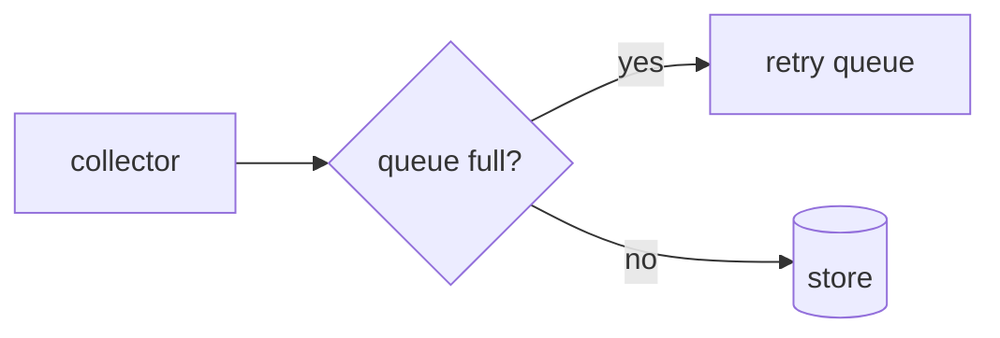
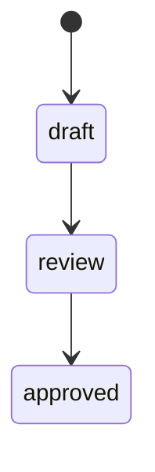
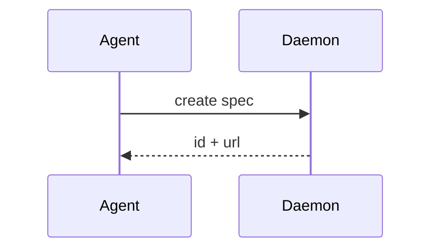

# Ingest topology, drawn

## TL;DR

<!-- sf:box class="panel" -->

Three mermaid diagrams and one ordinary code block. This fixture exists to hold the markdown round trip to its promise: a diagram travels as its own source in a fenced block, with no sidecar file, and a declared language survives in both directions.

## 1 · Architecture



The collector batches on a 200ms timer, so a burst never opens more than five connections.

```python
def collect(batch):
    return batch.flush()
```

## 2 · Lifecycle



A spec is approved once, and approval is the end of the line.



```
users/{src} to users/{dst}
        (not a language, and left undeclared on purpose)
```
